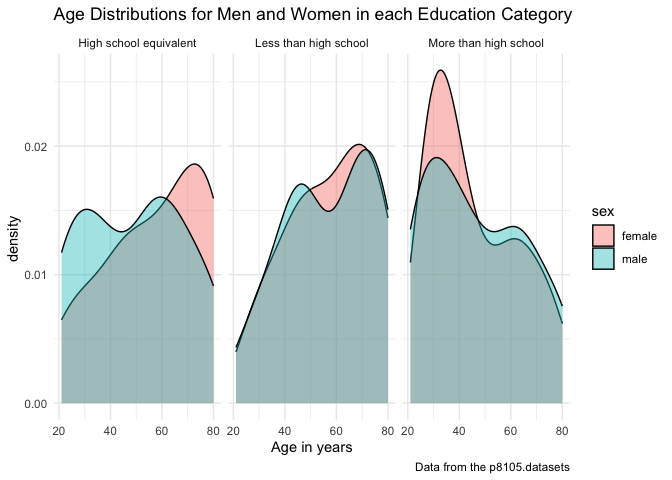

p8105_hw3_xw2962
================
Xiaoyu Wu
2023-10-06

#### Load `Instacart` Dataset

``` r
library(tidyverse)
library(dplyr)
library(p8105.datasets)
data("instacart")
```

## Problem One

#### Short descriptions of the dataset:

Dataset “instacart” has 15 variables: order_id, product_id,
add_to_cart_order, reordered, user_id, eval_set, order_number,
order_dow, order_hour_of_day, days_since_prior_order, product_name,
aisle_id, department_id, aisle, department. In this dataset, there are
1384617 rows. And there are 15 columns. Here we consider variables
“order_dow”, “order_hour_of_day”,“product id”, “product_name”,
“aisle_id” and “aisle”to be important for analysis.

**Q1: How many aisles are there, and which aisles are the most items
ordered from?**

``` r
n_distinct(instacart$aisle_id)
```

    ## [1] 134

``` r
# find how many distinct aisles are there 
instacart |>
  group_by(aisle_id) |>
  summarize(n_obs = n()) |>
  arrange(desc(n_obs))
```

    ## # A tibble: 134 × 2
    ##    aisle_id  n_obs
    ##       <int>  <int>
    ##  1       83 150609
    ##  2       24 150473
    ##  3      123  78493
    ##  4      120  55240
    ##  5       21  41699
    ##  6      115  36617
    ##  7       84  32644
    ##  8      107  31269
    ##  9       91  26240
    ## 10      112  23635
    ## # ℹ 124 more rows

``` r
# find which aisle ids are the most items ordered from
instacart |>
  group_by(aisle) |>
  summarize(n_obs = n()) |>
  arrange(desc(n_obs)) |>
  head() |>
  knitr::kable()
```

| aisle                         |  n_obs |
|:------------------------------|-------:|
| fresh vegetables              | 150609 |
| fresh fruits                  | 150473 |
| packaged vegetables fruits    |  78493 |
| yogurt                        |  55240 |
| packaged cheese               |  41699 |
| water seltzer sparkling water |  36617 |

``` r
# find which aisle names are the most items ordered from
```

#### Description

There are 134 aisles. Aisles with id: 83, 24 and 123 are the most items
ordered from. And their corresponding aisle names are: fresh vegetables,
fresh fruits and packaged vegetables fruits.

**Q2: Make a plot that shows the number of items ordered in each aisle,
limiting this to aisles with more than 10000 items ordered. Arrange
aisles sensibly, and organize your plot so others can read it.**

``` r
instacart |> 
  group_by(aisle) |>
  summarize(n_obs = n()) |>
  filter(n_obs>10000) |>
  mutate(aisle = forcats::fct_reorder(aisle, n_obs)) |>
  ggplot(aes(x=aisle,y=n_obs)) + 
  geom_bar(stat = "identity") +
  labs(
    title = "Number of Items Ordered in each Aisle",
    x = "Aisle Name",
    y = "Number of Items",
    caption = "Data from the p8105.datasets"
  ) +
   coord_flip()
```

<!-- -->

#### Comment

For showing the number of items ordered in each aisle, we first grouped
the observations by aisle and summarized the number of observation in
each group. We then filtered out the aisles with more than 10000 items
ordered. Next, we plot a horizontal bar chart with aisle names on the
x-axis and number of observations on the y-axis by ordering aisle names
with most number of observations to aisle names with least number of
observations.

**Q3: Make a table showing the three most popular items in each of the
aisles “baking ingredients”, “dog food care”, and “packaged vegetables
fruits”. Include the number of times each item is ordered in your
table.**

``` r
rank_df_one=instacart |>
      filter(aisle=="baking ingredients"|aisle=="dog food care"|aisle=="packaged vegetables fruits") |>
      group_by(aisle,product_name) |>
      summarize(
        n_obs = n()) |>
      mutate(item_ranking = min_rank(desc(n_obs))) |>
      filter(min_rank(desc(n_obs)) < 4) |>
      arrange(aisle,item_ranking) |>
      knitr::kable(digits = 1)
rank_df_one
```

| aisle                      | product_name                                  | n_obs | item_ranking |
|:---------------------------|:----------------------------------------------|------:|-------------:|
| baking ingredients         | Light Brown Sugar                             |   499 |            1 |
| baking ingredients         | Pure Baking Soda                              |   387 |            2 |
| baking ingredients         | Cane Sugar                                    |   336 |            3 |
| dog food care              | Snack Sticks Chicken & Rice Recipe Dog Treats |    30 |            1 |
| dog food care              | Organix Chicken & Brown Rice Recipe           |    28 |            2 |
| dog food care              | Small Dog Biscuits                            |    26 |            3 |
| packaged vegetables fruits | Organic Baby Spinach                          |  9784 |            1 |
| packaged vegetables fruits | Organic Raspberries                           |  5546 |            2 |
| packaged vegetables fruits | Organic Blueberries                           |  4966 |            3 |

#### Comment

For making a table showing the three most popular items in each of the
aisles “baking ingredients”, “dog food care”, and “packaged vegetables
fruits”, we first filtered out the rows with aisle names that are
“baking ingredients”, “dog food care”, and “packaged vegetables fruits”.
We then grouped the data by aisle and product name, summarizing the
observations in each group and ranking the number of observations in
descending order. We kept the top three products with top three highest
number of observations. Finally, we arranged the table according to
aisle and item ranking. In the table, we can see that: for aisle baking
ingredients, the top three most popular items are Light Brown Sugar,
Pure Baking Soda and Cane Sugar; for dog food care, the top three most
popular items are Snack Sticks Chicken & Rice Recipe Dog Treats,Organix
Chicken & Brown Rice Recipe and Small Dog Biscuits; for packaged
vegetables fruits, the top three most popular items are Organic Baby
Spinach,Organic Raspberries and Organic Blueberries.

**Q4: Make a table showing the mean hour of the day at which Pink Lady
Apples and Coffee Ice Cream are ordered on each day of the week; format
this table for human readers (i.e. produce a 2 x 7 table).**

``` r
day_ave_df=instacart |>
      filter(product_name=="Pink Lady Apples"|product_name=="Coffee Ice Cream") |>
      group_by(product_name,order_dow) |>
      summarize(
         mean_hour = mean(order_hour_of_day, na.rm = TRUE)) |>
      select(product_name,mean_hour,order_dow)  |>
      arrange(order_dow) |>
      pivot_wider(
        names_from = product_name,
        values_from = mean_hour) |>
      mutate(
    order_dow = recode(order_dow, "0" = "Sunday", "1" = "Monday", "2" = "Tuesday","3" = "Wednesday","4" = "Thursday","5" = "Friday","6" = "Saturday")) |>
      knitr::kable(digits = 1)
day_ave_df
```

| order_dow | Coffee Ice Cream | Pink Lady Apples |
|:----------|-----------------:|-----------------:|
| Sunday    |             13.8 |             13.4 |
| Monday    |             14.3 |             11.4 |
| Tuesday   |             15.4 |             11.7 |
| Wednesday |             15.3 |             14.2 |
| Thursday  |             15.2 |             11.6 |
| Friday    |             12.3 |             12.8 |
| Saturday  |             13.8 |             11.9 |

#### Comment

For making a table showing the mean hour of the day at which Pink Lady
Apples and Coffee Ice Cream are ordered on each day of the week, we
first filtered out the rows with product names “Pink Lady Apples” and
“Coffee Ice Cream”. Then we grouped our observations by product_name and
order_dow. Next, we summarized the mean of order_hour_of_day in each
group. We also selected product_name,mean_hour,order_dow to be shown in
the table and arranged them by order_dow. For the last step, we used
pivot wider, names mutation and knitr to make our table more readable.
The resulting table have three columns:order_dow, Coffee Ice Cream and
Pink Lady Apples.

## Problem Two

#### Load `BRFSS` Dataset

``` r
library(p8105.datasets)
data("brfss_smart2010")
```

``` r
brfss_smart_df=
   brfss_smart2010 |> 
  janitor::clean_names() |> 
# format the data to use appropriate variable names
  filter(topic=="Overall Health") |>
# focus on the “Overall Health” topic
  filter(response=="Excellent"|response=="Fair"|response=="Good"|response=="Poor"|response=="Very good") |>
# include only responses from “Excellent” to “Poor”
  mutate(response=as.factor(response)) |> 
  mutate(response=forcats::fct_relevel(response,c("Poor","Fair","Good","Very good","Excellent")))
# organize responses as a factor taking levels ordered from “Poor” to “Excellent”
brfss_smart_df
```

    ## # A tibble: 10,625 × 23
    ##     year locationabbr locationdesc     class topic question response sample_size
    ##    <int> <chr>        <chr>            <chr> <chr> <chr>    <fct>          <int>
    ##  1  2010 AL           AL - Jefferson … Heal… Over… How is … Excelle…          94
    ##  2  2010 AL           AL - Jefferson … Heal… Over… How is … Very go…         148
    ##  3  2010 AL           AL - Jefferson … Heal… Over… How is … Good             208
    ##  4  2010 AL           AL - Jefferson … Heal… Over… How is … Fair             107
    ##  5  2010 AL           AL - Jefferson … Heal… Over… How is … Poor              45
    ##  6  2010 AL           AL - Mobile Cou… Heal… Over… How is … Excelle…          91
    ##  7  2010 AL           AL - Mobile Cou… Heal… Over… How is … Very go…         177
    ##  8  2010 AL           AL - Mobile Cou… Heal… Over… How is … Good             224
    ##  9  2010 AL           AL - Mobile Cou… Heal… Over… How is … Fair             120
    ## 10  2010 AL           AL - Mobile Cou… Heal… Over… How is … Poor              66
    ## # ℹ 10,615 more rows
    ## # ℹ 15 more variables: data_value <dbl>, confidence_limit_low <dbl>,
    ## #   confidence_limit_high <dbl>, display_order <int>, data_value_unit <chr>,
    ## #   data_value_type <chr>, data_value_footnote_symbol <chr>,
    ## #   data_value_footnote <chr>, data_source <chr>, class_id <chr>,
    ## #   topic_id <chr>, location_id <chr>, question_id <chr>, respid <chr>,
    ## #   geo_location <chr>

**Q1: In 2002, which states were observed at 7 or more locations? What
about in 2010?**

``` r
brfss_2002=brfss_smart_df |>
           filter(year==2002) |>
           group_by(locationabbr) |>
           summarize(
             n_location = n_distinct(locationdesc)) |>
           filter(n_location > 6) |>
           arrange(n_location) |>
           knitr::kable()
brfss_2002
```

| locationabbr | n_location |
|:-------------|-----------:|
| CT           |          7 |
| FL           |          7 |
| NC           |          7 |
| MA           |          8 |
| NJ           |          8 |
| PA           |         10 |

``` r
brfss_2010=brfss_smart_df |>
           filter(year==2010) |>
           group_by(locationabbr) |>
           summarize(
             n_location = n_distinct(locationdesc)) |>
           filter(n_location > 6) |>
           arrange(n_location) |>
           knitr::kable()
brfss_2010
```

| locationabbr | n_location |
|:-------------|-----------:|
| CO           |          7 |
| PA           |          7 |
| SC           |          7 |
| OH           |          8 |
| MA           |          9 |
| NY           |          9 |
| NE           |         10 |
| WA           |         10 |
| CA           |         12 |
| MD           |         12 |
| NC           |         12 |
| TX           |         16 |
| NJ           |         19 |
| FL           |         41 |

#### Comment

In 2002, six states: CT,FL,MA,NC,NJ and PA were observed at 7 or more
locations.

In 2010, fourteen states: CA,CO,FL,MA,MD,NC,NE,NJ,NY,OH,PA,SC,TX and WA
were observed at 7 or more locations.

**Q2: Construct a dataset that is limited to Excellent responses, and
contains, year, state, and a variable that averages the data_value
across locations within a state. Make a “spaghetti” plot of this average
value over time within a state.**

``` r
        brfss_smart_df |>
        filter(response=="Excellent") |>
        group_by(locationabbr,year) |>
        summarize(
        response=response,
        year=year,
        mean_data = mean(data_value, na.rm = TRUE)) |>
        select(response, year,locationabbr,mean_data) |>
        rename(state=locationabbr) |>
        ggplot(aes(x = year, y = mean_data,color=state)) + 
        geom_line() +
        labs(
    title = "Average Value over Time within a State",
    x = "Year",
    y = "Mean Value",
    caption = "Data from the p8105.datasets"
  )+
  viridis::scale_color_viridis(
      name = "State",
      discrete=TRUE)
```

<!-- -->

#### Comment

For cleaning the dataset, we first filtered out the observations with
responses that are only excellent. Then we grouped the observations by
locationabbr and year. Next, we calculated the mean of data_value
according to this grouping. Finally, we selected the variables we want
and renamed “locationabbr” to “state”.

For making the “spaghetti” plot, we set the aesthetics so that x-axis
showing the year variable, y-axis showing the mean_data variable and
color takes the state variable. Then, we chose the geom_line, labeling
the axises and graph, as well as setting the color scale.

**Q3: Make a two-panel plot showing, for the years 2006, and 2010,
distribution of data_value for responses (“Poor” to “Excellent”) among
locations in NY State.**

``` r
distribution_df = brfss_smart_df|>
  filter(
    locationabbr == "NY"
  )|>
  filter(
    year == 2006 | year == 2010)

distribution_plot= distribution_df |>
  ggplot(aes(x = response, y = data_value,fill=response)) + 
  geom_boxplot()+
  facet_grid(. ~ year)+
  labs(
    title = "Distribution of Data value for Responses across NY in 2006 and 2010",
    caption = "Data from the p8105.datasets"
  )
distribution_plot
```

<!-- -->

#### Comment

For making the two-panel plot, we first filtered out the rows for which
state is NY and then filtered out the rows for which years are 2006 and
2010. Then we set the aesthetics using response as x variable and
data_value as y variable, creating boxplots using geom_boxplot. And next
we created two seperate panels for year 2006 and year 2010 using facet
function. Last, we added some labels to make a better view.

From this plot, we can see that distributions of data values for very
good and good groups are the highest in both years. Distributions of
data values for excellent groups are among the next highest around 20 to
25 in both years. And the distributions of data values for poor and fair
groups are the lowest below 20 in both years. The range of data values
for good response in 2006 is larger than the range of data values for
good response in 2010. The ranges of data values for very good and fair
responses are larger in 2010 than the ranges of data values for very
good and fair responses in 2006. The means for the distributions of data
values in each group are about the same in 2006 and 2010.

## Problem Three

#### Import Participants’ Demographic Data and Clean

``` r
demo_df = 
  read_csv("./data/nhanes_covar.csv", skip = 4)|>
  janitor::clean_names()|>
  drop_na()|>
# exclude those with missing demographic data
  filter(
    age >= 21
  )|>
# exclude participants less than 21 years of age
  mutate(
    sex = recode(sex, "1" = "male", "2" = "female"),
    education = recode(education, "1" = "Less than high school", 
                   "2" = "High school equivalent", 
                   "3" = "More than high school"), 
# encode data with reasonable variable classes, not numeric 
    sex = factor(sex), 
    education = factor(education)
  )
# convert sex and education into factor variables 
demo_df
```

    ## # A tibble: 228 × 5
    ##     seqn sex      age   bmi education             
    ##    <dbl> <fct>  <dbl> <dbl> <fct>                 
    ##  1 62161 male      22  23.3 High school equivalent
    ##  2 62164 female    44  23.2 More than high school 
    ##  3 62169 male      21  20.1 High school equivalent
    ##  4 62174 male      80  33.9 More than high school 
    ##  5 62177 male      51  20.1 High school equivalent
    ##  6 62178 male      80  28.5 High school equivalent
    ##  7 62180 male      35  27.9 More than high school 
    ##  8 62184 male      26  22.1 High school equivalent
    ##  9 62189 female    30  22.4 More than high school 
    ## 10 62199 male      57  28   More than high school 
    ## # ℹ 218 more rows

#### Import Participants’ Accelerometer Data and Clean

``` r
accel_df_pivot= 
  read_csv("./data/nhanes_accel.csv")|>
  janitor::clean_names() |>
  pivot_longer(
    min1:min1440, 
    names_to = "time",
    values_to = "activity"
  )
accel_df=
  read_csv("./data/nhanes_accel.csv")|>
  janitor::clean_names()

accel_df_pivot
```

    ## # A tibble: 360,000 × 3
    ##     seqn time  activity
    ##    <dbl> <chr>    <dbl>
    ##  1 62161 min1     1.11 
    ##  2 62161 min2     3.12 
    ##  3 62161 min3     1.47 
    ##  4 62161 min4     0.938
    ##  5 62161 min5     1.60 
    ##  6 62161 min6     0.145
    ##  7 62161 min7     2.10 
    ##  8 62161 min8     0.509
    ##  9 62161 min9     1.63 
    ## 10 62161 min10    1.20 
    ## # ℹ 359,990 more rows

#### Merge Two Cleaned Datasets

``` r
merged_demo_accel_df= 
  left_join(demo_df, accel_df_pivot, by = join_by(seqn)) 

head(merged_demo_accel_df)|>
  knitr::kable()
```

|  seqn | sex  | age |  bmi | education              | time |  activity |
|------:|:-----|----:|-----:|:-----------------------|:-----|----------:|
| 62161 | male |  22 | 23.3 | High school equivalent | min1 | 1.1060000 |
| 62161 | male |  22 | 23.3 | High school equivalent | min2 | 3.1151667 |
| 62161 | male |  22 | 23.3 | High school equivalent | min3 | 1.4675000 |
| 62161 | male |  22 | 23.3 | High school equivalent | min4 | 0.9376667 |
| 62161 | male |  22 | 23.3 | High school equivalent | min5 | 1.5986667 |
| 62161 | male |  22 | 23.3 | High school equivalent | min6 | 0.1453333 |

``` r
# merge two cleaned datasets and return a table  
merged_demo_accel_data=left_join(demo_df, accel_df, by = join_by(seqn))
# merge two datasets for later use 
```

#### Table for the Number of Men and Women in each Education Category

``` r
sex_edu_df = merged_demo_accel_data|>
  group_by(sex, education)|>
  summarize(counts = n())|>
  pivot_wider(names_from = sex, values_from = counts) |>
  knitr::kable()
sex_edu_df
```

| education              | female | male |
|:-----------------------|-------:|-----:|
| High school equivalent |     23 |   35 |
| Less than high school  |     28 |   27 |
| More than high school  |     59 |   56 |

#### Visualization of the Age Distributions for Men and Women in each Education Category

``` r
sex_edu_age_df  = merged_demo_accel_data|>
  group_by(sex, education)|>
  summarize(mean_age = mean(age, na.rm = TRUE))

sex_edu_age_plot = merged_demo_accel_data|>
  ggplot(aes(x = age, fill = sex))+
  geom_density(alpha = .4)+
  facet_grid(. ~ education)
sex_edu_age_plot
```

<!-- -->

#### Comment

For creating the visualization of the age distribution for men and women
in each education category,we set up the age as x variable and sex as
fill in the ggplot aesthetics. Then, we used geom_density plot and set
transparency level as 0.4. Then we created seperate panels for different
education levels using facet_grid function.

We could see in the plot that, for people who have more than high school
degree, more of them are younger people. For people who have less than
high school or high school equivalent degrees, more of them are older
people.

#### Plot Total Activities (y-axis) against Age (x-axis)

``` r
acc_agg_df = merged_demo_accel_data|>
  mutate(
    aggregate_move = rowSums(select(merged_demo_accel_data, starts_with("min")))
  )

aggregated_age_plot = acc_agg_df|>
  ggplot(aes(x = age, y = aggregate_move, color = sex))+
  geom_point(alpha = .5)+
  geom_smooth()+
  facet_grid(. ~ education)
aggregated_age_plot
```

<!-- -->

#### Comment

For plotting total activities in y-axis against age in x-axis, we first
mutated the merged dataset for calculating row sums for columns starting
with min in each row and named that row sum as aggregate_move. Then, we
set age as x variable and aggregate_move as y variable, and sex as color
in the aesthetics. We used geom_point together with geom_smooth for
showing the trends. And created seperate panels for different education
levels using facet_grid function.

From the plots, we can see that all movements begin decreasing as ages
exceed 60. In the high school equivalent and more than high school
groups, female has higher movements than male. Whereas in the less than
high school group, male’s movement exceeds female’s movement around age
40.

#### Three-paneled Plot

``` r
group_24_df = merged_demo_accel_data|>
  group_by(education, sex)|>
  summarise(across(starts_with("min"), ~ mean(.), .names = "mean_{.col}"))|>
  pivot_longer(cols=starts_with("mean_"), names_to = "time", values_to = "mean")|>
  mutate(
    time = substring(time, 9), 
    time= as.numeric(time)
  )

group_24_plot = group_24_df|>
  ggplot(aes(x = time, y = mean, color = sex))+
  geom_line()+
  facet_grid(. ~ education)
group_24_plot
```

<!-- -->

#### Comment

For making a three-panel plot that shows the 24-hour activity time
courses for each education level, we grouped the merged dataset by
education and sex. Then we summarized the means for each column starting
with min, substituting each column name with “mean\_”. Next, we used
pivot longer functions to switch from wide to longer version of the
dataframe. Here, we also used mutate function to extract the time as a
numeric value. We set time as x variable and mean as y variable and sex
as color in aesthetics and used geom_line for plotting. Finally, we
created seperate panels for different education levels using facet_grid
function.

For people in the group of high school equivalent and more than high
school, average movement for female is higher than average movement for
male. And people in all these three groups show low movement from 0 to
250min.
