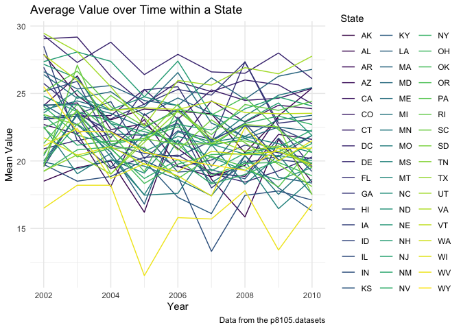

p8105_hw3_xw2962
================
Xiaoyu Wu
2023-10-06

## Load `Instacart` Dataset

``` r
library(tidyverse)
library(dplyr)
library(p8105.datasets)
data("instacart")
```

## Problem One

#### Short descriptions of the dataset:

Dataset “instacart” has 15 variables: order_id, product_id,
add_to_cart_order, reordered, user_id, eval_set, order_number,
order_dow, order_hour_of_day, days_since_prior_order, product_name,
aisle_id, department_id, aisle, department. In this dataset, there are
1384617 rows. And there are 15 columns. Here we consider variables
“order_dow”, “order_hour_of_day”,“product id”, “product_name”,
“aisle_id” and “aisle”to be important for analysis.

**Q1: How many aisles are there, and which aisles are the most items
ordered from?**

``` r
n_distinct(instacart$aisle_id)
```

    ## [1] 134

``` r
# find how many distinct aisles are there 
instacart |>
  group_by(aisle_id) |>
  summarize(n_obs = n()) |>
  arrange(desc(n_obs))
```

    ## # A tibble: 134 × 2
    ##    aisle_id  n_obs
    ##       <int>  <int>
    ##  1       83 150609
    ##  2       24 150473
    ##  3      123  78493
    ##  4      120  55240
    ##  5       21  41699
    ##  6      115  36617
    ##  7       84  32644
    ##  8      107  31269
    ##  9       91  26240
    ## 10      112  23635
    ## # ℹ 124 more rows

``` r
# find which aisle ids are the most items ordered from
instacart |>
  group_by(aisle) |>
  summarize(n_obs = n()) |>
  arrange(desc(n_obs))
```

    ## # A tibble: 134 × 2
    ##    aisle                          n_obs
    ##    <chr>                          <int>
    ##  1 fresh vegetables              150609
    ##  2 fresh fruits                  150473
    ##  3 packaged vegetables fruits     78493
    ##  4 yogurt                         55240
    ##  5 packaged cheese                41699
    ##  6 water seltzer sparkling water  36617
    ##  7 milk                           32644
    ##  8 chips pretzels                 31269
    ##  9 soy lactosefree                26240
    ## 10 bread                          23635
    ## # ℹ 124 more rows

``` r
# find which aisle names are the most items ordered from
```

#### Description

There are 134 aisles. Aisles with id: 83, 24 and 123 are the most items
ordered from. And their corresponding aisle names are: fresh vegetables,
fresh fruits and packaged vegetables fruits.

**Q2: Make a plot that shows the number of items ordered in each aisle,
limiting this to aisles with more than 10000 items ordered. Arrange
aisles sensibly, and organize your plot so others can read it.**

``` r
instacart |> 
  group_by(aisle) |>
  summarize(n_obs = n()) |>
  filter(n_obs>10000) |>
  mutate(aisle = forcats::fct_reorder(aisle, n_obs)) |>
  ggplot(aes(x=aisle,y=n_obs)) + 
  geom_bar(stat = "identity") +
  labs(
    title = "Number of Items Ordered in each Aisle",
    x = "Aisle Name",
    y = "Number of Items",
    caption = "Data from the p8105.datasets"
  ) +
   coord_flip()
```

<!-- -->

#### Comment

For showing the number of items ordered in each aisle, we first grouped
the observations by aisle and summarized the number of observation in
each group. We then filtered out the aisles with more than 10000 items
ordered. Next, we plot a horizontal bar chart with aisle names on the
x-axis and number of observations on the y-axis by ordering aisle names
with most number of observations to aisle names with least number of
observations.

**Q3: Make a table showing the three most popular items in each of the
aisles “baking ingredients”, “dog food care”, and “packaged vegetables
fruits”. Include the number of times each item is ordered in your
table.**

``` r
rank_df_one=instacart |>
      filter(aisle=="baking ingredients"|aisle=="dog food care"|aisle=="packaged vegetables fruits") |>
      group_by(aisle,product_name) |>
      summarize(
        n_obs = n()) |>
      mutate(item_ranking = min_rank(desc(n_obs))) |>
      filter(min_rank(desc(n_obs)) < 4) |>
      arrange(aisle,item_ranking) |>
      knitr::kable(digits = 1)
rank_df_one
```

| aisle                      | product_name                                  | n_obs | item_ranking |
|:---------------------------|:----------------------------------------------|------:|-------------:|
| baking ingredients         | Light Brown Sugar                             |   499 |            1 |
| baking ingredients         | Pure Baking Soda                              |   387 |            2 |
| baking ingredients         | Cane Sugar                                    |   336 |            3 |
| dog food care              | Snack Sticks Chicken & Rice Recipe Dog Treats |    30 |            1 |
| dog food care              | Organix Chicken & Brown Rice Recipe           |    28 |            2 |
| dog food care              | Small Dog Biscuits                            |    26 |            3 |
| packaged vegetables fruits | Organic Baby Spinach                          |  9784 |            1 |
| packaged vegetables fruits | Organic Raspberries                           |  5546 |            2 |
| packaged vegetables fruits | Organic Blueberries                           |  4966 |            3 |

#### Comment

For making a table showing the three most popular items in each of the
aisles “baking ingredients”, “dog food care”, and “packaged vegetables
fruits”, we first filtered out the rows with aisle names that are
“baking ingredients”, “dog food care”, and “packaged vegetables fruits”.
We then grouped the data by aisle and product name, summarizing the
observations in each group and ranking the number of observations in
descending order. We kept the top three products with top three highest
number of observations. Finally, we arranged the table according to
aisle and item ranking. In the table, we can see that: for aisle baking
ingredients, the top three most popular items are Light Brown Sugar,
Pure Baking Soda and Cane Sugar; for dog food care, the top three most
popular items are Snack Sticks Chicken & Rice Recipe Dog Treats,Organix
Chicken & Brown Rice Recipe and Small Dog Biscuits; for packaged
vegetables fruits, the top three most popular items are Organic Baby
Spinach,Organic Raspberries and Organic Blueberries.

**Q4: Make a table showing the mean hour of the day at which Pink Lady
Apples and Coffee Ice Cream are ordered on each day of the week; format
this table for human readers (i.e. produce a 2 x 7 table).**

``` r
day_ave_df=instacart |>
      filter(product_name=="Pink Lady Apples"|product_name=="Coffee Ice Cream") |>
      group_by(product_name,order_dow) |>
      summarize(
         mean_hour = mean(order_hour_of_day, na.rm = TRUE)) |>
      select(product_name,mean_hour,order_dow)  |>
      arrange(order_dow) |>
      pivot_wider(
        names_from = product_name,
        values_from = mean_hour) |>
      mutate(
    order_dow = recode(order_dow, "0" = "Sunday", "1" = "Monday", "2" = "Tuesday","3" = "Wednesday","4" = "Thursday","5" = "Friday","6" = "Saturday")) |>
      knitr::kable(digits = 1)
day_ave_df
```

| order_dow | Coffee Ice Cream | Pink Lady Apples |
|:----------|-----------------:|-----------------:|
| Sunday    |             13.8 |             13.4 |
| Monday    |             14.3 |             11.4 |
| Tuesday   |             15.4 |             11.7 |
| Wednesday |             15.3 |             14.2 |
| Thursday  |             15.2 |             11.6 |
| Friday    |             12.3 |             12.8 |
| Saturday  |             13.8 |             11.9 |

#### Comment

For making a table showing the mean hour of the day at which Pink Lady
Apples and Coffee Ice Cream are ordered on each day of the week, we
first filtered out the rows with product names “Pink Lady Apples” and
“Coffee Ice Cream”. Then we grouped our observations by product_name and
order_dow. Next, we summarized the mean of order_hour_of_day in each
group. We also selected product_name,mean_hour,order_dow to be shown in
the table and arranged them by order_dow. For the last step, we used
pivot wider, names mutation and knitr to make our table more readable.
The resulting table have three columns:order_dow, Coffee Ice Cream and
Pink Lady Apples.

## Problem Two

## Load `BRFSS` Dataset

``` r
library(p8105.datasets)
data("brfss_smart2010")
```

``` r
brfss_smart_df=
   brfss_smart2010 |> 
  janitor::clean_names() |> 
# format the data to use appropriate variable names
  filter(topic=="Overall Health") |>
# focus on the “Overall Health” topic
  filter(response=="Excellent"|response=="Fair"|response=="Good"|response=="Poor"|response=="Very good") |>
# include only responses from “Excellent” to “Poor”
  mutate(response=as.factor(response)) |> 
  mutate(response=forcats::fct_relevel(response,c("Poor","Fair","Good","Very good","Excellent")))
# organize responses as a factor taking levels ordered from “Poor” to “Excellent”
brfss_smart_df
```

    ## # A tibble: 10,625 × 23
    ##     year locationabbr locationdesc     class topic question response sample_size
    ##    <int> <chr>        <chr>            <chr> <chr> <chr>    <fct>          <int>
    ##  1  2010 AL           AL - Jefferson … Heal… Over… How is … Excelle…          94
    ##  2  2010 AL           AL - Jefferson … Heal… Over… How is … Very go…         148
    ##  3  2010 AL           AL - Jefferson … Heal… Over… How is … Good             208
    ##  4  2010 AL           AL - Jefferson … Heal… Over… How is … Fair             107
    ##  5  2010 AL           AL - Jefferson … Heal… Over… How is … Poor              45
    ##  6  2010 AL           AL - Mobile Cou… Heal… Over… How is … Excelle…          91
    ##  7  2010 AL           AL - Mobile Cou… Heal… Over… How is … Very go…         177
    ##  8  2010 AL           AL - Mobile Cou… Heal… Over… How is … Good             224
    ##  9  2010 AL           AL - Mobile Cou… Heal… Over… How is … Fair             120
    ## 10  2010 AL           AL - Mobile Cou… Heal… Over… How is … Poor              66
    ## # ℹ 10,615 more rows
    ## # ℹ 15 more variables: data_value <dbl>, confidence_limit_low <dbl>,
    ## #   confidence_limit_high <dbl>, display_order <int>, data_value_unit <chr>,
    ## #   data_value_type <chr>, data_value_footnote_symbol <chr>,
    ## #   data_value_footnote <chr>, data_source <chr>, class_id <chr>,
    ## #   topic_id <chr>, location_id <chr>, question_id <chr>, respid <chr>,
    ## #   geo_location <chr>

**Q1: In 2002, which states were observed at 7 or more locations? What
about in 2010?**

``` r
brfss_2002=brfss_smart_df |>
           filter(year==2002) |>
           group_by(locationabbr) |>
           summarize(
             n_obs = n(),
             n_location = n_distinct(locationdesc)) |>
           filter(n_location > 6)  
brfss_2002
```

    ## # A tibble: 6 × 3
    ##   locationabbr n_obs n_location
    ##   <chr>        <int>      <int>
    ## 1 CT              35          7
    ## 2 FL              35          7
    ## 3 MA              40          8
    ## 4 NC              35          7
    ## 5 NJ              40          8
    ## 6 PA              50         10

``` r
brfss_2010=brfss_smart_df |>
           filter(year==2010) |>
           group_by(locationabbr) |>
           summarize(
             n_obs = n(),
             n_location = n_distinct(locationdesc)) |>
           filter(n_location > 6)  
brfss_2010
```

    ## # A tibble: 14 × 3
    ##    locationabbr n_obs n_location
    ##    <chr>        <int>      <int>
    ##  1 CA              60         12
    ##  2 CO              35          7
    ##  3 FL             205         41
    ##  4 MA              45          9
    ##  5 MD              60         12
    ##  6 NC              60         12
    ##  7 NE              50         10
    ##  8 NJ              95         19
    ##  9 NY              45          9
    ## 10 OH              40          8
    ## 11 PA              35          7
    ## 12 SC              35          7
    ## 13 TX              80         16
    ## 14 WA              50         10

#### Comment

In 2002, six states: CT,FL,MA,NC,NJ and PA were observed at 7 or more
locations.

In 2010, fourteen states: CA,CO,FL,MA,MD,NC,NE,NJ,NY,OH,PA,SC,TX and WA
were observed at 7 or more locations.

**Q2: Construct a dataset that is limited to Excellent responses, and
contains, year, state, and a variable that averages the data_value
across locations within a state. Make a “spaghetti” plot of this average
value over time within a state.**

``` r
        brfss_smart_df |>
        filter(response=="Excellent") |>
        group_by(locationabbr,year) |>
        summarize(
        response=response,
        year=year,
        mean_data = mean(data_value, na.rm = TRUE)) |>
        select(response, year,locationabbr,mean_data) |>
        rename(state=locationabbr) |>
        ggplot(aes(x = year, y = mean_data,color=state)) + 
        geom_line() +
        labs(
    title = "Average Value over Time within a State",
    x = "Year",
    y = "Mean Value",
    caption = "Data from the p8105.datasets"
  )+
  viridis::scale_color_viridis(
      name = "State",
      discrete=TRUE)
```

<!-- -->

#### Comment

For cleaning the dataset, we first filtered out the observations with
responses that are only excellent. Then we grouped the observations by
locationabbr and year. Next, we calculated the mean of data_value
according to this grouping. Finally, we selected the variables we want
and renamed “locationabbr” to “state”.

For making the “spaghetti” plot, we set the aesthetics so that x-axis
showing the year variable, y-axis showing the mean_data variable and
color takes the state variable. Then, we chose the geom_line, labeling
the axises and graph, as well as setting the color scale.

**Q3: Make a two-panel plot showing, for the years 2006, and 2010,
distribution of data_value for responses (“Poor” to “Excellent”) among
locations in NY State.**

``` r
distribution_df = brfss_smart_df|>
  filter(
    locationabbr == "NY"
  )|>
  filter(
    year == 2006 | year == 2010)

distribution_plot= distribution_df |>
  ggplot(aes(x = data_value, fill = locationdesc)) + 
  geom_density(alpha = .3, adjust = .75)+
  facet_grid(. ~ year)

distribution_plot
```

<!-- -->

#### Comment

## Problem Three

#### Import Participants’ Demographic Data and Clean

``` r
demo_df = 
  read_csv("./data/nhanes_covar.csv", skip = 4)|>
  janitor::clean_names()|>
  drop_na()|>
# exclude those with missing demographic data
  filter(
    age >= 21
  )|>
# exclude participants less than 21 years of age
  mutate(
    sex = recode(sex, "1" = "male", "2" = "female"),
    education = recode(education, "1" = "Less than high school", 
                   "2" = "High school equivalent", 
                   "3" = "More than high school"), 
# encode data with reasonable variable classes, not numeric 
    sex = factor(sex), 
    education = factor(education)
  )
# convert sex and education into factor variables 
demo_df
```

    ## # A tibble: 228 × 5
    ##     seqn sex      age   bmi education             
    ##    <dbl> <fct>  <dbl> <dbl> <fct>                 
    ##  1 62161 male      22  23.3 High school equivalent
    ##  2 62164 female    44  23.2 More than high school 
    ##  3 62169 male      21  20.1 High school equivalent
    ##  4 62174 male      80  33.9 More than high school 
    ##  5 62177 male      51  20.1 High school equivalent
    ##  6 62178 male      80  28.5 High school equivalent
    ##  7 62180 male      35  27.9 More than high school 
    ##  8 62184 male      26  22.1 High school equivalent
    ##  9 62189 female    30  22.4 More than high school 
    ## 10 62199 male      57  28   More than high school 
    ## # ℹ 218 more rows

#### Import Participants’ Accelerometer Data and Clean

``` r
accel_df = 
  read_csv("./data/nhanes_accel.csv")|>
  janitor::clean_names() 

accel_df
```

    ## # A tibble: 250 × 1,441
    ##     seqn  min1  min2  min3  min4   min5   min6  min7   min8    min9  min10
    ##    <dbl> <dbl> <dbl> <dbl> <dbl>  <dbl>  <dbl> <dbl>  <dbl>   <dbl>  <dbl>
    ##  1 62161 1.11  3.12  1.47  0.938 1.60   0.145  2.10  0.509   1.63   1.20  
    ##  2 62164 1.92  1.67  2.38  0.935 2.59   5.22   2.39  4.90    1.97   3.13  
    ##  3 62169 5.85  5.18  4.76  6.48  6.85   7.24   6.12  7.48    5.47   6.49  
    ##  4 62174 5.42  3.48  3.72  3.81  6.85   4.45   0.561 1.61    0.698  2.72  
    ##  5 62177 6.14  8.06  9.99  6.60  4.57   2.78   7.10  7.25   10.1    7.49  
    ##  6 62178 0.167 0.429 0.131 1.20  0.0796 0.0487 0.106 0.0653  0.0564 0.0639
    ##  7 62180 0.039 0     0     0     0.369  0.265  0.506 0.638   0      0.011 
    ##  8 62184 1.55  2.81  3.86  4.76  6.10   7.61   4.74  6.73    5.42   4.24  
    ##  9 62186 3.08  2.54  2.63  2.12  1.14   1.68   2.84  2.72    2.13   2.18  
    ## 10 62189 2.81  0.195 0.163 0     0.144  0.180  0.870 0.214   0      0     
    ## # ℹ 240 more rows
    ## # ℹ 1,430 more variables: min11 <dbl>, min12 <dbl>, min13 <dbl>, min14 <dbl>,
    ## #   min15 <dbl>, min16 <dbl>, min17 <dbl>, min18 <dbl>, min19 <dbl>,
    ## #   min20 <dbl>, min21 <dbl>, min22 <dbl>, min23 <dbl>, min24 <dbl>,
    ## #   min25 <dbl>, min26 <dbl>, min27 <dbl>, min28 <dbl>, min29 <dbl>,
    ## #   min30 <dbl>, min31 <dbl>, min32 <dbl>, min33 <dbl>, min34 <dbl>,
    ## #   min35 <dbl>, min36 <dbl>, min37 <dbl>, min38 <dbl>, min39 <dbl>, …

#### Merge `demo_df` and `accel_df`

``` r
merged_demo_accel_df= left_join(demo_df, accel_df, by = join_by(seqn))

head(merged_demo_accel_df)|>
  knitr::kable()
```

|  seqn | sex    | age |  bmi | education              |      min1 |      min2 |      min3 |      min4 |      min5 |      min6 |      min7 |      min8 |       min9 |     min10 |     min11 |     min12 |     min13 |     min14 |      min15 |     min16 |     min17 |     min18 |      min19 |     min20 |      min21 |     min22 |     min23 |     min24 |     min25 |    min26 |     min27 |     min28 |      min29 |     min30 |     min31 |     min32 |     min33 |     min34 |     min35 |     min36 |     min37 |     min38 |      min39 |     min40 |     min41 |     min42 |      min43 |     min44 |     min45 |     min46 |     min47 |     min48 |     min49 |     min50 |     min51 |     min52 |     min53 |     min54 |     min55 |     min56 |     min57 |     min58 |     min59 |     min60 |     min61 |     min62 |     min63 |     min64 |     min65 |     min66 |     min67 |     min68 |    min69 |     min70 |     min71 |     min72 |      min73 |     min74 |     min75 |     min76 |     min77 |     min78 |     min79 |     min80 |     min81 |     min82 |     min83 |     min84 |     min85 |     min86 |     min87 |     min88 |     min89 |     min90 |     min91 |     min92 |      min93 |      min94 |      min95 |      min96 |      min97 |     min98 |     min99 |    min100 |    min101 |    min102 |    min103 |    min104 |    min105 |    min106 |    min107 |   min108 |    min109 |    min110 |    min111 |    min112 |    min113 |    min114 |    min115 |    min116 |    min117 |    min118 |    min119 |    min120 |    min121 |    min122 |    min123 |   min124 |    min125 |    min126 |    min127 |    min128 |    min129 |    min130 |    min131 |    min132 |    min133 |    min134 |    min135 |    min136 |    min137 |    min138 |    min139 |    min140 |    min141 |    min142 |    min143 |    min144 |    min145 |   min146 |    min147 |    min148 |    min149 |    min150 |    min151 |    min152 |    min153 |    min154 |    min155 |    min156 |    min157 |    min158 |    min159 |    min160 |    min161 |    min162 |    min163 |    min164 |    min165 |    min166 |    min167 |    min168 |    min169 |    min170 |    min171 |    min172 |   min173 |    min174 |    min175 |    min176 |    min177 |    min178 |    min179 |    min180 |    min181 |    min182 |    min183 |    min184 |    min185 |    min186 |    min187 |    min188 |    min189 |    min190 |    min191 |    min192 |    min193 |    min194 |    min195 |    min196 |    min197 |    min198 |    min199 |    min200 |    min201 |    min202 |    min203 |    min204 |    min205 |    min206 |    min207 |    min208 |    min209 |    min210 |    min211 |    min212 |    min213 |    min214 |    min215 |    min216 |    min217 |    min218 |    min219 |    min220 |    min221 |    min222 |    min223 |    min224 |    min225 |    min226 |    min227 |    min228 |    min229 |    min230 |    min231 |    min232 |    min233 |    min234 |    min235 |    min236 |    min237 |    min238 |    min239 |    min240 |    min241 |    min242 |    min243 |    min244 |    min245 |    min246 |    min247 |    min248 |    min249 |    min250 |    min251 |    min252 |    min253 |    min254 |    min255 |    min256 |    min257 |    min258 |    min259 |    min260 |    min261 |    min262 |    min263 |    min264 |    min265 |    min266 |    min267 |    min268 |    min269 |    min270 |    min271 |    min272 |    min273 |    min274 |    min275 |    min276 |    min277 |    min278 |    min279 |    min280 |    min281 |    min282 |    min283 |    min284 |    min285 |    min286 |    min287 |    min288 |    min289 |    min290 |    min291 |    min292 |    min293 |    min294 |    min295 |    min296 |   min297 |    min298 |    min299 |    min300 |    min301 |    min302 |    min303 |    min304 |    min305 |    min306 |    min307 |    min308 |    min309 |    min310 |    min311 |    min312 |    min313 |    min314 |    min315 |    min316 |    min317 |    min318 |    min319 |    min320 |    min321 |    min322 |    min323 |    min324 |    min325 |    min326 |    min327 |    min328 |    min329 |     min330 |    min331 |    min332 |    min333 |    min334 |    min335 |    min336 |    min337 |    min338 |    min339 |    min340 |    min341 |    min342 |    min343 |    min344 |    min345 |    min346 |    min347 |    min348 |    min349 |    min350 |    min351 |    min352 |    min353 |    min354 |    min355 |    min356 |    min357 |    min358 |    min359 |    min360 |    min361 |     min362 |    min363 |     min364 |     min365 |    min366 |    min367 |    min368 |    min369 |    min370 |    min371 |    min372 |    min373 |    min374 |    min375 |     min376 |    min377 |     min378 |     min379 |     min380 |     min381 |    min382 |     min383 |     min384 |     min385 |     min386 |     min387 |     min388 |    min389 |     min390 |     min391 |     min392 |     min393 |     min394 |    min395 |     min396 |     min397 |     min398 |     min399 |     min400 |     min401 |     min402 |     min403 |   min404 |    min405 |    min406 |    min407 |     min408 |     min409 |     min410 |     min411 |     min412 |     min413 |     min414 |     min415 |     min416 |    min417 |     min418 |    min419 |     min420 |    min421 |    min422 |     min423 |    min424 |    min425 |    min426 |     min427 |    min428 |    min429 |    min430 |    min431 |     min432 |   min433 |     min434 |    min435 |     min436 |    min437 |    min438 |    min439 |    min440 |    min441 |    min442 |    min443 |    min444 |    min445 |    min446 |     min447 |    min448 |     min449 |     min450 |    min451 |    min452 |    min453 |    min454 |    min455 |    min456 |    min457 |    min458 |    min459 |    min460 |     min461 |     min462 |    min463 |    min464 |    min465 |    min466 |     min467 |    min468 |    min469 |     min470 |     min471 |    min472 |     min473 |    min474 |     min475 |    min476 |    min477 |     min478 |     min479 |    min480 |     min481 |    min482 |    min483 |    min484 |    min485 |    min486 |    min487 |    min488 |    min489 |    min490 |    min491 |     min492 |   min493 |     min494 |     min495 |    min496 |     min497 |    min498 |    min499 |    min500 |    min501 |    min502 |    min503 |    min504 |    min505 |    min506 |    min507 |    min508 |    min509 |    min510 |    min511 |    min512 |    min513 |    min514 |    min515 |    min516 |    min517 |    min518 |    min519 |    min520 |    min521 |    min522 |    min523 |    min524 |    min525 |    min526 |    min527 |    min528 |    min529 |   min530 |    min531 |    min532 |    min533 |    min534 |    min535 |    min536 |   min537 |    min538 |   min539 |    min540 |    min541 |    min542 |    min543 |    min544 |    min545 |    min546 |   min547 |    min548 |    min549 |    min550 |    min551 |    min552 |    min553 |    min554 |    min555 |    min556 |    min557 |    min558 |    min559 |    min560 |    min561 |    min562 |    min563 |    min564 |    min565 |    min566 |    min567 |    min568 |    min569 |    min570 |    min571 |    min572 |    min573 |    min574 |    min575 |    min576 |    min577 |    min578 |    min579 |    min580 |    min581 |    min582 |    min583 |    min584 |    min585 |    min586 |    min587 |    min588 |    min589 |    min590 |    min591 |    min592 |    min593 |    min594 |    min595 |    min596 |    min597 |    min598 |    min599 |    min600 |    min601 |    min602 |    min603 |    min604 |    min605 |    min606 |    min607 |    min608 |    min609 |    min610 |    min611 |    min612 |    min613 |    min614 |    min615 |    min616 |    min617 |    min618 |    min619 |    min620 |    min621 |    min622 |    min623 |    min624 |    min625 |    min626 |    min627 |    min628 |    min629 |    min630 |    min631 |    min632 |    min633 |    min634 |   min635 |    min636 |    min637 |    min638 |    min639 |    min640 |    min641 |    min642 |    min643 |    min644 |    min645 |    min646 |    min647 |    min648 |    min649 |    min650 |    min651 |    min652 |    min653 |    min654 |    min655 |    min656 |    min657 |    min658 |    min659 |    min660 |    min661 |    min662 |    min663 |    min664 |    min665 |    min666 |    min667 |    min668 |    min669 |    min670 |    min671 |    min672 |    min673 |    min674 |    min675 |    min676 |   min677 |    min678 |    min679 |    min680 |    min681 |    min682 |    min683 |    min684 |    min685 |    min686 |    min687 |    min688 |    min689 |    min690 |   min691 |    min692 |    min693 |   min694 |   min695 |   min696 |   min697 |   min698 |    min699 |    min700 |    min701 |    min702 |    min703 |    min704 |    min705 |    min706 |    min707 |    min708 |    min709 |    min710 |    min711 |    min712 |    min713 |    min714 |    min715 |    min716 |    min717 |    min718 |   min719 |    min720 |   min721 |   min722 |    min723 |    min724 |    min725 |    min726 |    min727 |    min728 |    min729 |    min730 |    min731 |    min732 |    min733 |    min734 |    min735 |    min736 |    min737 |   min738 |    min739 |    min740 |    min741 |    min742 |    min743 |    min744 |    min745 |    min746 |    min747 |    min748 |    min749 |    min750 |    min751 |    min752 |    min753 |    min754 |    min755 |    min756 |    min757 |    min758 |    min759 |    min760 |    min761 |    min762 |    min763 |    min764 |    min765 |    min766 |    min767 |    min768 |    min769 |    min770 |    min771 |    min772 |    min773 |    min774 |    min775 |    min776 |    min777 |    min778 |    min779 |    min780 |    min781 |    min782 |    min783 |    min784 |    min785 |    min786 |    min787 |    min788 |   min789 |    min790 |    min791 |    min792 |    min793 |    min794 |    min795 |   min796 |    min797 |    min798 |    min799 |    min800 |    min801 |    min802 |    min803 |    min804 |    min805 |    min806 |    min807 |    min808 |    min809 |    min810 |    min811 |    min812 |    min813 |    min814 |    min815 |    min816 |    min817 |    min818 |    min819 |    min820 |    min821 |    min822 |    min823 |    min824 |   min825 |    min826 |    min827 |    min828 |    min829 |    min830 |    min831 |    min832 |    min833 |    min834 |   min835 |    min836 |    min837 |    min838 |    min839 |    min840 |    min841 |    min842 |    min843 |    min844 |    min845 |    min846 |    min847 |    min848 |    min849 |    min850 |    min851 |    min852 |    min853 |    min854 |    min855 |    min856 |    min857 |    min858 |    min859 |    min860 |    min861 |    min862 |    min863 |    min864 |    min865 |    min866 |    min867 |    min868 |    min869 |    min870 |    min871 |    min872 |    min873 |    min874 |    min875 |    min876 |    min877 |    min878 |    min879 |    min880 |    min881 |    min882 |    min883 |    min884 |    min885 |    min886 |    min887 |    min888 |    min889 |    min890 |    min891 |    min892 |    min893 |   min894 |    min895 |    min896 |    min897 |    min898 |    min899 |    min900 |    min901 |    min902 |    min903 |    min904 |    min905 |    min906 |    min907 |    min908 |    min909 |   min910 |    min911 |    min912 |    min913 |    min914 |    min915 |    min916 |    min917 |    min918 |    min919 |    min920 |    min921 |    min922 |    min923 |    min924 |    min925 |    min926 |    min927 |    min928 |    min929 |    min930 |    min931 |    min932 |    min933 |    min934 |    min935 |    min936 |    min937 |    min938 |    min939 |    min940 |    min941 |   min942 |    min943 |    min944 |    min945 |    min946 |    min947 |    min948 |    min949 |    min950 |    min951 |    min952 |    min953 |    min954 |    min955 |    min956 |    min957 |    min958 |    min959 |    min960 |    min961 |    min962 |    min963 |    min964 |    min965 |    min966 |    min967 |    min968 |    min969 |    min970 |    min971 |    min972 |    min973 |    min974 |    min975 |    min976 |    min977 |    min978 |    min979 |    min980 |    min981 |    min982 |    min983 |    min984 |    min985 |    min986 |    min987 |    min988 |    min989 |    min990 |    min991 |    min992 |    min993 |    min994 |    min995 |    min996 |    min997 |    min998 |    min999 |   min1000 |   min1001 |   min1002 |   min1003 |   min1004 |   min1005 |   min1006 |   min1007 |   min1008 |   min1009 |   min1010 |   min1011 |   min1012 |   min1013 |   min1014 |   min1015 |   min1016 |   min1017 |   min1018 |   min1019 |  min1020 |   min1021 |   min1022 |   min1023 |  min1024 |   min1025 |   min1026 |   min1027 |   min1028 |   min1029 |   min1030 |   min1031 |   min1032 |   min1033 |   min1034 |  min1035 |   min1036 |  min1037 |   min1038 |   min1039 |  min1040 |  min1041 |  min1042 |   min1043 |   min1044 |   min1045 |   min1046 |   min1047 |   min1048 |   min1049 |   min1050 |   min1051 |   min1052 |   min1053 |   min1054 |   min1055 |   min1056 |   min1057 |   min1058 |   min1059 |   min1060 |   min1061 |   min1062 |   min1063 |   min1064 |   min1065 |   min1066 |   min1067 |   min1068 |   min1069 |   min1070 |   min1071 |   min1072 |   min1073 |   min1074 |   min1075 |   min1076 |   min1077 |   min1078 |   min1079 |   min1080 |   min1081 |   min1082 |   min1083 |   min1084 |   min1085 |   min1086 |  min1087 |   min1088 |   min1089 |   min1090 |   min1091 |   min1092 |   min1093 |   min1094 |   min1095 |   min1096 |   min1097 |   min1098 |   min1099 |   min1100 |   min1101 |   min1102 |   min1103 |   min1104 |   min1105 |   min1106 |   min1107 |   min1108 |   min1109 |   min1110 |   min1111 |   min1112 |   min1113 |   min1114 |   min1115 |   min1116 |   min1117 |   min1118 |   min1119 |   min1120 |   min1121 |   min1122 |   min1123 |   min1124 |   min1125 |  min1126 |   min1127 |  min1128 |   min1129 |   min1130 |   min1131 |   min1132 |   min1133 |   min1134 |   min1135 |   min1136 |   min1137 |   min1138 |   min1139 |   min1140 |   min1141 |   min1142 |   min1143 |   min1144 |   min1145 |   min1146 |   min1147 |   min1148 |   min1149 |   min1150 |   min1151 |   min1152 |   min1153 |   min1154 |   min1155 |   min1156 |   min1157 |   min1158 |   min1159 |   min1160 |   min1161 |   min1162 |   min1163 |   min1164 |   min1165 |   min1166 |   min1167 |   min1168 |   min1169 |   min1170 |   min1171 |   min1172 |   min1173 |   min1174 |   min1175 |   min1176 |   min1177 |   min1178 |   min1179 |   min1180 |   min1181 |   min1182 |   min1183 |   min1184 |   min1185 |   min1186 |   min1187 |   min1188 |   min1189 |   min1190 |   min1191 |   min1192 |   min1193 |   min1194 |   min1195 |   min1196 |   min1197 |   min1198 |   min1199 |  min1200 |   min1201 |  min1202 |   min1203 |   min1204 |   min1205 |   min1206 |   min1207 |  min1208 |  min1209 |  min1210 |   min1211 |   min1212 |   min1213 |   min1214 |   min1215 |   min1216 |   min1217 |   min1218 |   min1219 |   min1220 |   min1221 |   min1222 |   min1223 |   min1224 |   min1225 |   min1226 |   min1227 |   min1228 |   min1229 |   min1230 |   min1231 |   min1232 |   min1233 |   min1234 |   min1235 |   min1236 |   min1237 |   min1238 |   min1239 |   min1240 |   min1241 |   min1242 |   min1243 |   min1244 |   min1245 |  min1246 |   min1247 |  min1248 |   min1249 |   min1250 |  min1251 |  min1252 |   min1253 |   min1254 |   min1255 |  min1256 |   min1257 |  min1258 |   min1259 |   min1260 |   min1261 |   min1262 |   min1263 |   min1264 |   min1265 |   min1266 |   min1267 |   min1268 |  min1269 |   min1270 |   min1271 |   min1272 |   min1273 |   min1274 |   min1275 |   min1276 |   min1277 |   min1278 |   min1279 |   min1280 |   min1281 |   min1282 |   min1283 |   min1284 |   min1285 |   min1286 |   min1287 |   min1288 |   min1289 |   min1290 |    min1291 |    min1292 |   min1293 |   min1294 |    min1295 |    min1296 |    min1297 |   min1298 |    min1299 |    min1300 |   min1301 |    min1302 |   min1303 |    min1304 |   min1305 |   min1306 |    min1307 |   min1308 |    min1309 |   min1310 |   min1311 |   min1312 |    min1313 |   min1314 |   min1315 |  min1316 |  min1317 |   min1318 |   min1319 |   min1320 |   min1321 |    min1322 |    min1323 |   min1324 |    min1325 |   min1326 |    min1327 |    min1328 |    min1329 |    min1330 |    min1331 |    min1332 |   min1333 |    min1334 |   min1335 |   min1336 |    min1337 |    min1338 |    min1339 |    min1340 |    min1341 |    min1342 |    min1343 |    min1344 |    min1345 |    min1346 |    min1347 |    min1348 |    min1349 |    min1350 |    min1351 |    min1352 |    min1353 |    min1354 |    min1355 |   min1356 |    min1357 |    min1358 |    min1359 |    min1360 |    min1361 |   min1362 |    min1363 |    min1364 |    min1365 |  min1366 |    min1367 |   min1368 |    min1369 |   min1370 |   min1371 |   min1372 |   min1373 |   min1374 |   min1375 |    min1376 |   min1377 |   min1378 |    min1379 |    min1380 |    min1381 |    min1382 |    min1383 |    min1384 |    min1385 |    min1386 |    min1387 |    min1388 |    min1389 |    min1390 |   min1391 |   min1392 |   min1393 |   min1394 |    min1395 |    min1396 |    min1397 |    min1398 |    min1399 |    min1400 |    min1401 |    min1402 |    min1403 |    min1404 |    min1405 |    min1406 |    min1407 |    min1408 |    min1409 |   min1410 |  min1411 |   min1412 |   min1413 |    min1414 |    min1415 |   min1416 |   min1417 |   min1418 |    min1419 |    min1420 |   min1421 |   min1422 |    min1423 |    min1424 |   min1425 |    min1426 |    min1427 |   min1428 |   min1429 |   min1430 |   min1431 |   min1432 |    min1433 |   min1434 |    min1435 |   min1436 |   min1437 |   min1438 |   min1439 |   min1440 |
|------:|:-------|----:|-----:|:-----------------------|----------:|----------:|----------:|----------:|----------:|----------:|----------:|----------:|-----------:|----------:|----------:|----------:|----------:|----------:|-----------:|----------:|----------:|----------:|-----------:|----------:|-----------:|----------:|----------:|----------:|----------:|---------:|----------:|----------:|-----------:|----------:|----------:|----------:|----------:|----------:|----------:|----------:|----------:|----------:|-----------:|----------:|----------:|----------:|-----------:|----------:|----------:|----------:|----------:|----------:|----------:|----------:|----------:|----------:|----------:|----------:|----------:|----------:|----------:|----------:|----------:|----------:|----------:|----------:|----------:|----------:|----------:|----------:|----------:|----------:|---------:|----------:|----------:|----------:|-----------:|----------:|----------:|----------:|----------:|----------:|----------:|----------:|----------:|----------:|----------:|----------:|----------:|----------:|----------:|----------:|----------:|----------:|----------:|----------:|-----------:|-----------:|-----------:|-----------:|-----------:|----------:|----------:|----------:|----------:|----------:|----------:|----------:|----------:|----------:|----------:|---------:|----------:|----------:|----------:|----------:|----------:|----------:|----------:|----------:|----------:|----------:|----------:|----------:|----------:|----------:|----------:|---------:|----------:|----------:|----------:|----------:|----------:|----------:|----------:|----------:|----------:|----------:|----------:|----------:|----------:|----------:|----------:|----------:|----------:|----------:|----------:|----------:|----------:|---------:|----------:|----------:|----------:|----------:|----------:|----------:|----------:|----------:|----------:|----------:|----------:|----------:|----------:|----------:|----------:|----------:|----------:|----------:|----------:|----------:|----------:|----------:|----------:|----------:|----------:|----------:|---------:|----------:|----------:|----------:|----------:|----------:|----------:|----------:|----------:|----------:|----------:|----------:|----------:|----------:|----------:|----------:|----------:|----------:|----------:|----------:|----------:|----------:|----------:|----------:|----------:|----------:|----------:|----------:|----------:|----------:|----------:|----------:|----------:|----------:|----------:|----------:|----------:|----------:|----------:|----------:|----------:|----------:|----------:|----------:|----------:|----------:|----------:|----------:|----------:|----------:|----------:|----------:|----------:|----------:|----------:|----------:|----------:|----------:|----------:|----------:|----------:|----------:|----------:|----------:|----------:|----------:|----------:|----------:|----------:|----------:|----------:|----------:|----------:|----------:|----------:|----------:|----------:|----------:|----------:|----------:|----------:|----------:|----------:|----------:|----------:|----------:|----------:|----------:|----------:|----------:|----------:|----------:|----------:|----------:|----------:|----------:|----------:|----------:|----------:|----------:|----------:|----------:|----------:|----------:|----------:|----------:|----------:|----------:|----------:|----------:|----------:|----------:|----------:|----------:|----------:|----------:|----------:|----------:|----------:|----------:|----------:|----------:|----------:|----------:|---------:|----------:|----------:|----------:|----------:|----------:|----------:|----------:|----------:|----------:|----------:|----------:|----------:|----------:|----------:|----------:|----------:|----------:|----------:|----------:|----------:|----------:|----------:|----------:|----------:|----------:|----------:|----------:|----------:|----------:|----------:|----------:|----------:|-----------:|----------:|----------:|----------:|----------:|----------:|----------:|----------:|----------:|----------:|----------:|----------:|----------:|----------:|----------:|----------:|----------:|----------:|----------:|----------:|----------:|----------:|----------:|----------:|----------:|----------:|----------:|----------:|----------:|----------:|----------:|----------:|-----------:|----------:|-----------:|-----------:|----------:|----------:|----------:|----------:|----------:|----------:|----------:|----------:|----------:|----------:|-----------:|----------:|-----------:|-----------:|-----------:|-----------:|----------:|-----------:|-----------:|-----------:|-----------:|-----------:|-----------:|----------:|-----------:|-----------:|-----------:|-----------:|-----------:|----------:|-----------:|-----------:|-----------:|-----------:|-----------:|-----------:|-----------:|-----------:|---------:|----------:|----------:|----------:|-----------:|-----------:|-----------:|-----------:|-----------:|-----------:|-----------:|-----------:|-----------:|----------:|-----------:|----------:|-----------:|----------:|----------:|-----------:|----------:|----------:|----------:|-----------:|----------:|----------:|----------:|----------:|-----------:|---------:|-----------:|----------:|-----------:|----------:|----------:|----------:|----------:|----------:|----------:|----------:|----------:|----------:|----------:|-----------:|----------:|-----------:|-----------:|----------:|----------:|----------:|----------:|----------:|----------:|----------:|----------:|----------:|----------:|-----------:|-----------:|----------:|----------:|----------:|----------:|-----------:|----------:|----------:|-----------:|-----------:|----------:|-----------:|----------:|-----------:|----------:|----------:|-----------:|-----------:|----------:|-----------:|----------:|----------:|----------:|----------:|----------:|----------:|----------:|----------:|----------:|----------:|-----------:|---------:|-----------:|-----------:|----------:|-----------:|----------:|----------:|----------:|----------:|----------:|----------:|----------:|----------:|----------:|----------:|----------:|----------:|----------:|----------:|----------:|----------:|----------:|----------:|----------:|----------:|----------:|----------:|----------:|----------:|----------:|----------:|----------:|----------:|----------:|----------:|----------:|----------:|---------:|----------:|----------:|----------:|----------:|----------:|----------:|---------:|----------:|---------:|----------:|----------:|----------:|----------:|----------:|----------:|----------:|---------:|----------:|----------:|----------:|----------:|----------:|----------:|----------:|----------:|----------:|----------:|----------:|----------:|----------:|----------:|----------:|----------:|----------:|----------:|----------:|----------:|----------:|----------:|----------:|----------:|----------:|----------:|----------:|----------:|----------:|----------:|----------:|----------:|----------:|----------:|----------:|----------:|----------:|----------:|----------:|----------:|----------:|----------:|----------:|----------:|----------:|----------:|----------:|----------:|----------:|----------:|----------:|----------:|----------:|----------:|----------:|----------:|----------:|----------:|----------:|----------:|----------:|----------:|----------:|----------:|----------:|----------:|----------:|----------:|----------:|----------:|----------:|----------:|----------:|----------:|----------:|----------:|----------:|----------:|----------:|----------:|----------:|----------:|----------:|----------:|----------:|----------:|----------:|---------:|----------:|----------:|----------:|----------:|----------:|----------:|----------:|----------:|----------:|----------:|----------:|----------:|----------:|----------:|----------:|----------:|----------:|----------:|----------:|----------:|----------:|----------:|----------:|----------:|----------:|----------:|----------:|----------:|----------:|----------:|----------:|----------:|----------:|----------:|----------:|----------:|----------:|----------:|----------:|----------:|----------:|---------:|----------:|----------:|----------:|----------:|----------:|----------:|----------:|----------:|----------:|----------:|----------:|----------:|----------:|---------:|----------:|----------:|---------:|---------:|---------:|---------:|---------:|----------:|----------:|----------:|----------:|----------:|----------:|----------:|----------:|----------:|----------:|----------:|----------:|----------:|----------:|----------:|----------:|----------:|----------:|----------:|----------:|---------:|----------:|---------:|---------:|----------:|----------:|----------:|----------:|----------:|----------:|----------:|----------:|----------:|----------:|----------:|----------:|----------:|----------:|----------:|---------:|----------:|----------:|----------:|----------:|----------:|----------:|----------:|----------:|----------:|----------:|----------:|----------:|----------:|----------:|----------:|----------:|----------:|----------:|----------:|----------:|----------:|----------:|----------:|----------:|----------:|----------:|----------:|----------:|----------:|----------:|----------:|----------:|----------:|----------:|----------:|----------:|----------:|----------:|----------:|----------:|----------:|----------:|----------:|----------:|----------:|----------:|----------:|----------:|----------:|----------:|---------:|----------:|----------:|----------:|----------:|----------:|----------:|---------:|----------:|----------:|----------:|----------:|----------:|----------:|----------:|----------:|----------:|----------:|----------:|----------:|----------:|----------:|----------:|----------:|----------:|----------:|----------:|----------:|----------:|----------:|----------:|----------:|----------:|----------:|----------:|----------:|---------:|----------:|----------:|----------:|----------:|----------:|----------:|----------:|----------:|----------:|---------:|----------:|----------:|----------:|----------:|----------:|----------:|----------:|----------:|----------:|----------:|----------:|----------:|----------:|----------:|----------:|----------:|----------:|----------:|----------:|----------:|----------:|----------:|----------:|----------:|----------:|----------:|----------:|----------:|----------:|----------:|----------:|----------:|----------:|----------:|----------:|----------:|----------:|----------:|----------:|----------:|----------:|----------:|----------:|----------:|----------:|----------:|----------:|----------:|----------:|----------:|----------:|----------:|----------:|----------:|----------:|----------:|----------:|----------:|---------:|----------:|----------:|----------:|----------:|----------:|----------:|----------:|----------:|----------:|----------:|----------:|----------:|----------:|----------:|----------:|---------:|----------:|----------:|----------:|----------:|----------:|----------:|----------:|----------:|----------:|----------:|----------:|----------:|----------:|----------:|----------:|----------:|----------:|----------:|----------:|----------:|----------:|----------:|----------:|----------:|----------:|----------:|----------:|----------:|----------:|----------:|----------:|---------:|----------:|----------:|----------:|----------:|----------:|----------:|----------:|----------:|----------:|----------:|----------:|----------:|----------:|----------:|----------:|----------:|----------:|----------:|----------:|----------:|----------:|----------:|----------:|----------:|----------:|----------:|----------:|----------:|----------:|----------:|----------:|----------:|----------:|----------:|----------:|----------:|----------:|----------:|----------:|----------:|----------:|----------:|----------:|----------:|----------:|----------:|----------:|----------:|----------:|----------:|----------:|----------:|----------:|----------:|----------:|----------:|----------:|----------:|----------:|----------:|----------:|----------:|----------:|----------:|----------:|----------:|----------:|----------:|----------:|----------:|----------:|----------:|----------:|----------:|----------:|----------:|----------:|---------:|----------:|----------:|----------:|---------:|----------:|----------:|----------:|----------:|----------:|----------:|----------:|----------:|----------:|----------:|---------:|----------:|---------:|----------:|----------:|---------:|---------:|---------:|----------:|----------:|----------:|----------:|----------:|----------:|----------:|----------:|----------:|----------:|----------:|----------:|----------:|----------:|----------:|----------:|----------:|----------:|----------:|----------:|----------:|----------:|----------:|----------:|----------:|----------:|----------:|----------:|----------:|----------:|----------:|----------:|----------:|----------:|----------:|----------:|----------:|----------:|----------:|----------:|----------:|----------:|----------:|----------:|---------:|----------:|----------:|----------:|----------:|----------:|----------:|----------:|----------:|----------:|----------:|----------:|----------:|----------:|----------:|----------:|----------:|----------:|----------:|----------:|----------:|----------:|----------:|----------:|----------:|----------:|----------:|----------:|----------:|----------:|----------:|----------:|----------:|----------:|----------:|----------:|----------:|----------:|----------:|---------:|----------:|---------:|----------:|----------:|----------:|----------:|----------:|----------:|----------:|----------:|----------:|----------:|----------:|----------:|----------:|----------:|----------:|----------:|----------:|----------:|----------:|----------:|----------:|----------:|----------:|----------:|----------:|----------:|----------:|----------:|----------:|----------:|----------:|----------:|----------:|----------:|----------:|----------:|----------:|----------:|----------:|----------:|----------:|----------:|----------:|----------:|----------:|----------:|----------:|----------:|----------:|----------:|----------:|----------:|----------:|----------:|----------:|----------:|----------:|----------:|----------:|----------:|----------:|----------:|----------:|----------:|----------:|----------:|----------:|----------:|----------:|----------:|----------:|---------:|----------:|---------:|----------:|----------:|----------:|----------:|----------:|---------:|---------:|---------:|----------:|----------:|----------:|----------:|----------:|----------:|----------:|----------:|----------:|----------:|----------:|----------:|----------:|----------:|----------:|----------:|----------:|----------:|----------:|----------:|----------:|----------:|----------:|----------:|----------:|----------:|----------:|----------:|----------:|----------:|----------:|----------:|----------:|----------:|----------:|---------:|----------:|---------:|----------:|----------:|---------:|---------:|----------:|----------:|----------:|---------:|----------:|---------:|----------:|----------:|----------:|----------:|----------:|----------:|----------:|----------:|----------:|----------:|---------:|----------:|----------:|----------:|----------:|----------:|----------:|----------:|----------:|----------:|----------:|----------:|----------:|----------:|----------:|----------:|----------:|----------:|----------:|----------:|----------:|----------:|-----------:|-----------:|----------:|----------:|-----------:|-----------:|-----------:|----------:|-----------:|-----------:|----------:|-----------:|----------:|-----------:|----------:|----------:|-----------:|----------:|-----------:|----------:|----------:|----------:|-----------:|----------:|----------:|---------:|---------:|----------:|----------:|----------:|----------:|-----------:|-----------:|----------:|-----------:|----------:|-----------:|-----------:|-----------:|-----------:|-----------:|-----------:|----------:|-----------:|----------:|----------:|-----------:|-----------:|-----------:|-----------:|-----------:|-----------:|-----------:|-----------:|-----------:|-----------:|-----------:|-----------:|-----------:|-----------:|-----------:|-----------:|-----------:|-----------:|-----------:|----------:|-----------:|-----------:|-----------:|-----------:|-----------:|----------:|-----------:|-----------:|-----------:|---------:|-----------:|----------:|-----------:|----------:|----------:|----------:|----------:|----------:|----------:|-----------:|----------:|----------:|-----------:|-----------:|-----------:|-----------:|-----------:|-----------:|-----------:|-----------:|-----------:|-----------:|-----------:|-----------:|----------:|----------:|----------:|----------:|-----------:|-----------:|-----------:|-----------:|-----------:|-----------:|-----------:|-----------:|-----------:|-----------:|-----------:|-----------:|-----------:|-----------:|-----------:|----------:|---------:|----------:|----------:|-----------:|-----------:|----------:|----------:|----------:|-----------:|-----------:|----------:|----------:|-----------:|-----------:|----------:|-----------:|-----------:|----------:|----------:|----------:|----------:|----------:|-----------:|----------:|-----------:|----------:|----------:|----------:|----------:|----------:|
| 62161 | male   |  22 | 23.3 | High school equivalent | 1.1060000 | 3.1151667 | 1.4675000 | 0.9376667 | 1.5986667 | 0.1453333 | 2.1005000 | 0.5095000 |  1.6321667 | 1.1963333 | 0.9471667 | 0.0263333 | 0.0551667 | 0.0370000 |  2.0983333 | 0.5435000 | 0.0915000 | 0.9705000 |  0.8141667 | 0.9651667 |  0.0478333 | 1.8638333 | 1.0780000 | 1.0251667 | 1.2346667 | 2.287000 | 0.0606667 | 0.0533333 |  0.1025000 | 0.0906667 | 0.3088333 | 0.4005000 | 1.2341667 | 0.0330000 | 3.0613333 | 1.7228333 | 0.0605000 | 4.2205000 |  0.8051667 |  0.898000 | 1.7445000 | 1.5058333 |  0.8575000 | 1.0265000 | 0.0495000 | 0.1366667 | 0.9110000 | 0.2995000 | 0.3636667 | 0.0455000 | 0.0306667 | 2.2156667 | 0.0576667 | 1.2155000 | 0.0765000 | 0.0638333 | 0.5320000 | 0.0448333 | 0.0940000 | 0.0273333 | 0.9225000 | 0.0378333 | 0.1496667 | 0.0921667 | 0.3783333 | 0.0376667 | 1.1283333 | 0.1235000 | 1.212833 | 0.0503333 | 0.0243333 | 0.0543333 |  0.0273333 | 0.6796667 | 0.0511667 | 0.7471667 | 0.7428333 |  1.256500 | 0.8536667 | 1.1658333 | 0.2063333 | 0.8235000 | 0.1146667 | 1.0558333 | 3.7648333 | 6.8643333 | 5.9491667 | 1.5935000 | 0.3526667 | 0.7680000 | 0.2753333 | 0.0291667 |  1.9920000 |  0.0521667 |  0.8761667 |  0.4255000 |  1.2595000 | 1.9640000 | 0.9631667 | 6.1611667 | 5.0600000 | 3.8905000 | 1.7341667 | 0.6885000 | 3.8646667 | 0.9385000 | 3.0663333 | 0.165000 | 0.1193333 | 0.3096667 | 0.0440000 | 1.8651667 | 0.0655000 | 0.0453333 | 0.0383333 | 0.0406667 | 0.0471667 | 0.0465000 | 0.1553333 | 0.0731667 | 0.0561667 | 0.0461667 | 0.0513333 | 0.054500 | 0.0700000 | 3.9165000 | 0.0588333 | 0.7985000 | 0.5428333 | 0.0428333 | 0.0358333 | 0.0863333 | 0.0326667 | 0.0391667 | 0.0815000 | 0.0436667 | 0.0683333 | 0.0525000 | 0.0575000 | 0.0366667 | 0.0515000 | 0.2845000 | 0.0481667 | 0.1023333 | 0.0488333 | 1.628833 | 0.0891667 | 0.7366667 | 0.0615000 | 1.0231667 | 0.7321667 | 1.6490000 | 1.1923333 | 0.0343333 | 1.5848333 | 3.1320000 | 0.0478333 | 0.0588333 | 0.9556667 | 0.2906667 | 0.0943333 | 0.0758333 | 0.1493333 | 2.2958333 | 1.8775000 | 0.8935000 | 1.8583333 | 3.6053333 | 0.1311667 | 0.0300000 | 0.0316667 | 0.2051667 | 1.679667 | 0.3803333 | 0.7505000 | 0.6278333 | 0.7303333 | 0.0458333 | 0.4181667 | 0.3353333 | 1.4678333 | 0.3461667 | 1.5805000 | 1.2910000 | 0.0936667 | 0.1618333 | 0.6945000 | 1.0053333 | 0.0276667 | 1.1848333 | 3.0540000 | 0.2735000 | 1.7816667 | 0.5673333 | 0.3146667 | 0.1165000 | 1.0408333 | 0.0500000 | 0.0611667 | 0.5675000 | 0.0513333 | 0.0950000 | 0.0305000 | 0.0313333 | 0.0550000 | 0.4775000 | 0.0348333 | 0.4011667 | 0.0666667 | 0.3670000 | 0.2178333 | 0.0455000 | 0.8151667 | 0.0880000 | 0.0550000 | 0.0696667 | 0.2245000 | 3.0433333 | 0.0798333 | 0.4663333 | 0.0803333 | 0.0485000 | 0.3030000 | 0.0841667 | 0.1448333 | 0.0563333 | 0.7108333 | 1.2725000 | 1.0070000 | 3.6046667 | 0.0790000 | 0.0466667 | 0.0455000 | 0.2623333 | 0.0430000 | 0.0476667 | 0.0561667 | 0.0595000 | 6.8028333 | 1.2225000 | 2.4338333 | 0.1648333 | 0.0276667 | 0.0653333 | 0.0293333 | 0.0345000 | 0.0353333 | 0.0278333 | 0.0320000 | 0.0358333 | 0.0381667 | 1.6071667 | 0.5623333 | 0.3175000 | 0.0445000 | 2.3428333 | 0.2651667 | 1.1103333 | 0.0258333 | 1.7613333 | 3.1711667 | 0.0270000 | 0.2798333 | 1.1913333 | 0.6311667 | 0.8250000 | 0.0365000 | 0.0288333 | 0.0363333 | 0.6130000 | 0.1290000 | 0.0258333 | 0.9126667 | 1.3225000 | 0.0421667 | 0.6400000 | 0.0435000 | 0.2820000 | 0.2263333 | 0.0370000 | 0.0681667 | 0.2598333 | 0.1063333 | 0.3295000 | 0.3660000 | 0.5715000 | 0.0438333 | 0.1806667 | 0.1163333 | 0.8321667 | 0.3708333 | 0.7670000 | 0.0418333 | 1.4221667 | 0.0376667 | 0.3808333 | 0.338500 | 0.2713333 | 0.1660000 | 0.2413333 | 0.3313333 | 0.1193333 | 0.2305000 | 1.2520000 | 0.6176667 | 0.0793333 | 1.6578333 | 0.3240000 | 2.9035000 | 2.6698333 | 0.0543333 | 0.3583333 | 0.2480000 | 0.2730000 | 0.9148333 | 0.0245000 | 0.2545000 | 0.2895000 | 0.8365000 | 0.1330000 | 0.4030000 | 0.7708333 | 0.1175000 | 1.2963333 | 0.1636667 | 0.2396667 | 0.0311667 | 0.0520000 | 0.3813333 |  0.1345000 | 0.1026667 | 0.4305000 | 0.4850000 | 1.1475000 | 0.0436667 | 0.0316667 | 0.1178333 | 0.4543333 | 4.3536667 | 0.1770000 | 0.0336667 | 0.1371667 | 0.9126667 | 0.1338333 | 0.0428333 | 0.0693333 | 2.7178333 | 0.8476667 | 0.0755000 | 0.1478333 | 0.0420000 | 0.4205000 | 0.1023333 | 0.0761667 | 0.1556667 | 1.1526667 | 0.1621667 | 0.1141667 | 0.1635000 | 0.0710000 | 0.6428333 | 16.2520000 | 9.1285000 | 13.8950000 | 17.9935000 | 7.4945000 | 7.1731667 | 3.5996667 | 5.8920000 | 6.8733333 | 6.3200000 | 7.8543333 | 2.4986667 | 6.0141667 | 4.2745000 |  9.5653333 |  9.633333 |  8.2158333 | 12.7388333 | 13.2523333 | 14.9848333 | 17.109000 |  8.6350000 | 11.3481667 | 12.4356667 | 11.4043333 | 12.3965000 | 14.0216667 |  9.983000 | 10.5390000 | 14.9321667 |  7.8591667 |  8.9740000 |  6.2468333 |  4.104333 |  5.5246667 |  5.0888333 |  5.7498333 |  7.8380000 |  6.9140000 |  9.2763333 |  4.7425000 |  3.5780000 | 5.011667 | 1.9840000 |  3.278500 |  4.760833 |  2.4570000 |  5.6876667 |  5.9610000 |  7.1188333 |  8.1335000 |  7.3885000 | 10.2000000 |  4.2233333 |  1.2310000 |  4.858000 |  5.0926667 |  6.639167 |  6.6710000 |  4.230167 |  1.808500 |  3.2546667 | 0.9730000 |  3.535000 |  4.463000 |  5.3221667 |  4.871500 |  6.342333 |  5.411167 |  9.000500 |  7.4266667 | 11.01067 |  4.2160000 |  2.795167 |  4.7125000 |  5.866167 | 11.319167 |  8.975500 |  3.167000 |  4.187167 |  3.881167 |  5.097333 |  8.186167 |  6.228000 | 10.503000 | 10.6073333 | 13.695167 | 15.0595000 | 21.1296667 | 29.006667 | 19.559833 | 18.966500 | 16.616833 | 16.544167 | 21.712667 | 17.001500 | 19.013333 | 20.359500 | 17.940167 | 12.9875000 | 15.1795000 | 11.983833 |  9.574333 | 12.030833 | 12.017833 | 20.2148333 | 16.951000 | 20.665333 | 15.6478333 | 17.0136667 | 20.633667 | 20.3296667 | 15.153333 | 19.9306667 | 17.867333 | 18.006500 | 18.6845000 | 17.4160000 | 13.924333 | 11.9186667 |  9.725667 |  8.155000 |  8.947167 |  5.204667 |  7.629333 |  9.306333 |  9.165000 | 16.148333 | 23.532167 | 28.879333 | 19.4678333 | 21.08600 | 19.2880000 | 14.1006667 | 12.486333 | 14.7860000 | 18.332500 | 14.344500 | 20.942500 | 18.355167 | 12.151833 | 11.457833 | 11.789667 | 21.786333 | 14.529667 | 13.058833 | 15.801833 | 19.910500 | 19.885333 | 14.163167 | 15.556000 | 22.237500 | 16.601667 | 15.131833 | 11.402333 | 12.750167 | 15.715500 | 14.923667 | 17.280667 | 18.953500 | 17.363667 | 15.937167 | 17.353500 | 19.354000 |  7.228000 |  9.617333 | 10.261000 | 10.173167 | 7.354000 |  7.630500 |  4.232333 | 10.569167 | 14.778333 |  9.598333 | 10.783833 | 9.454000 | 10.308167 | 8.580000 | 13.721000 | 12.672167 | 25.229167 | 16.723167 | 15.331667 | 18.691500 | 17.046833 | 19.60983 | 16.346667 | 17.062833 | 20.387500 | 19.380167 | 17.404333 | 14.628000 | 17.961167 | 15.927167 | 11.242333 | 13.908167 | 16.561833 | 14.909833 | 13.695333 | 12.777667 |  9.516833 | 12.187500 |  9.049167 | 13.628167 | 15.020500 | 13.129333 | 16.271833 | 19.192167 | 24.284833 | 20.538167 | 23.021833 | 24.276833 | 23.844167 | 22.464000 | 20.310000 | 18.672167 | 22.177667 | 22.413000 | 19.188833 | 25.762500 | 24.220833 | 20.468167 | 22.139500 | 22.431333 | 21.274833 | 19.898167 | 24.078667 | 22.358167 | 19.780500 | 24.422333 | 22.928833 | 19.708500 | 24.082500 | 22.762667 | 19.236667 | 18.094833 | 15.048833 | 17.660500 | 18.059333 | 15.282667 | 16.464500 | 15.991333 | 14.605833 | 14.330000 | 19.825667 | 16.359833 | 17.256500 | 15.359000 | 20.464833 | 14.610167 | 19.357500 | 18.652333 | 14.162500 | 14.648000 | 16.067667 | 14.487667 | 11.390667 | 20.959667 | 13.996000 | 13.107167 | 14.840833 | 12.566000 | 17.551333 | 21.230500 | 12.150333 | 14.393500 | 13.727500 | 14.799333 | 14.860167 | 17.904167 | 18.838333 | 17.041167 | 19.871500 | 19.42800 | 19.933833 | 19.036500 | 14.935167 | 16.501333 | 14.530667 | 12.219000 | 15.187833 | 15.945500 | 23.691500 | 16.721333 | 19.429167 | 23.185167 | 17.613500 | 17.755333 | 14.591167 | 23.671000 | 20.714000 | 19.981833 | 18.663500 | 20.857667 | 27.599667 | 25.460167 | 16.525167 | 23.784500 | 22.288167 | 22.504000 | 22.462833 | 18.444833 | 23.664833 | 22.808833 | 24.609167 | 21.457333 | 26.565000 | 26.697667 | 16.701833 | 22.176000 | 20.717833 | 17.353833 | 20.698667 | 17.018167 | 18.578833 | 18.03083 | 13.602833 | 21.550333 | 22.171667 | 22.023000 | 24.173500 | 16.777167 | 24.451333 | 24.754833 | 15.530833 | 15.814000 | 18.073500 | 18.906500 | 13.811667 | 15.37783 | 16.401500 | 11.608500 | 24.93167 | 23.06750 | 22.87367 | 22.03200 | 19.87017 | 14.999500 | 20.473833 | 17.007500 | 11.055333 | 14.140000 | 14.642833 | 11.138667 | 14.241833 | 11.018833 | 13.049000 | 13.742167 | 25.392833 | 16.244333 | 11.034000 | 11.716500 | 17.450667 | 14.439667 | 17.827500 | 16.083667 | 10.653000 | 11.03817 | 13.213000 | 13.17067 | 10.47067 |  5.704667 |  7.086333 |  8.383333 | 11.812667 | 13.424833 | 14.861167 |  6.401000 |  8.218167 | 11.711833 | 12.540333 | 17.001500 | 12.762500 | 11.531500 | 16.942333 | 11.887167 | 12.24950 | 14.140500 | 15.060833 | 16.776333 | 14.271167 | 13.978500 | 17.603167 | 15.078333 | 12.804000 | 12.014333 | 12.202167 | 11.774000 | 11.824833 | 18.646333 | 22.416000 | 27.029833 | 22.483833 | 19.212667 | 26.877333 | 22.637000 | 17.348167 | 19.678167 | 19.747500 | 16.821500 | 18.559167 | 20.714333 | 17.368833 | 23.856833 | 23.425000 | 24.613000 | 17.429500 | 15.294333 | 23.851167 | 17.273333 | 15.481167 | 13.599500 | 13.152167 | 18.080833 | 16.665333 | 22.649000 | 20.096333 | 14.969833 | 19.523500 | 21.416333 | 17.107833 | 27.249333 | 24.028667 | 18.358500 | 26.888667 | 18.460167 | 13.836000 | 16.95067 | 15.096667 | 19.169000 | 16.669333 | 18.220500 | 13.200500 | 20.143500 | 14.79467 | 12.911167 | 13.633167 | 17.630500 | 18.942833 | 23.915667 | 17.455167 | 18.294667 | 29.384667 | 21.708167 | 27.475667 | 26.303500 | 33.833667 | 24.354333 | 17.296500 | 15.507833 | 20.592167 | 21.704833 | 18.070333 | 22.921000 | 18.746500 | 16.667833 | 19.299333 | 12.521333 | 16.376000 | 12.892667 | 18.861833 | 17.344833 | 16.183500 | 19.26900 | 16.449833 | 16.456667 | 17.424500 | 16.692667 | 16.541333 | 11.360833 |  8.814333 | 22.832500 | 13.107667 | 18.56067 | 20.453333 | 21.065167 | 14.292333 | 14.924833 | 12.813333 |  8.648667 | 12.024667 | 10.340667 |  8.242000 | 11.260000 |  9.210000 | 13.635500 |  9.381000 | 17.226833 | 14.996667 |  9.624833 |  6.022500 | 12.540333 |  9.991167 | 13.523333 | 12.130833 | 17.132000 |  8.915000 |  5.581833 |  6.986500 | 13.083000 | 15.360500 | 17.309833 | 12.670000 | 15.383000 | 12.449500 |  9.670667 | 16.649167 | 16.524667 | 14.652833 |  9.342500 | 14.291500 | 15.175000 | 11.848667 | 18.980833 | 21.816000 | 18.161667 | 20.505500 | 16.592500 | 16.403833 | 19.869333 | 14.802167 | 17.314000 | 18.749000 | 14.818833 | 11.328333 | 11.638667 | 14.332167 | 17.600500 | 23.068333 | 20.457500 | 16.634833 |  9.247167 | 14.60083 | 11.648667 | 14.023333 | 19.322167 | 15.224500 | 11.986500 | 18.217667 | 21.604333 | 19.886667 | 26.030333 | 23.773333 | 21.278167 | 20.436500 | 17.374667 | 18.289667 | 14.510833 | 11.52500 | 17.099500 | 15.800333 | 16.661667 | 19.362833 | 25.906333 | 23.553333 | 14.169333 | 16.132833 | 15.437333 | 11.576167 | 12.840833 | 17.336667 | 15.842000 | 15.222167 | 23.725167 | 20.144000 | 17.846000 | 10.357667 | 13.821833 | 18.406333 | 20.430833 | 19.265833 | 15.484667 | 16.556167 | 12.599500 | 12.844000 | 10.203667 |  8.019833 | 11.528167 | 11.311667 | 17.090000 | 15.95683 | 15.041333 | 28.363167 | 18.711000 | 19.872500 | 21.415333 | 17.678833 | 16.184833 | 10.865333 |  9.001000 | 15.678833 | 17.022000 | 15.581333 | 17.074333 | 25.361167 | 19.911500 | 21.273667 | 22.889667 | 16.813167 | 17.604500 | 17.076500 | 11.799333 | 13.794500 | 11.787667 |  4.222833 | 10.362000 |  8.025000 |  5.487833 |  6.434667 |  5.466000 |  8.288333 | 17.169833 | 15.839500 | 11.485000 | 12.823500 | 13.084167 | 10.592833 | 12.474833 | 11.575333 | 10.604833 | 15.028333 | 12.486667 | 12.136167 |  9.828500 |  8.854500 | 10.267167 | 15.925667 | 12.739000 | 12.422833 |  9.828333 | 12.168500 | 17.648833 |  6.002333 | 14.798667 | 18.394167 |  8.558167 |  9.729000 | 12.079667 | 20.023667 | 15.498833 | 13.335333 | 19.684000 | 14.513333 | 18.258667 | 10.413167 | 12.227000 | 14.968333 | 10.691167 | 15.848000 | 15.438500 | 20.293833 | 15.751667 | 19.773500 | 15.646333 |  7.583167 | 15.924833 | 10.353667 |  6.804667 | 11.42250 | 12.040000 | 15.970167 | 20.365667 | 24.60983 | 18.412167 | 17.807167 | 21.449667 | 16.177000 | 18.029167 | 16.340000 | 17.566167 | 11.597333 |  6.895667 | 11.394333 | 17.30767 |  8.373500 | 10.24200 |  7.296333 |  9.520333 | 12.02333 | 13.27000 | 11.22767 |  7.455833 | 10.523500 |  9.598500 | 12.998167 | 12.632167 | 11.297333 | 10.126667 | 14.644500 | 16.466333 | 10.030000 |  8.151500 |  6.656500 |  6.182333 |  8.963000 |  5.867833 |  6.945833 |  5.573500 |  4.850000 | 10.378000 |  5.741667 |  6.597333 | 10.934833 |  8.320167 | 13.915167 | 18.778167 | 17.996000 | 13.713167 |  9.867667 | 12.262333 | 10.001000 | 10.186500 | 16.691000 | 18.701667 | 12.507333 | 12.160000 | 11.797833 |  9.071667 |  8.728000 | 11.770167 |  6.928500 | 11.044833 |  8.478500 |  7.208833 |  7.654000 | 9.802000 |  6.275500 |  9.917833 | 10.657833 |  4.740500 |  5.581167 | 11.424667 | 12.338333 | 13.171333 |  9.459000 |  9.952667 | 13.219000 | 16.633000 | 17.285000 | 14.832833 | 17.953333 | 14.242333 | 10.203500 | 11.905833 |  5.875500 |  5.568500 |  1.797667 |  2.295167 |  7.388000 |  7.456667 |  4.681500 |  4.717333 |  5.146333 |  7.501000 |  8.286500 |  5.392000 |  4.630833 |  5.236167 | 12.780333 |  9.481000 | 17.350667 | 10.018000 | 14.714500 |  6.892500 | 5.402333 |  5.642000 | 4.813833 |  7.285667 |  7.417000 |  8.529500 | 17.280667 | 19.828000 | 17.860000 | 19.701333 | 15.901833 | 13.440000 | 21.774833 | 19.214333 | 18.895667 | 15.550500 | 16.957667 | 13.255667 | 16.275833 | 10.383833 | 13.051833 | 15.353167 | 11.965667 | 13.844833 | 11.948333 | 10.505167 | 13.211833 | 11.851000 | 18.269500 | 15.020500 | 15.769667 | 14.420333 | 20.078167 | 19.901167 | 21.618833 | 18.346000 | 23.830667 |  7.591500 |  7.812500 |  4.802667 |  5.580500 |  9.854000 | 11.529667 | 12.266000 | 11.088167 | 13.616333 |  8.908000 |  5.014000 |  4.042833 |  8.315333 |  7.565667 |  4.820833 | 10.395167 |  2.737833 |  5.861333 |  5.494833 | 15.037000 | 19.834833 | 10.003833 | 13.155667 |  8.713000 |  4.825833 |  5.202333 |  6.960667 |  3.785833 |  7.994333 | 18.348833 | 13.769500 | 16.510333 | 15.942833 |  7.021167 |  9.981833 | 11.463833 |  7.828000 | 11.46383 | 16.790333 | 12.91067 |  3.436167 |  1.616000 |  3.706500 |  4.784500 |  7.726667 | 4.460000 | 5.199000 | 2.813167 |  3.622833 |  4.423000 | 13.761167 | 11.452500 |  7.891333 |  5.317833 |  3.751833 |  5.047333 |  3.972000 |  6.080333 |  8.531833 |  8.796333 |  7.235500 |  7.234333 |  5.876667 | 12.148833 | 11.733000 | 16.469333 |  8.098167 | 14.222833 |  9.072000 |  5.744167 |  7.463000 | 11.905833 | 10.434500 | 10.799667 |  7.039667 |  5.854167 |  5.749167 |  5.719500 |  8.272667 |  8.005000 |  7.049667 |  3.402500 |  5.639500 | 4.992667 | 0.4118333 | 4.039000 |  5.021000 |  3.618500 | 8.120333 | 8.660167 | 11.703333 |  9.319167 |  5.010667 | 7.529500 |  7.540667 | 5.193333 |  7.625667 | 10.082167 | 14.238333 | 16.275333 | 10.767500 | 18.367000 | 14.374667 |  6.542333 | 13.587667 |  5.562500 |  4.85900 |  4.611667 |  6.460833 |  2.767333 |  4.577167 |  2.798833 |  1.373833 |  3.894333 |  4.142333 |  3.300500 |  5.935500 |  1.976667 |  1.065500 |  3.726333 |  3.498667 |  3.504500 |  6.620167 |  6.250167 |  4.990333 |  2.678667 |  5.991000 |  8.216833 |  5.4108333 |  7.0018333 |  4.758500 |  1.174500 |  0.5098333 |  1.3776667 |  5.5081667 | 12.022667 |  4.5375000 |  7.1213333 |  4.516667 |  4.2056667 |  6.645333 |  2.0523333 |  1.815667 |  3.020667 |  0.5733333 |  2.739167 |  2.9315000 |  1.363167 |  1.741333 |  1.262500 |  0.5566667 |  6.320167 |  3.043833 | 1.813833 | 1.312833 |  0.386000 |  1.102000 |  4.482000 |  7.754167 | 10.0235000 | 10.3160000 |  5.704667 |  3.0941667 |  1.934000 |  1.1640000 |  0.9650000 |  0.7961667 |  0.1336667 |  0.9081667 |  1.9580000 | 1.4140000 |  0.4160000 | 2.1708333 |  4.954000 |  0.2736667 |  0.9676667 |  0.1108333 |  0.7066667 |  0.5090000 |  0.0740000 |  2.1621667 |  0.2963333 |  0.2085000 |  0.0440000 |  0.5881667 |  0.0571667 |  0.0656667 |  0.8173333 |  0.0386667 |  0.0593333 |  0.0308333 |  0.0163333 |  0.1770000 | 0.9941667 |  0.6555000 |  0.1015000 |  0.0185000 |  1.1210000 |  0.5966667 |  1.378167 |  0.2468333 |  0.7686667 |  1.0548333 | 0.631000 |  0.0315000 |  0.030500 |  0.0351667 |  4.258500 | 0.3176667 | 1.3166667 | 1.9325000 | 0.0523333 |  0.073000 |  0.0316667 |  0.034500 |  0.782000 |  0.5850000 |  0.9643333 |  0.5353333 |  0.8086667 |  1.9620000 |  2.4998333 |  0.0683333 |  0.8833333 |  0.4796667 |  0.0393333 |  0.0855000 |  1.7930000 |  0.067000 | 1.2246667 |  1.089333 |  1.227167 |  0.2881667 |  0.1016667 |  0.0523333 |  1.2365000 |  5.5266667 |  1.0360000 |  1.2116667 |  3.9700000 |  0.1048333 |  0.7355000 |  0.0526667 |  1.7081667 |  0.1255000 |  0.4338333 |  1.8603333 |  3.688333 | 4.354167 | 0.3921667 |  1.592500 |  0.9838333 |  1.2278333 | 0.6906667 | 0.0371667 | 0.3675000 |  0.6855000 |  0.4578333 | 0.1741667 | 0.4800000 |  0.3986667 |  0.1558333 |  2.226667 |  1.1201667 |  0.0666667 | 1.6735000 | 0.1293333 |  1.052500 | 2.0481667 |  2.548167 |  1.4335000 | 2.2766667 |  0.9723333 | 0.9026667 | 0.1005000 | 1.3953333 | 1.3828333 | 1.5275000 |
| 62164 | female |  44 | 23.2 | More than high school  | 1.9245714 | 1.6694286 | 2.3760000 | 0.9345714 | 2.5931429 | 5.2212857 | 2.3931429 | 4.9017143 |  1.9682857 | 3.1340000 | 2.7708571 | 2.4538571 | 2.1964286 | 3.0788571 |  7.7241429 | 9.4642857 | 6.8507143 | 5.5027143 |  6.1104286 | 3.4432857 |  3.5678571 | 1.4735714 | 3.1010000 | 1.7724286 | 3.2760000 | 4.532286 | 2.5034286 | 1.3331429 |  0.7650000 | 5.9848571 | 3.2498571 | 0.7451429 | 0.9901429 | 1.3421429 | 3.5911429 | 5.0632857 | 4.6420000 | 5.0187143 |  2.6640000 |  1.362571 | 2.4272857 | 5.1648571 |  6.5267143 | 3.2170000 | 6.4894286 | 6.6021429 | 2.5354286 | 3.5322857 | 2.3647143 | 1.0395714 | 0.8050000 | 0.7220000 | 1.1585714 | 1.2434286 | 1.2767143 | 1.2551429 | 0.6137143 | 0.7018571 | 4.9540000 | 4.0598571 | 9.2511429 | 2.8972857 | 1.8705714 | 1.1697143 | 2.6250000 | 2.4760000 | 2.3358571 | 4.9830000 | 3.257714 | 4.6211429 | 3.8281429 | 2.0437143 |  1.0824286 | 6.0227143 | 5.1124286 | 7.6460000 | 6.1807143 |  4.771000 | 4.3732857 | 4.5602857 | 1.9208571 | 2.6482857 | 2.1677143 | 1.3182857 | 2.7545714 | 1.8475714 | 1.4767143 | 0.7151429 | 1.5521429 | 1.5825714 | 1.3995714 | 3.4962857 |  0.9755714 |  3.4008571 |  3.4975714 |  3.5905714 |  1.1107143 | 0.6540000 | 1.3022857 | 1.6920000 | 2.4138571 | 2.0637143 | 4.8098571 | 2.3562857 | 4.3492857 | 2.2215714 | 2.3371429 | 1.856286 | 1.3778571 | 1.9111429 | 1.5015714 | 2.7841429 | 4.8211429 | 1.1428571 | 0.8367143 | 2.1637143 | 2.4727143 | 1.6887143 | 3.4271429 | 2.8748571 | 3.4864286 | 2.6811429 | 1.3245714 | 1.655571 | 1.4102857 | 3.3875714 | 4.0192857 | 3.7651429 | 1.8248571 | 5.3918571 | 6.4500000 | 5.7391429 | 3.6540000 | 6.0304286 | 6.4885714 | 5.5001429 | 2.7625714 | 0.5677143 | 2.6561429 | 4.8492857 | 5.3930000 | 1.6230000 | 1.8184286 | 3.0982857 | 2.8395714 | 4.730714 | 2.0384286 | 1.0944286 | 1.2775714 | 2.6351429 | 2.0685714 | 3.8125714 | 5.0037143 | 3.5061429 | 2.3912857 | 1.1584286 | 1.0587143 | 2.1214286 | 3.3335714 | 5.5154286 | 3.9460000 | 2.9705714 | 3.0474286 | 1.6950000 | 4.1510000 | 1.9961429 | 1.4155714 | 2.6032857 | 1.0987143 | 0.8400000 | 0.5990000 | 4.0747143 | 2.160000 | 1.0025714 | 0.6420000 | 2.0584286 | 2.2654286 | 1.5341429 | 2.1940000 | 1.7498571 | 2.3594286 | 3.1501429 | 3.9258571 | 5.9308571 | 4.9085714 | 5.8381429 | 5.4568571 | 4.8241429 | 4.4364286 | 2.2288571 | 3.0592857 | 2.3634286 | 0.4760000 | 0.9322857 | 2.5454286 | 0.8550000 | 1.0155714 | 1.4194286 | 1.9757143 | 1.6405714 | 1.9452857 | 2.1801429 | 2.4841429 | 0.9082857 | 2.0891429 | 1.1487143 | 3.8791429 | 1.9214286 | 2.5515714 | 1.6717143 | 1.7065714 | 1.8668571 | 0.9504286 | 1.8201429 | 2.5152857 | 2.7227143 | 4.4925714 | 1.9471429 | 3.4125714 | 0.6215714 | 1.1155714 | 0.7874286 | 0.9331429 | 2.0747143 | 2.7767143 | 2.7361429 | 3.5194286 | 2.3202857 | 2.7475714 | 4.4557143 | 1.8772857 | 1.3490000 | 1.8942857 | 0.7374286 | 1.3442857 | 0.9238571 | 0.6520000 | 0.8388571 | 2.8035714 | 1.1455714 | 4.0262857 | 1.6555714 | 1.4672857 | 1.9060000 | 1.0100000 | 2.7658571 | 3.3217143 | 3.1837143 | 5.3550000 | 4.2632857 | 1.5364286 | 3.8401429 | 1.5652857 | 2.2222857 | 2.7912857 | 2.6787143 | 2.1261429 | 2.2040000 | 2.3694286 | 2.0522857 | 2.3620000 | 1.3780000 | 1.0734286 | 0.3060000 | 1.6782857 | 0.3674286 | 0.4500000 | 0.5937143 | 0.3800000 | 1.5371429 | 0.4958571 | 1.6277143 | 1.1874286 | 0.4431429 | 0.2368571 | 1.0797143 | 4.8250000 | 5.2890000 | 2.9044286 | 0.0737143 | 0.1862857 | 0.6340000 | 1.8898571 | 0.0131429 | 1.8438571 | 0.1724286 | 1.1854286 | 0.0431429 | 0.6145714 | 0.8622857 | 1.6494286 | 1.3358571 | 0.4701429 | 1.6425714 | 2.3128571 | 0.8862857 | 1.044571 | 1.4362857 | 0.7520000 | 0.0081429 | 0.9607143 | 0.0112857 | 0.0000000 | 0.5940000 | 1.7065714 | 0.8632857 | 0.2074286 | 1.4725714 | 0.3505714 | 0.0000000 | 1.9382857 | 0.0055714 | 0.6567143 | 0.0954286 | 4.3325714 | 0.0325714 | 0.4061429 | 1.2801429 | 0.1474286 | 1.0762857 | 0.2920000 | 0.1710000 | 0.4922857 | 4.0364286 | 2.4487143 | 2.1321429 | 4.4111429 | 5.3861429 | 2.3101429 | 10.5001429 | 3.6914286 | 3.5694286 | 6.4104286 | 5.0302857 | 3.0822857 | 3.4490000 | 2.8631429 | 4.3065714 | 1.4975714 | 0.9007143 | 2.6120000 | 0.3422857 | 2.9944286 | 1.2090000 | 0.6612857 | 1.2488571 | 2.1652857 | 3.0265714 | 1.2190000 | 2.6532857 | 1.4207143 | 0.9160000 | 1.5170000 | 1.3227143 | 0.7395714 | 1.7761429 | 2.2287143 | 2.2610000 | 1.6987143 | 6.0624286 | 7.1981429 |  2.3814286 | 5.7244286 |  4.0627143 |  4.3290000 | 2.3404286 | 1.4227143 | 1.0624286 | 0.9272857 | 1.2470000 | 1.0982857 | 5.2830000 | 6.4074286 | 5.7201429 | 9.0688571 | 17.4774286 | 13.160429 | 14.2808571 | 19.5001429 | 22.7344286 | 23.0444286 | 24.480571 | 22.2907143 | 28.2072857 | 24.2238571 | 19.8057143 | 20.7371429 | 16.1698571 | 25.756286 | 19.9910000 | 22.7732857 | 20.3144286 | 15.6508571 | 16.3654286 | 17.126571 | 17.4061429 | 30.0004286 | 24.5061429 | 21.0594286 | 17.3778571 | 18.5588571 | 11.8272857 | 12.3385714 | 8.856857 | 7.9972857 | 14.580571 | 14.292714 | 13.9812857 | 14.0042857 | 13.4615714 | 12.0768571 | 17.8894286 | 12.8821429 | 13.6618571 |  9.7677143 |  5.4880000 | 10.598286 |  5.3867143 |  4.167857 |  8.8160000 |  8.106286 |  5.515571 |  5.6167143 | 7.7311429 | 10.158571 | 10.320571 |  9.1767143 | 12.962000 |  8.193000 |  5.371571 | 14.631000 | 13.1047143 | 10.08700 |  8.7191429 | 12.413429 | 11.6082857 | 14.015857 | 16.142286 | 13.161571 |  9.791286 |  7.281857 |  5.838000 |  6.242286 |  8.451286 |  5.355857 | 10.605429 |  9.3672857 | 17.737000 | 11.2305714 | 11.9348571 | 13.919000 | 14.186857 | 11.661571 | 13.529000 | 13.801429 | 16.703571 | 11.510143 | 10.975857 |  8.798429 |  7.213000 |  8.1700000 | 12.3434286 | 11.670571 | 10.134286 |  8.042857 |  9.257857 | 13.6114286 |  4.804714 |  9.560571 | 11.2502857 | 11.5727143 | 10.010143 |  7.7880000 |  9.419571 | 18.1138571 | 11.959857 | 10.734286 | 10.2834286 | 13.0261429 |  8.127857 | 12.4311429 |  6.735857 |  8.409857 | 11.031714 |  9.272857 | 10.081429 |  3.621571 | 12.270571 |  9.927714 | 14.494143 | 14.837571 |  9.5395714 | 10.36443 |  6.0015714 | 10.5758571 |  8.627286 |  8.1784286 | 14.520571 | 12.288000 | 11.952286 |  8.235143 |  8.754143 |  8.866429 | 13.996714 | 11.518429 | 13.093143 | 13.819714 |  8.835571 |  9.581714 | 15.977714 | 14.095857 | 16.359571 | 10.423714 |  8.931429 |  7.012000 |  6.601429 | 11.313286 | 10.451857 |  7.124143 | 17.358000 |  9.005286 | 12.095000 |  8.043143 | 12.495714 | 11.894286 | 10.012857 | 10.223000 | 11.363000 |  6.518571 | 7.341429 |  6.421286 |  9.300571 | 11.696571 |  9.517143 |  9.976857 |  8.331857 | 9.560000 |  5.367429 | 7.411429 |  9.786571 |  8.598571 | 10.435143 | 13.567000 | 10.674286 | 11.696000 | 11.979286 | 10.10871 | 11.298571 |  8.851286 | 10.814000 | 11.126429 |  8.594000 |  7.207143 | 10.624857 |  8.498000 |  7.921571 |  8.851000 |  9.510286 |  8.210000 |  5.505571 |  5.151857 |  6.012143 | 10.316429 |  7.990143 |  9.040714 | 12.422429 | 19.903429 | 13.878000 | 10.431000 | 14.475429 | 11.637429 | 12.154143 | 14.488143 |  7.472143 | 14.933143 | 11.509714 | 15.390714 | 21.404571 | 14.304429 | 11.866857 | 12.727000 |  9.324571 | 18.660714 | 16.856857 | 13.953857 |  9.512571 | 11.249286 | 14.316000 | 11.061429 |  9.241857 |  9.846571 |  8.360286 | 13.208857 |  8.285714 |  9.334714 | 14.802571 | 13.064143 | 15.687286 | 15.362714 | 12.977714 | 12.559857 | 15.433286 | 16.358000 |  9.841000 | 21.739857 | 22.310714 | 21.540429 | 16.792714 | 12.272000 | 13.399286 | 18.571286 | 16.029857 | 14.423000 | 13.352429 | 13.065857 | 17.056714 | 11.374714 | 15.264714 | 16.251000 | 18.626286 | 14.359857 | 19.938286 | 13.704857 | 16.864571 | 22.436429 | 19.512000 | 22.757429 | 19.919143 | 19.468571 | 23.494000 | 22.664714 | 16.789286 | 18.253714 | 18.053857 | 16.85543 | 12.499571 | 13.547429 | 16.160714 | 18.413286 | 18.415429 | 15.552000 |  8.317000 | 13.575857 | 14.045143 | 14.193286 | 11.577286 | 10.294571 | 10.641286 |  9.949714 |  6.848714 |  8.858571 | 12.417286 | 17.037000 | 13.622000 |  4.831143 |  9.315000 |  8.002714 | 12.967857 | 15.602000 | 10.091429 |  8.741714 |  7.394429 |  5.520000 | 13.096000 |  4.378714 |  7.586714 |  8.152000 | 10.827286 |  9.465429 | 11.485714 | 14.706714 | 11.767143 |  8.543429 | 10.911857 | 12.486857 | 14.090286 | 11.62357 | 11.859571 |  9.243571 | 11.501000 | 11.565429 | 13.767714 | 15.494714 | 15.793571 | 14.649429 |  9.649857 | 11.315429 |  9.652857 | 15.151429 | 13.806286 | 14.94543 | 12.968143 | 12.598571 | 17.01729 | 16.03786 | 21.00157 | 24.14943 | 19.74571 | 18.139143 | 15.719571 | 16.944429 | 19.050714 | 15.587571 | 14.606429 | 14.049714 | 13.951286 | 12.791857 | 19.062714 | 17.036143 | 16.478571 | 11.223000 | 13.238143 | 16.326429 | 15.056000 |  8.607714 | 10.729714 | 14.732571 | 11.404286 | 12.63471 | 17.043714 | 20.41871 | 18.12143 | 17.182857 | 18.707857 | 18.604857 | 23.113286 | 22.854714 | 16.783429 | 20.748143 | 10.167429 | 18.212286 | 21.070000 | 18.898714 | 12.108857 | 10.676143 | 16.344286 | 14.783000 | 15.28557 | 12.254714 |  9.278714 | 10.038429 |  9.682286 | 12.346429 |  8.839429 |  5.256714 | 10.970857 | 10.188286 |  9.714429 | 13.636857 | 10.497714 | 13.915429 |  8.622429 | 11.369714 | 14.919429 | 15.013429 | 10.481714 | 17.893000 | 16.557571 |  8.862000 |  5.849714 |  5.417000 |  4.443286 |  9.530857 |  9.089000 | 17.481000 |  8.444000 | 13.858714 | 14.556571 | 15.343571 | 13.778429 | 19.591000 | 17.528429 | 16.946143 | 13.910000 | 13.658857 | 12.898857 | 14.354000 | 12.382143 | 14.513857 | 15.917429 | 17.177000 | 20.256429 | 20.759571 | 17.486143 | 18.044000 | 12.764286 |  9.123571 | 13.927714 | 14.37771 | 14.508000 | 14.360000 | 13.483714 | 13.583143 | 13.361429 | 14.246143 | 16.41714 | 13.383714 | 12.840143 | 13.047571 | 14.609857 | 12.372143 | 11.543571 | 11.906000 | 11.602571 | 11.650286 | 15.033571 | 13.163714 | 15.103857 | 13.791571 | 17.787571 | 11.673143 | 15.481000 | 12.637714 | 13.821571 | 16.267286 | 11.633714 |  6.361857 |  8.596857 | 11.500143 | 11.921571 | 12.729143 | 17.180000 | 16.566714 | 17.205571 | 12.97629 | 13.260000 | 12.213000 | 12.811714 | 10.737143 | 14.102571 | 12.543000 | 17.269000 | 13.414857 | 15.175857 | 13.49914 | 14.474571 |  8.929143 | 11.823857 | 16.397857 | 21.612286 | 16.258857 | 13.033571 | 15.609000 | 16.560143 | 17.535143 | 13.777429 | 10.806571 | 12.540857 |  9.118857 |  9.466000 |  7.489714 | 10.750143 | 10.620143 | 10.403714 | 10.813143 | 12.180000 |  4.725714 |  9.292857 | 14.086143 | 11.798000 | 11.963143 | 11.453857 | 14.206143 | 13.183143 | 13.028143 | 10.054857 | 12.171571 | 13.305714 |  9.931143 |  9.987143 | 13.361143 | 11.581857 |  8.955143 |  7.935000 |  8.839286 |  8.170286 | 12.167714 | 11.317857 | 13.746000 | 13.901857 | 10.490429 | 13.499857 | 15.714143 | 18.362000 | 18.308571 | 12.274286 | 14.518857 | 14.513571 | 15.008857 | 14.364429 | 10.066714 | 11.252714 | 10.835429 | 19.31657 | 14.306571 | 14.210857 | 14.137143 | 12.015143 | 11.131429 | 13.290857 |  9.079143 | 11.060143 | 10.086429 | 10.454286 | 10.192857 |  9.023429 | 11.701571 | 11.077857 | 11.894286 | 13.24329 | 18.913857 | 20.349143 | 12.944857 | 17.168714 | 13.773286 | 16.685857 | 11.654143 | 11.814429 |  9.157286 | 10.331143 | 12.856857 | 14.979286 | 14.197000 | 16.395286 | 17.607000 | 23.724143 | 16.392286 | 14.328571 | 13.801286 | 18.366143 | 17.905000 | 14.934143 | 14.903714 | 17.626714 | 21.906000 | 24.631000 | 19.522286 | 17.945143 | 17.916857 | 19.126429 | 15.103714 | 18.31957 | 16.281000 | 10.859714 |  7.964286 | 13.072714 | 19.990571 | 19.788143 | 11.617000 | 17.542857 | 19.006000 | 11.553143 | 11.486857 | 11.393286 | 12.580286 | 13.685429 | 10.385286 | 14.258286 | 18.361286 | 17.263143 | 19.475000 | 12.824571 | 13.435286 | 10.344571 |  8.278571 | 15.465857 | 13.475571 | 15.015429 | 11.265857 |  7.733571 |  9.255857 | 10.143571 | 11.272714 | 10.734000 |  7.247571 | 15.388000 | 15.568857 | 11.465571 | 10.808429 | 12.004714 | 11.826857 | 11.968571 |  7.177857 | 13.827143 | 15.320429 | 11.204571 | 11.345000 | 12.647571 |  8.398857 | 11.691714 | 11.990429 |  8.999286 | 10.567429 | 13.344714 | 11.673857 | 16.037857 | 16.912000 | 16.658000 | 16.551571 | 14.518000 | 13.040714 | 11.303000 | 11.866286 |  8.056000 |  9.195000 |  7.873714 |  8.010429 |  9.988000 |  9.022571 |  4.799429 |  6.369714 | 10.226143 |  8.890857 |  9.502000 | 10.059714 | 11.024429 | 10.610714 | 14.247857 | 12.533286 | 13.70200 | 14.144000 | 15.482143 | 11.498000 | 16.45571 | 17.760571 | 13.590714 | 23.453000 | 12.345429 |  9.565286 | 13.113429 | 16.508143 | 13.775429 | 13.335429 | 16.294714 | 16.30086 | 10.688571 | 14.13671 | 12.584286 | 12.405714 | 16.48000 | 14.74486 | 20.22014 | 14.206714 | 13.255571 | 14.557571 |  7.237429 |  7.252571 | 12.328000 | 12.581000 | 18.865000 | 17.103000 | 18.477714 | 20.529714 | 15.728143 |  9.681286 | 15.666000 |  9.670571 |  8.240857 | 12.344429 | 19.383286 | 20.925857 | 22.261571 | 23.169857 | 17.669571 | 15.767000 | 12.894571 | 16.089714 | 19.049286 | 16.469857 | 19.468143 | 19.992000 | 14.640286 | 17.444571 | 19.865571 | 19.085714 | 20.533286 | 17.292429 | 18.173571 | 20.868143 | 18.930429 | 19.774714 | 14.321714 | 14.432000 | 15.110143 | 12.768143 | 11.592000 | 8.503000 | 13.001143 | 11.808429 |  9.359143 | 11.530429 | 16.057286 | 11.922286 | 15.292000 | 12.577000 | 13.975714 | 18.678857 | 13.426571 | 12.159143 |  8.128000 | 10.335429 |  9.535857 | 13.513000 |  7.101143 |  7.431000 | 13.417429 | 12.728714 |  8.627714 | 11.267143 |  8.402571 | 10.178429 |  7.936857 |  6.718714 |  3.598429 | 11.949571 |  6.621429 | 14.211286 | 14.919000 | 14.817571 | 12.775143 |  8.768571 |  8.248000 | 10.648857 | 12.921429 | 11.431143 | 7.825000 | 10.984714 | 9.280143 | 12.777571 |  9.459429 |  9.597143 |  8.117857 |  8.037000 |  9.105857 |  8.913286 |  7.584429 |  6.920286 |  7.682143 |  4.902857 |  5.612000 |  9.784714 |  9.439714 | 13.929000 |  8.415714 |  7.057000 |  7.539571 |  5.500571 |  8.094429 | 15.118429 | 13.885571 |  8.620714 |  8.902286 |  7.844714 |  5.157857 |  5.740286 | 11.798143 | 13.522286 |  9.492429 |  5.237571 |  8.812286 |  5.378857 |  6.229429 |  9.870286 |  8.647143 | 10.177714 | 10.904857 |  5.322714 |  4.291571 |  7.708571 |  5.581286 |  7.789429 |  6.177286 |  8.917000 |  9.695714 |  7.637143 |  8.232286 |  5.985857 |  6.983286 |  3.766571 |  4.290857 |  6.110286 |  5.911143 |  7.328000 |  4.038714 |  5.476000 |  4.835000 |  4.397429 |  5.079714 |  7.311000 |  5.955857 |  3.757143 |  4.982429 |  7.473857 |  7.533571 |  1.692429 |  3.968857 | 13.086857 | 10.047571 |  6.439857 | 10.93557 | 11.140286 | 10.56286 | 11.840000 |  7.900857 |  6.145857 |  8.896571 |  8.624143 | 5.901000 | 5.590571 | 6.636429 |  7.354571 |  7.158000 |  7.332286 | 12.186286 | 18.418571 | 16.305571 | 22.914143 | 14.317000 |  7.501429 |  8.137286 |  6.044857 |  2.666143 |  4.398000 |  6.438286 |  9.570714 |  5.302571 |  4.752286 |  6.169429 |  5.565143 | 10.038857 |  9.739143 |  8.981714 |  6.989714 |  9.957143 |  9.627714 |  4.866143 |  6.861857 |  5.090429 |  6.763429 |  8.912286 |  7.358714 |  4.763143 |  5.405286 |  4.518857 |  4.149857 | 3.245286 | 4.3651429 | 6.450429 |  4.579429 |  5.776571 | 6.330286 | 5.868571 | 11.609857 | 13.048143 | 10.046714 | 9.224286 | 10.915286 | 9.235571 |  6.765429 |  8.651857 |  8.538429 |  9.973286 | 12.137286 | 14.666571 |  8.520429 | 11.433000 | 15.629286 | 12.751714 | 15.45471 | 12.982714 |  5.640429 |  7.849000 | 16.146714 | 13.333000 | 13.488000 |  8.814571 | 15.532286 | 13.878714 | 19.632000 | 18.255143 | 16.852143 | 14.681714 | 14.488000 | 14.361857 | 15.493000 | 14.704000 | 14.584286 | 16.659714 | 20.129429 | 22.841571 | 12.0055714 | 14.9935714 | 13.490857 | 13.990571 | 15.1867143 | 14.2978571 | 14.9325714 | 15.423714 | 14.3922857 | 11.6560000 | 14.731571 | 13.6627143 | 17.605000 |  9.3400000 |  8.478429 |  6.721286 |  7.4835714 |  3.866714 |  8.8794286 |  9.626143 | 13.905000 |  8.319143 |  7.6707143 |  7.113857 |  5.412429 | 6.265714 | 4.725000 |  8.024000 |  5.018286 |  5.218286 |  4.449857 |  4.4331429 |  6.0947143 |  7.573143 |  7.2348571 | 11.325286 |  5.6544286 |  9.0097143 |  6.1062857 |  4.0677143 |  5.8708571 | 10.8468571 | 5.3405714 |  5.9160000 | 9.5575714 | 12.642143 |  8.5701429 |  8.3335714 | 14.0228571 | 11.1571429 | 16.1421429 | 13.4012857 | 10.2638571 | 11.9395714 |  6.3448571 |  6.7555714 | 11.2618571 | 12.7204286 | 18.1644286 | 16.6201429 |  9.6857143 | 10.7310000 |  7.1164286 | 10.7722857 | 12.0552857 | 9.1611429 | 12.9240000 | 10.8608571 | 12.0565714 | 11.3968571 | 10.5360000 |  8.975571 | 13.6934286 |  7.4714286 |  6.4031429 | 9.711714 | 11.0638571 |  8.341143 |  8.3937143 |  9.433000 | 8.4417143 | 9.3367143 | 5.3750000 | 3.9858571 |  4.488571 |  9.2991429 |  7.522429 | 10.737857 |  8.7878571 |  9.2564286 |  7.6305714 |  4.5128571 |  4.3625714 |  7.8120000 |  5.1745714 |  2.9598571 |  2.2574286 |  3.0854286 |  2.7794286 |  2.2245714 |  3.869429 | 2.0241429 |  2.995429 |  2.608286 |  3.4900000 |  2.7947143 |  2.5902857 |  4.8410000 |  4.3648571 |  8.3398571 |  3.9922857 |  6.4164286 |  4.6491429 |  4.9274286 |  2.7404286 |  1.8177143 |  3.1060000 |  3.4324286 |  4.8860000 |  5.772000 | 4.870000 | 4.9977143 |  5.618714 |  5.3858571 |  8.7005714 | 5.1127143 | 3.3282857 | 5.5708571 |  4.1268571 |  6.4464286 | 5.9948571 | 2.9800000 |  1.5791429 |  4.9900000 |  8.307429 |  6.0427143 |  2.4368571 | 3.2595714 | 2.7645714 |  2.371857 | 2.3974286 |  2.234429 |  2.5085714 | 6.3937143 |  3.8922857 | 8.8287143 | 5.7200000 | 8.2515714 | 3.0307143 | 4.4628571 |
| 62169 | male   |  21 | 20.1 | High school equivalent | 5.8468571 | 5.1777143 | 4.7628571 | 6.4820000 | 6.8535714 | 7.2418571 | 6.1151429 | 7.4841429 |  5.4707143 | 6.4907143 | 5.1352857 | 3.5134286 | 5.4328571 | 3.8357143 | 10.2167143 | 6.9418571 | 5.9618571 | 8.1630000 | 14.1995714 | 8.6925714 | 25.9920000 | 9.2397143 | 6.6297143 | 5.0961429 | 4.7812857 | 8.476857 | 7.4078571 | 4.4674286 |  5.3842857 | 3.7921429 | 5.9865714 | 4.2181429 | 3.4907143 | 3.6242857 | 5.9530000 | 7.5980000 | 7.6967143 | 6.3448571 | 20.1294286 | 10.044429 | 4.4081429 | 8.6638571 | 10.4317143 | 6.7482857 | 3.8894286 | 3.9758571 | 3.4700000 | 5.1680000 | 5.6922857 | 5.1940000 | 3.5295714 | 6.1744286 | 7.8921429 | 7.5892857 | 6.3474286 | 5.1994286 | 5.8140000 | 8.0918571 | 6.6231429 | 5.9017143 | 6.4380000 | 6.4271429 | 5.1032857 | 5.1355714 | 4.5408571 | 5.7208571 | 4.7034286 | 6.6672857 | 5.612857 | 3.4960000 | 3.5521429 | 6.0114286 |  4.9490000 | 5.5207143 | 5.4481429 | 6.1675714 | 5.7757143 | 10.524714 | 7.0892857 | 7.9594286 | 7.1157143 | 4.8552857 | 7.5182857 | 9.2150000 | 5.0311429 | 4.3964286 | 9.5675714 | 9.1124286 | 9.9498571 | 9.7015714 | 4.5077143 | 7.5771429 | 12.1360000 | 13.8067143 | 15.4634286 | 10.1930000 | 16.7442857 | 6.0544286 | 7.7181429 | 6.4250000 | 6.3781429 | 7.3930000 | 7.2480000 | 4.5425714 | 5.6734286 | 3.6414286 | 1.8427143 | 3.651143 | 6.6934286 | 4.9812857 | 4.4315714 | 4.2114286 | 3.8502857 | 2.5042857 | 4.0537143 | 6.1860000 | 2.1878571 | 1.6775714 | 1.8771429 | 1.5350000 | 6.4001429 | 2.9824286 | 1.1644286 | 2.159286 | 1.8468571 | 1.3117143 | 1.8772857 | 0.7925714 | 3.8757143 | 4.1397143 | 5.0921429 | 7.7014286 | 6.5681429 | 7.7830000 | 3.6694286 | 2.7448571 | 1.7651429 | 1.7588571 | 0.7485714 | 1.1007143 | 2.2387143 | 2.4992857 | 0.7538571 | 0.7620000 | 2.4797143 | 1.465286 | 1.4772857 | 1.1155714 | 1.4517143 | 1.0514286 | 0.7455714 | 1.5747143 | 2.6895714 | 1.8431429 | 0.9957143 | 2.3267143 | 1.3468571 | 0.8692857 | 1.1098571 | 3.4422857 | 1.8171429 | 2.1167143 | 4.5228571 | 3.9660000 | 4.9967143 | 7.9522857 | 6.3722857 | 1.9911429 | 3.2218571 | 3.7427143 | 2.4800000 | 2.0110000 | 1.658857 | 0.8850000 | 0.9822857 | 3.1061429 | 1.8597143 | 5.1108571 | 4.5355714 | 5.0024286 | 4.7597143 | 1.1684286 | 1.3277143 | 0.6755714 | 1.5774286 | 0.9550000 | 2.7017143 | 1.4970000 | 2.4605714 | 2.0165714 | 4.2341429 | 0.9977143 | 1.4968571 | 0.9900000 | 2.8615714 | 1.6774286 | 1.4375714 | 2.8911429 | 0.6088571 | 1.1550000 | 1.6058571 | 1.8612857 | 2.3331429 | 1.3097143 | 1.1971429 | 2.8451429 | 2.0488571 | 3.3207143 | 1.2357143 | 0.8774286 | 1.3905714 | 1.5414286 | 1.3667143 | 7.2204286 | 1.8764286 | 4.0575714 | 1.4277143 | 1.1502857 | 1.5385714 | 0.6281429 | 1.5224286 | 2.2937143 | 2.1548571 | 3.1028571 | 1.1965714 | 0.9862857 | 2.1165714 | 1.4562857 | 1.5984286 | 2.9258571 | 5.3092857 | 4.3462857 | 5.0240000 | 3.1568571 | 3.7197143 | 3.7282857 | 4.4800000 | 6.3951429 | 3.6692857 | 0.7021429 | 2.4028571 | 4.7321429 | 2.7012857 | 1.7100000 | 3.1972857 | 1.4324286 | 3.8501429 | 0.5291429 | 0.8101429 | 4.3492857 | 4.5181429 | 7.9108571 | 3.8712857 | 5.4450000 | 5.4210000 | 5.6735714 | 7.9010000 | 5.9124286 | 4.1407143 | 0.8622857 | 1.1288571 | 1.7875714 | 0.4962857 | 0.0570000 | 1.9707143 | 0.0000000 | 0.0527143 | 0.3717143 | 1.1537143 | 1.2754286 | 0.5381429 | 0.1211429 | 1.5955714 | 0.3825714 | 0.6634286 | 2.2880000 | 0.0057143 | 1.1900000 | 0.6408571 | 0.5762857 | 0.8641429 | 1.4428571 | 1.1242857 | 0.6332857 | 0.3814286 | 0.8902857 | 0.5431429 | 0.5164286 | 1.1631429 | 0.2875714 | 0.0000000 | 2.4334286 | 0.4088571 | 0.4307143 | 0.1378571 | 2.7245714 | 0.997000 | 0.9437143 | 0.2990000 | 0.8771429 | 0.1828571 | 0.4632857 | 1.2462857 | 0.0452857 | 0.1440000 | 0.7170000 | 0.0275714 | 0.4362857 | 0.0000000 | 0.0000000 | 1.7412857 | 1.6341429 | 1.9812857 | 2.7054286 | 1.5148571 | 0.5751429 | 0.7950000 | 0.5068571 | 0.7831429 | 0.5891429 | 2.1798571 | 1.7332857 | 0.8251429 | 0.0375714 | 0.1072857 | 0.1471429 | 0.0104286 | 1.0315714 | 0.0925714 |  1.2330000 | 0.3265714 | 1.1050000 | 0.8358571 | 0.0024286 | 0.7698571 | 0.3957143 | 0.7608571 | 0.6970000 | 0.2060000 | 0.5001429 | 1.6217143 | 0.2457143 | 0.0612857 | 0.6142857 | 0.2940000 | 0.2320000 | 3.3330000 | 0.1715714 | 0.7260000 | 1.2612857 | 0.5692857 | 0.0000000 | 0.0221429 | 0.0077143 | 1.0145714 | 0.1657143 | 0.0000000 | 0.3290000 | 2.6464286 | 0.5170000 | 0.3627143 |  0.0288571 | 0.3348571 |  2.3540000 |  0.2012857 | 0.4818571 | 0.0721429 | 0.7932857 | 0.0691429 | 1.6397143 | 0.5040000 | 0.5374286 | 1.2027143 | 1.2465714 | 0.0197143 |  0.6548571 |  1.226429 |  0.9992857 |  0.1284286 |  1.1444286 |  1.1067143 |  1.226000 |  1.2968571 |  0.0260000 |  2.2618571 |  0.1087143 |  0.9211429 |  0.8111429 |  0.954000 |  0.1445714 |  0.0752857 |  0.3314286 |  0.1880000 |  1.3002857 |  0.000000 |  0.9447143 |  0.4132857 |  0.2365714 |  0.2814286 |  0.9227143 |  1.7117143 |  0.5638571 |  0.7778571 | 1.111143 | 0.5391429 |  1.731714 |  2.262143 |  2.6610000 |  0.3357143 |  0.3497143 |  2.1510000 |  0.5311429 |  0.0275714 |  1.3130000 |  0.7425714 |  0.6028571 |  0.000000 |  0.0068571 |  0.626000 |  0.7470000 |  1.166286 |  1.027571 |  0.0225714 | 0.5971429 |  1.090429 |  1.698714 |  0.4608571 |  0.070000 |  1.402143 |  1.190571 |  1.577857 |  0.2221429 |  1.01900 |  0.7777143 |  1.834429 |  1.9162857 |  6.028571 |  6.861857 |  5.433857 |  4.862000 |  2.756714 |  5.667286 |  3.337286 |  3.736143 |  2.846429 |  1.922143 |  1.4914286 |  2.939857 |  2.7311429 |  2.4045714 |  1.676286 |  3.779000 |  4.388429 |  4.845000 |  5.981571 |  2.105857 |  3.665000 |  3.546857 |  7.066143 |  3.316571 |  4.3845714 |  4.7580000 |  4.786286 |  4.218286 |  0.858000 |  2.758714 |  2.3312857 |  3.894429 |  2.127714 |  2.5374286 |  2.4687143 |  1.058429 |  0.9084286 |  1.331857 |  2.0237143 |  2.185714 |  1.976714 |  0.4045714 |  0.9545714 |  2.711286 |  0.6048571 |  1.668000 |  3.060571 |  2.287857 |  7.737429 |  9.118857 | 10.577286 |  7.355429 |  1.541000 |  5.676143 |  2.507714 |  9.0651429 | 13.86200 | 13.6428571 |  8.0817143 | 16.543000 |  9.6171429 | 10.023286 | 12.176857 | 14.013857 |  8.983286 | 10.947143 | 10.121429 | 10.696286 |  8.229429 |  8.497286 |  7.661143 |  4.143571 |  5.996429 |  3.581000 |  2.474286 |  5.227714 |  2.897000 |  3.484000 |  6.557286 |  6.934143 |  8.868429 |  9.041429 |  7.983000 |  8.551143 |  8.357571 |  5.841714 |  3.931857 |  3.326571 |  7.175429 |  5.626429 |  5.093429 |  5.839143 |  5.800429 | 5.062714 |  5.091286 |  4.434286 |  3.659857 |  4.442857 |  4.270857 |  3.384000 | 4.022714 |  5.381143 | 4.307000 |  2.189714 |  2.698143 |  3.346571 |  2.148000 |  4.024857 |  7.163143 |  2.351857 |  2.05600 |  4.469429 |  2.805000 |  2.157143 |  5.233143 |  5.428143 |  4.027143 |  3.588286 |  1.876429 |  2.296143 |  3.501000 |  1.101429 |  1.685286 |  1.693429 |  2.021714 |  1.715000 |  4.158571 |  3.043429 |  1.866143 |  2.849429 |  2.340000 |  3.169714 |  4.453714 |  3.730857 |  5.362143 |  5.765429 |  4.423286 |  2.633714 |  1.365143 |  1.301714 |  1.458429 |  2.404286 |  3.938571 |  2.953857 |  2.310714 |  4.768857 |  1.585000 |  2.304714 |  4.316857 |  1.120000 |  2.063429 |  3.256000 |  2.959857 |  3.047286 |  4.659286 |  6.034000 |  4.826143 |  5.792857 |  8.899571 |  5.634143 |  5.239143 |  6.140857 |  4.932286 |  9.695429 |  7.590143 |  7.193714 |  6.982429 |  5.802429 |  4.485143 |  3.061143 |  2.991286 |  5.403286 |  5.328857 |  4.139714 |  4.487143 |  3.653286 |  4.744286 |  5.503143 |  4.499429 |  3.446857 |  7.635429 |  8.621429 |  6.967857 |  6.113000 |  4.384429 |  6.011429 |  4.082857 |  4.202857 |  4.373429 |  2.829857 |  6.596286 | 11.609000 |  7.458857 |  8.218857 |  7.400714 |  7.371857 |  6.949429 | 12.887714 |  7.91500 |  6.320857 |  6.198143 |  7.870571 |  5.314000 |  8.546286 | 11.476143 |  7.724143 |  9.645143 |  8.516429 | 10.701143 | 11.726000 |  8.519571 | 11.421429 |  9.226286 |  6.722571 |  5.732286 | 12.365000 | 12.686714 | 12.798286 | 12.630857 | 14.535000 |  9.074286 |  4.698714 |  6.076143 |  6.523714 |  7.510714 |  5.779857 |  7.947429 |  3.702714 |  6.240000 |  2.210714 |  4.682429 |  5.410857 |  5.721143 |  3.841143 |  4.278429 |  3.679857 |  2.895857 |  6.624714 |  6.298857 |  5.702714 |  7.38300 |  8.398857 |  8.944286 |  4.745000 |  7.395429 |  7.980000 |  9.368571 | 11.334286 | 15.744429 | 15.870714 | 17.349143 | 16.076000 |  9.883429 | 12.119857 |  7.64000 |  7.954429 | 10.790143 |  9.93300 | 10.46500 | 13.89614 | 13.99386 | 12.71686 | 13.224857 | 12.537429 |  5.766286 |  6.680143 |  5.630571 |  6.119571 |  8.038714 |  5.928000 |  6.663143 |  8.551429 |  4.166429 | 10.116143 | 13.207429 | 12.249143 | 15.804571 | 16.362286 | 15.257857 | 15.518857 | 15.900714 | 16.012286 | 13.17929 | 13.336000 | 12.72871 | 13.96471 | 13.971286 |  9.090857 |  7.575429 |  6.959429 |  9.960000 |  6.619286 |  8.462571 | 13.612000 |  8.957571 |  6.679143 |  8.690857 | 11.554571 |  5.284429 |  5.848000 |  6.569286 |  4.59300 |  2.474714 |  6.751000 |  4.489714 |  1.377286 |  2.172571 |  3.759000 |  8.854714 |  9.884714 |  8.746714 |  7.648143 |  6.228000 |  5.258286 |  5.272143 |  4.823571 |  9.541429 | 10.993714 | 15.851857 | 10.408429 | 10.446571 | 10.548714 |  9.779143 | 10.274857 |  7.215429 |  6.985143 |  6.018857 |  4.085143 |  7.656714 |  9.394143 |  8.711143 |  8.050857 | 10.694000 |  9.389714 |  8.259286 |  4.203286 |  9.357286 |  6.137429 | 10.670143 |  8.017143 |  9.734286 | 10.883714 |  5.635429 |  8.347286 |  4.764571 |  7.420714 |  5.758000 |  4.860286 |  7.933714 | 15.450714 |  9.619286 | 10.850714 | 10.20329 |  9.332857 | 13.758286 | 12.263286 | 19.225714 | 23.064857 | 18.198714 | 12.26800 | 11.565143 |  9.849286 | 12.285000 | 15.560714 | 13.424143 |  9.721714 |  7.104714 |  9.960286 |  9.034143 |  6.807714 |  6.322286 | 12.840000 | 18.265714 | 12.883714 | 16.596857 | 13.909000 | 12.930857 | 10.053429 |  8.193143 |  7.435571 | 11.740429 | 10.215714 | 11.171143 |  5.096857 |  5.186429 |  9.417857 | 13.663571 |  8.266857 | 10.49771 | 16.091000 | 20.371143 | 16.168000 |  9.109857 |  9.445143 | 12.685857 | 11.848000 | 12.682571 | 15.230286 | 15.40614 | 12.306000 |  9.910429 | 10.403000 | 13.563143 | 10.319143 | 14.092143 | 15.348857 | 10.950286 |  9.414286 |  9.203571 |  8.900857 |  7.270857 | 11.147571 |  8.288429 |  8.410429 |  7.001286 |  6.039571 |  9.296000 | 11.135286 |  8.085857 |  7.946286 | 10.250714 | 13.211143 | 14.573429 | 16.303714 | 10.962429 |  7.387857 |  4.963143 |  5.844714 |  7.852571 |  7.598714 | 10.191571 |  5.359000 |  5.216143 |  7.640429 |  6.885000 |  8.545429 |  9.724857 |  6.653714 | 10.480143 |  8.766286 | 11.817286 |  4.816286 |  5.629571 |  5.135714 |  6.347571 |  7.613000 |  6.947571 |  6.576143 |  5.000429 |  9.188286 | 12.521000 | 11.508571 |  8.854571 |  5.527143 |  8.772714 | 12.989429 | 13.294714 | 13.61643 |  9.608857 | 11.199286 |  8.023000 |  9.126571 | 12.334143 | 19.911143 | 16.076429 | 11.433286 |  9.521000 |  9.487286 | 14.249000 | 11.299571 | 13.768714 | 13.549286 |  8.393429 | 18.03814 | 20.788571 | 24.740000 | 14.974571 | 11.437286 |  9.085429 |  8.805571 | 16.259429 | 10.957571 |  8.076286 |  9.246286 |  6.773571 |  5.387571 |  6.387286 | 10.499000 | 15.081714 | 13.178143 | 12.627429 | 13.675857 | 14.625286 | 13.537000 | 19.085857 | 19.276286 | 14.129286 | 16.243429 | 16.330571 |  9.840429 | 10.768000 |  7.994571 | 11.647286 |  7.215000 | 15.801143 | 14.51000 | 19.155000 | 12.001286 | 11.970143 | 10.805857 | 11.836857 | 14.758000 |  7.484000 | 10.292714 |  8.665857 |  6.009571 |  7.059000 | 13.236714 |  6.542000 |  8.570571 |  7.649571 | 12.777857 |  6.738286 |  5.544857 |  7.667000 |  8.066429 |  3.595857 |  3.682000 |  5.839286 |  8.083000 | 10.038286 |  5.204143 | 12.222857 |  3.392429 |  5.668286 |  8.435143 |  6.901429 |  5.598857 |  7.441857 |  9.387286 | 10.101429 | 12.525857 |  9.865571 |  7.765143 | 12.673286 |  8.599429 | 10.619143 |  8.974571 | 13.635857 | 10.022857 |  7.212143 |  7.026714 |  8.335143 |  5.734571 |  5.692714 |  4.750714 |  4.548143 |  8.110857 | 10.457857 |  8.437571 | 11.018286 |  8.399571 | 13.979000 |  7.188571 |  5.343143 | 12.151143 | 10.455857 |  8.850143 |  7.858714 |  8.507857 | 16.943429 | 13.615429 |  7.001857 |  7.630429 | 11.301000 |  9.448714 |  8.743143 |  7.792571 | 12.019714 |  7.073143 | 10.426143 |  7.969714 | 12.833000 | 13.80257 | 13.373286 | 10.192714 | 11.471143 | 10.16186 |  9.864143 |  8.299000 | 10.202714 |  7.710429 | 13.581143 | 18.297000 | 18.094143 | 18.486286 | 14.271714 | 15.692429 | 12.25629 |  8.799000 | 13.53186 | 10.617286 | 10.043000 | 11.45500 | 19.10457 | 14.26457 | 24.852429 | 16.667857 | 12.937286 | 13.399429 | 14.824857 | 14.118714 | 14.392429 | 13.592714 | 15.702429 | 17.135429 | 16.791286 |  8.429429 | 15.401714 |  7.417429 | 11.394286 |  8.946714 |  6.292571 |  8.972571 |  8.673143 |  9.043429 |  8.675429 | 11.245143 |  8.801143 |  9.751857 |  8.932286 |  8.308143 |  9.946000 | 11.309000 |  8.802714 | 11.549286 | 13.266429 | 10.170571 | 20.481714 | 17.216571 | 15.426714 |  8.742429 | 10.387000 | 10.981857 | 10.264000 | 12.421286 |  9.699571 |  8.372714 |  9.713000 |  8.392286 | 9.298429 |  3.053571 |  4.580857 |  4.571857 |  4.443714 |  5.728429 |  5.326286 | 10.601857 | 13.060714 | 10.887714 | 11.962571 |  8.080714 |  7.774286 |  7.669857 |  7.975429 |  7.402857 |  6.801000 |  5.544571 |  6.491000 |  4.984429 |  9.039714 | 14.429857 | 18.446429 | 13.713000 | 15.720714 | 14.338571 | 14.719000 | 13.965000 | 13.011143 | 10.833143 | 11.740000 | 12.343000 |  4.398857 |  4.216714 | 10.136714 |  6.750714 | 10.837143 | 11.351000 |  7.497571 | 4.702000 |  4.839571 | 9.300714 | 10.250000 | 11.682000 |  8.013143 |  8.070286 |  8.659286 |  4.953286 |  5.158143 | 10.697143 |  8.243857 | 12.970286 | 10.892000 | 10.543857 | 14.044714 | 14.140857 | 17.295714 |  8.600857 | 11.552571 | 22.336143 | 13.959857 | 14.292429 | 10.891571 | 11.035857 |  9.441000 | 11.064286 | 11.680286 |  9.427000 |  5.269000 |  7.587714 |  8.382429 |  7.255571 |  6.857143 |  7.625286 |  8.935286 | 10.461714 | 11.993286 | 13.189429 |  9.289857 |  5.404857 |  8.583571 |  5.456714 |  8.633714 | 10.633143 |  6.159429 |  9.076286 | 17.963429 | 14.523143 | 14.482286 | 17.844429 | 12.901000 | 11.620286 |  8.405429 | 15.178857 | 14.339143 | 18.325857 | 11.997000 | 15.146000 | 12.070429 | 12.899000 | 11.854429 | 15.819286 | 11.846429 | 11.420143 | 14.348143 | 14.627000 | 11.171714 | 11.496714 | 15.139000 | 12.527714 | 12.451571 |  6.002143 | 13.797286 | 12.96229 | 14.833286 | 11.06871 |  9.621286 | 10.672714 | 10.703286 |  8.337429 |  5.882571 | 6.617000 | 4.591857 | 3.643286 |  6.820571 |  7.576571 |  8.541286 |  9.769143 |  6.762571 |  6.819857 | 10.775286 | 11.761143 |  6.601714 | 11.899714 |  5.444000 |  6.477286 |  7.224000 |  7.961714 |  4.861143 |  5.510571 |  6.150857 |  6.200857 |  5.498000 |  5.565714 |  6.469714 |  6.216714 |  3.896143 |  5.010429 |  5.115143 |  9.407714 | 10.181857 |  5.944143 |  5.237714 |  6.182000 |  5.569857 |  3.464000 |  4.877714 |  4.534143 |  5.120429 | 7.827571 | 7.5735714 | 8.678857 |  7.232714 |  7.485429 | 8.859857 | 5.946286 |  5.046429 |  5.964714 |  4.152143 | 1.723286 |  7.729429 | 5.355571 |  5.008571 |  5.704714 |  9.898000 |  6.142429 |  9.622714 | 10.257286 |  7.186429 |  7.810286 |  7.503429 |  9.922857 | 14.36057 | 13.108286 |  9.879714 |  6.984571 |  7.181286 |  8.122286 |  5.755571 |  9.563286 |  6.401857 |  8.476571 |  6.425571 |  5.715857 |  6.837571 | 11.035714 |  7.034714 |  8.416857 |  7.854143 |  8.802143 |  7.773000 | 12.669429 |  9.851857 |  8.523143 |  8.2612857 | 17.3637143 |  7.626286 | 11.282857 | 14.8252857 | 15.1540000 | 14.6761429 | 13.881571 |  8.3321429 | 11.6248571 | 12.837714 | 12.6440000 | 11.495143 | 12.8512857 |  8.313000 | 12.380714 | 11.6390000 | 15.877429 | 11.8311429 | 16.507857 | 14.704143 |  9.500429 |  6.3372857 |  7.337429 |  9.078714 | 6.480000 | 6.740857 |  5.984857 |  7.147714 |  9.652286 | 10.576143 | 14.2168571 | 12.6224286 | 10.211714 | 10.1168571 |  8.046429 |  9.3641429 | 12.2155714 | 16.2632857 | 10.1310000 | 12.2742857 | 10.2527143 | 9.5178571 |  8.6964286 | 7.2322857 |  9.532286 |  9.0772857 |  8.6782857 |  4.9077143 |  6.0937143 |  6.6490000 | 11.8178571 | 10.1634286 |  7.5320000 |  7.0208571 |  4.0274286 |  4.0750000 |  7.2232857 |  4.1685714 |  7.8375714 |  8.0817143 |  8.6107143 |  5.5728571 | 10.5390000 |  8.0521429 | 8.8780000 |  8.0258571 |  6.2725714 |  3.1311429 |  3.0418571 |  6.1862857 | 11.215571 | 10.4304286 | 13.1577143 | 12.0014286 | 6.916143 | 10.0477143 | 13.380714 | 11.5222857 |  9.929429 | 5.0998571 | 5.9697143 | 8.6078571 | 6.5768571 |  9.407857 |  6.0240000 |  7.023143 |  4.644286 |  5.3722857 | 10.9050000 | 10.4454286 |  6.2387143 |  8.6507143 |  8.7208571 | 12.1474286 | 11.9227143 |  9.9314286 |  7.8144286 |  2.9518571 |  7.8638571 |  6.766571 | 2.0055714 |  7.511571 | 10.830714 | 13.2441429 | 13.5490000 | 13.3747143 | 16.6955714 | 11.6548571 | 11.9287143 | 10.8508571 |  6.6920000 | 11.7222857 | 10.5574286 |  7.1501429 |  4.3454286 |  5.6491429 |  4.5487143 |  2.8430000 |  6.270714 | 6.601143 | 3.9971429 |  4.220286 |  3.8672857 |  5.8244286 | 4.9731429 | 5.9517143 | 9.8884286 |  7.6997143 |  5.8577143 | 4.1834286 | 2.7205714 |  4.1880000 |  6.6155714 |  4.192429 |  6.2668571 |  8.3224286 | 7.6397143 | 3.5200000 |  4.142143 | 5.7322857 |  3.745429 |  4.5795714 | 6.4131429 |  5.5452857 | 7.9930000 | 3.2671429 | 4.6811429 | 7.9525714 | 4.5078571 |
| 62174 | male   |  80 | 33.9 | More than high school  | 5.4210000 | 3.4821667 | 3.7173333 | 3.8083333 | 6.8546667 | 4.4491667 | 0.5611667 | 1.6080000 |  0.6981667 | 2.7243333 | 4.8453333 | 0.5776667 | 1.1740000 | 2.8006667 |  1.0610000 | 0.0290000 | 0.9488333 | 2.6760000 |  4.8806667 | 0.1265000 |  2.5968333 | 5.0246667 | 1.6535000 | 5.2570000 | 4.7160000 | 5.022667 | 4.7186667 | 6.8561667 |  2.8058333 | 4.3601667 | 3.3575000 | 1.7415000 | 1.9980000 | 0.9796667 | 0.0155000 | 0.4571667 | 0.6661667 | 1.0471667 |  0.0200000 |  0.507500 | 0.0426667 | 0.7555000 |  1.7630000 | 3.2870000 | 0.0893333 | 0.7321667 | 1.3628333 | 0.1175000 | 0.7593333 | 0.5965000 | 0.4190000 | 0.1470000 | 1.7413333 | 2.2860000 | 4.3313333 | 0.1208333 | 0.0183333 | 0.6980000 | 0.0840000 | 0.5968333 | 0.0150000 | 0.0156667 | 0.1830000 | 0.7496667 | 0.0310000 | 0.0306667 | 0.0421667 | 0.8726667 | 5.841333 | 6.2575000 | 4.0658333 | 4.9895000 |  0.4661667 | 1.1148333 | 6.5371667 | 5.7031667 | 0.4105000 |  1.037500 | 0.3588333 | 0.9313333 | 0.2370000 | 1.5290000 | 5.5986667 | 3.2016667 | 3.2960000 | 2.9586667 | 0.0330000 | 0.3941667 | 1.1373333 | 0.2120000 | 0.5268333 | 2.1611667 |  3.3660000 |  0.1886667 |  1.7766667 |  0.6213333 |  2.2721667 | 2.2016667 | 1.4770000 | 1.2400000 | 0.2983333 | 0.9633333 | 0.0673333 | 2.0150000 | 0.7038333 | 1.3295000 | 2.8850000 | 1.051667 | 0.4341667 | 1.1525000 | 1.6951667 | 0.7251667 | 0.4068333 | 1.2080000 | 2.8338333 | 1.9245000 | 0.7668333 | 4.6925000 | 1.9898333 | 0.9211667 | 5.0251667 | 2.4758333 | 3.3125000 | 4.648667 | 1.3453333 | 0.0278333 | 0.8925000 | 0.0000000 | 0.0158333 | 0.0000000 | 0.4838333 | 0.7760000 | 2.2125000 | 3.2058333 | 3.5860000 | 0.5515000 | 4.0516667 | 4.6576667 | 1.5755000 | 8.1426667 | 7.3596667 | 5.2120000 | 3.4270000 | 0.7058333 | 0.7016667 | 0.570500 | 0.1340000 | 0.1313333 | 0.0291667 | 0.0271667 | 1.2593333 | 0.7513333 | 1.3180000 | 5.1735000 | 1.1570000 | 0.1803333 | 0.8380000 | 0.0128333 | 0.7011667 | 0.5521667 | 0.0445000 | 0.0541667 | 0.0706667 | 0.5518333 | 0.2163333 | 0.0303333 | 0.6623333 | 0.7848333 | 0.4636667 | 2.7030000 | 2.1330000 | 0.2338333 | 1.928167 | 0.0978333 | 0.1715000 | 0.0208333 | 2.3660000 | 0.2576667 | 2.2390000 | 1.6380000 | 1.3596667 | 1.3521667 | 3.8660000 | 0.1366667 | 0.4873333 | 0.8085000 | 2.4736667 | 1.1523333 | 0.7066667 | 1.9630000 | 0.7598333 | 4.4265000 | 1.1025000 | 2.0751667 | 0.0488333 | 0.0000000 | 0.4181667 | 0.0585000 | 1.7760000 | 0.8161667 | 1.8815000 | 1.1046667 | 1.3816667 | 1.0376667 | 3.0033333 | 4.3196667 | 2.0446667 | 5.5465000 | 4.0465000 | 0.7268333 | 1.4141667 | 0.1281667 | 0.4470000 | 0.0611667 | 0.0066667 | 0.0498333 | 1.8455000 | 3.6885000 | 0.7355000 | 1.9018333 | 3.3905000 | 2.4490000 | 0.3976667 | 1.6871667 | 3.8705000 | 3.6495000 | 3.8180000 | 0.7798333 | 1.0853333 | 0.4641667 | 1.9531667 | 3.4060000 | 0.2280000 | 0.8063333 | 3.1956667 | 5.0131667 | 1.0673333 | 0.3261667 | 2.3755000 | 2.7160000 | 0.8920000 | 4.4358333 | 3.0573333 | 6.8160000 | 3.2403333 | 3.3440000 | 2.4845000 | 2.8706667 | 0.5956667 | 0.0830000 | 0.4010000 | 3.2498333 | 2.0161667 | 0.5745000 | 0.0383333 | 0.3835000 | 0.0000000 | 0.0160000 | 0.2208333 | 0.0198333 | 1.1901667 | 4.1460000 | 2.6410000 | 0.3615000 | 2.3883333 | 2.8111667 | 0.2000000 | 0.0000000 | 0.3796667 | 0.1321667 | 1.7670000 | 1.7318333 | 0.0126667 | 0.0000000 | 0.5050000 | 0.3506667 | 0.4520000 | 2.5513333 | 0.5576667 | 1.4163333 | 1.3681667 | 2.4748333 | 1.6375000 | 0.3918333 | 0.5481667 | 1.1331667 | 3.4690000 | 1.9405000 | 0.4266667 | 0.0431667 | 3.1791667 | 0.6811667 | 0.2590000 | 0.5095000 | 0.3660000 | 1.2176667 | 1.392333 | 1.4258333 | 0.0458333 | 0.7378333 | 0.5381667 | 0.5946667 | 0.3951667 | 0.2970000 | 1.9761667 | 0.1048333 | 2.2121667 | 0.2995000 | 0.0000000 | 0.1533333 | 0.0026667 | 1.1668333 | 0.2486667 | 0.0000000 | 0.5720000 | 0.0000000 | 0.3516667 | 0.4346667 | 6.8043333 | 3.9165000 | 3.1153333 | 4.0190000 | 3.3163333 | 1.0410000 | 1.4641667 | 5.3435000 | 0.8131667 | 0.0000000 | 0.4720000 |  0.0068333 | 0.1421667 | 0.0235000 | 0.3620000 | 0.0956667 | 0.6658333 | 0.6876667 | 0.0853333 | 0.7853333 | 1.8281667 | 4.7560000 | 5.5163333 | 0.2266667 | 0.9595000 | 2.9385000 | 2.0996667 | 0.4968333 | 0.0221667 | 0.3020000 | 0.1005000 | 0.0046667 | 0.0795000 | 0.4278333 | 0.0211667 | 0.0000000 | 0.3573333 | 1.0485000 | 3.9871667 | 0.0210000 | 1.0665000 | 0.1240000 | 2.2256667 |  0.8415000 | 0.0420000 |  1.1453333 |  0.6851667 | 5.5095000 | 3.8840000 | 0.0963333 | 0.4220000 | 2.4725000 | 2.9138333 | 4.0958333 | 0.6295000 | 0.3406667 | 0.1216667 |  0.3321667 |  0.059000 |  0.0193333 |  2.1348333 |  0.1553333 |  0.0453333 |  0.605000 |  1.6931667 |  3.7550000 |  5.9110000 |  2.9008333 |  4.8676667 |  3.7036667 |  1.790167 |  0.9738333 |  0.4645000 |  0.5045000 |  1.3211667 |  1.0415000 |  2.480000 |  3.0845000 |  5.0328333 |  3.5741667 |  3.3983333 |  4.9550000 |  1.5746667 |  4.0193333 |  3.3343333 | 2.799833 | 4.4065000 |  5.645667 |  6.378667 |  4.5535000 |  3.4976667 |  3.2945000 |  5.9540000 |  3.0963333 |  2.2625000 |  3.0573333 |  4.7561667 |  3.0908333 |  4.099333 |  4.3918333 |  3.008000 |  3.7530000 |  3.824000 |  0.542000 |  4.4356667 | 3.3073333 |  2.619833 |  5.149000 |  2.8121667 |  2.116833 |  2.314167 |  2.733333 |  1.662333 |  2.5830000 |  2.34150 |  3.5603333 |  2.954500 |  0.1613333 |  1.962833 |  5.944000 |  2.742833 |  1.574000 |  1.507500 |  2.243000 |  2.723500 |  2.092667 |  4.213333 |  2.224000 |  0.5958333 |  0.945000 |  0.4506667 |  0.6721667 |  1.417000 |  1.520333 |  2.176000 |  4.682333 |  1.014333 |  2.816000 |  1.072167 |  1.229167 |  0.422500 |  1.585500 |  0.8903333 |  0.8418333 |  1.376167 |  1.042167 |  1.551000 |  1.574000 |  0.6861667 |  0.506500 |  0.601500 |  0.4768333 |  0.9183333 |  4.343333 |  3.5290000 |  2.227500 |  0.3911667 |  1.152167 |  2.153333 |  0.8031667 |  1.1203333 |  1.616667 |  1.4720000 |  1.889333 |  4.170000 |  2.585500 |  2.252833 |  1.040333 |  1.788500 |  2.865833 |  6.599500 |  1.626000 |  1.898000 |  0.9921667 |  1.22450 |  0.9721667 |  0.9828333 |  1.104167 |  0.3851667 |  0.569000 |  0.550500 |  0.325000 |  3.577833 |  2.845833 |  3.229000 |  2.122167 |  4.033500 |  6.147333 |  4.500000 |  5.425667 |  5.907667 |  4.125667 |  7.008500 |  5.859833 |  6.388167 |  4.398833 |  4.841333 |  9.084667 |  8.334500 |  7.759000 |  9.265333 |  8.018500 |  8.579167 | 11.862000 | 12.029167 |  8.232500 | 10.265667 |  9.839333 |  6.675333 |  8.018500 |  7.713833 | 7.483833 |  4.807000 |  4.819667 |  3.805333 |  4.406500 |  6.150333 |  5.442333 | 8.739833 |  9.072667 | 6.964833 |  8.221500 |  8.074167 |  6.026000 |  5.623167 |  5.030167 |  8.106000 |  8.219667 | 12.22800 | 11.199167 | 13.961500 | 11.673000 | 12.091167 |  8.752500 | 10.039167 |  8.549833 |  9.779500 |  7.999500 |  8.969167 |  5.694500 |  8.041833 |  4.743333 |  6.499167 |  8.879667 |  7.869500 | 14.702833 |  7.874667 | 10.785167 |  7.740500 |  7.173667 |  7.667667 |  9.501833 | 13.906333 | 11.713667 | 13.447167 | 14.354833 | 16.044500 | 14.476833 | 16.836333 | 16.155667 | 14.873167 | 16.586500 | 17.451167 | 11.286333 | 13.182500 | 17.842333 | 13.862000 | 10.557667 |  8.913500 | 13.082833 | 11.170167 | 13.620667 | 18.146667 | 13.133500 |  8.972167 | 13.802333 | 12.707333 | 12.246167 |  9.493500 | 12.670500 |  9.118500 | 11.002167 | 13.114500 | 10.303333 | 13.039667 | 10.685167 | 15.169000 | 13.204500 |  8.164833 | 11.807333 |  9.456000 | 12.236000 | 11.646667 | 13.751333 | 13.990000 | 11.830833 |  9.889500 | 12.701500 | 11.314333 | 12.472000 | 10.317333 |  9.726000 | 11.404167 |  9.814167 |  9.458833 | 10.181167 | 11.174833 |  5.394167 |  5.872333 |  7.024500 |  8.079167 |  7.736333 |  8.209500 |  9.042000 |  9.297833 |  6.977167 |  8.92300 | 10.556333 |  5.989500 |  7.998833 |  9.510333 |  9.055000 |  5.835833 |  5.255667 |  5.430500 |  7.776500 |  7.440167 |  7.362167 |  8.292833 | 10.876167 |  9.829500 |  7.043500 |  5.785000 |  5.974667 |  8.403500 |  8.747667 |  5.316000 |  6.479667 |  7.620500 |  3.802000 |  7.054333 |  8.497167 | 10.104000 |  7.465167 | 11.505833 |  8.972833 |  8.805500 |  8.698167 | 12.229667 |  7.630000 |  4.683500 |  5.782167 |  6.997833 |  5.239167 |  2.716000 |  3.773000 |  1.439000 |  3.745000 |  5.76000 |  9.716333 |  7.117333 |  9.337667 |  9.930500 |  6.516500 |  8.445667 |  3.832167 |  3.126167 |  4.023333 |  7.610167 |  8.782167 | 12.025500 |  7.726167 | 10.01133 |  6.097167 |  8.053667 | 12.15000 | 12.40250 | 14.59200 |  9.08050 |  9.81950 |  4.615667 |  4.864667 |  7.068833 |  6.463333 |  7.858500 |  3.201833 |  6.403000 |  6.168833 |  4.836000 |  4.013500 |  2.174833 |  2.838833 |  4.093833 |  5.366667 |  5.651833 |  5.201167 |  2.920833 |  4.236333 |  4.459500 |  8.741500 | 11.22083 |  6.911333 |  8.71400 | 13.34183 |  6.816667 |  7.666667 |  9.380167 |  9.963167 |  9.760667 |  8.225833 | 13.399667 |  9.110000 |  9.451667 |  6.919667 | 10.664000 | 10.037333 |  6.163000 |  5.564833 |  8.682500 |  9.70700 |  8.916167 |  9.766333 |  7.626167 |  7.248500 |  8.039667 |  7.233167 |  6.689333 |  9.008333 |  9.021167 |  6.010500 |  8.263833 | 11.391833 |  9.910833 |  7.179000 |  7.320667 | 10.240000 |  7.930833 | 11.104000 |  7.549333 | 10.155833 |  7.173833 |  6.644833 |  8.406833 |  9.293333 | 13.359333 | 11.089500 |  8.263333 |  9.370667 | 10.621333 | 10.741167 |  7.411333 |  8.021333 | 10.141500 | 10.711167 | 12.745667 |  9.814167 | 14.776833 |  8.553167 | 10.647167 |  7.238833 |  8.876833 |  6.010500 |  8.807667 |  9.460500 |  9.578000 |  9.805667 |  8.872000 | 13.173667 | 12.960000 | 13.826000 | 11.64650 |  7.524167 |  9.348667 |  6.638333 | 10.145333 | 12.011167 | 10.426167 |  9.97400 | 10.497167 |  9.955000 | 12.664833 | 13.491333 | 11.657833 | 11.275333 |  8.960167 |  8.844667 | 13.068833 | 10.667167 |  8.612333 |  8.478167 |  9.922667 | 12.079167 | 10.368833 |  8.225167 |  9.002833 |  5.816667 |  7.454333 |  5.394833 |  5.124167 |  5.598667 | 11.553000 |  7.193833 |  5.064667 |  5.583833 |  6.914833 |  5.956833 |  4.54700 |  4.167833 |  2.752000 |  3.935167 |  3.192000 |  4.106333 |  5.107333 |  4.077667 |  3.365500 |  3.445333 |  7.58250 |  9.283167 |  9.598500 | 11.076167 |  4.989000 |  7.549500 |  8.330667 |  7.211167 |  7.971833 |  3.755000 |  3.225500 |  7.706000 |  7.978500 |  8.809333 |  8.070333 |  7.900000 |  5.581333 |  7.062000 | 10.242333 |  9.208500 |  8.531667 |  9.824000 | 10.478000 |  9.504667 |  9.321667 |  9.018000 |  7.453833 |  7.772833 |  8.501000 |  6.758667 |  5.290000 |  5.538000 |  6.326667 |  7.197667 |  7.458833 |  4.218000 |  7.502667 |  7.001833 |  6.873667 |  6.843500 |  3.125833 |  2.453333 |  2.090167 |  2.957000 |  2.954833 |  7.169500 |  3.553333 |  4.222167 |  4.947000 |  3.551833 | 11.160833 |  8.956833 |  5.362667 |  4.450333 |  5.708667 |  5.787333 |  8.577833 |  6.775500 |  4.355333 |  3.13300 |  3.687000 |  4.726500 |  4.292667 |  5.347333 |  5.372500 |  5.017833 |  4.030333 |  6.112333 |  6.150667 |  5.191500 |  7.871667 |  7.507333 |  5.901833 |  8.249000 | 10.426167 |  7.46200 |  5.667333 |  8.086333 |  5.954500 |  5.429667 |  5.128000 |  3.737667 |  5.552167 |  2.712333 |  4.152667 |  4.931833 |  6.135167 |  4.421333 | 11.283000 |  6.302167 |  6.116833 |  5.350833 |  7.543333 |  5.984167 |  7.427667 |  4.657000 |  2.477000 |  7.212167 |  7.684333 |  7.025333 |  7.263333 | 10.571833 |  4.941167 |  8.873667 |  9.768333 | 10.958667 |  8.446167 |  9.87350 | 10.589667 |  6.157667 |  7.868333 | 10.537333 | 10.505667 |  7.475167 |  8.482667 |  9.752333 |  8.633000 |  8.561333 |  9.014333 |  8.788000 |  8.870000 | 10.101333 | 10.840833 | 11.005000 | 10.158667 | 10.270000 |  7.255167 |  5.524333 |  8.167000 |  7.923167 | 12.501000 | 11.988167 |  8.263500 |  9.253833 |  8.679833 |  9.223333 |  7.490000 | 10.182167 | 11.091000 | 13.777833 | 10.998667 |  7.885667 |  9.689333 |  9.523667 |  9.028500 |  7.665167 |  9.444167 |  8.230667 |  7.584000 |  7.621000 |  9.157833 |  7.152500 |  9.223667 | 11.094167 | 14.254333 | 11.017667 | 11.596167 | 13.670000 | 12.541333 | 13.198500 |  9.983500 |  8.393000 |  9.615667 | 10.168167 |  8.130667 |  3.389667 | 11.266833 |  8.031000 | 10.435667 | 11.282667 |  8.968667 | 14.597667 | 11.463333 | 12.854833 |  8.187167 | 14.192000 | 10.107333 |  9.915000 |  8.008833 | 10.111167 |  7.966333 |  8.604833 |  8.808833 | 10.777333 |  6.696333 |  9.85800 |  7.417167 |  8.990833 |  8.735167 | 11.15867 |  8.806833 |  9.369667 |  9.245500 | 11.035333 | 10.860333 | 13.920667 | 10.180833 | 11.679000 |  8.619500 |  7.108333 | 10.51650 |  9.659333 | 10.31717 |  5.557000 |  8.094167 | 10.93700 | 15.07533 | 15.95067 | 14.083167 | 11.707667 | 12.305333 | 12.627833 | 11.653667 |  8.954500 | 10.123167 | 11.879167 |  8.661167 |  6.909000 |  8.213333 |  8.947167 | 12.065500 |  8.842833 |  8.947500 | 11.385667 |  8.217667 |  6.935167 |  8.143500 |  5.810500 |  6.495167 |  7.941333 | 11.058833 |  7.231667 |  9.869833 |  7.273167 |  9.242167 |  9.018500 |  8.728333 |  7.599833 |  5.884000 |  7.733000 |  8.901167 |  9.701667 |  6.660833 |  7.896667 |  9.591500 |  8.703333 | 10.138333 | 10.654333 | 10.081167 |  8.369500 |  4.643500 |  5.722833 | 9.758667 | 12.335167 |  8.804500 | 13.859167 | 11.390167 | 10.447000 | 10.993833 | 12.863333 | 10.026333 | 11.455667 |  8.249833 |  6.597833 |  8.806667 | 11.197333 |  6.979000 |  6.933833 |  5.703333 |  4.468667 |  2.847333 |  3.259000 |  2.110000 |  2.921833 |  8.311667 |  7.816500 | 10.108333 |  8.633500 |  6.228500 |  6.257833 |  5.713167 |  8.268333 |  6.377167 |  6.048000 |  7.223167 |  5.907333 |  6.414167 |  6.329167 |  5.244667 |  4.089333 |  3.197500 | 6.399333 |  6.469833 | 8.426167 |  6.578333 |  4.403000 |  2.864333 |  3.276833 |  3.479167 |  4.112667 |  2.760000 |  6.098500 |  4.708667 |  5.205833 |  4.932500 |  4.388167 |  3.771000 |  4.189167 |  3.075833 |  3.774000 |  3.354667 |  3.451667 |  8.597000 |  8.201667 |  5.456000 |  6.336333 |  8.065667 |  8.590833 |  8.112167 |  9.531000 |  5.440000 |  5.951500 |  5.720000 |  5.254833 |  5.278667 |  4.789000 |  5.086833 |  7.873000 |  8.339500 |  6.567167 |  9.238667 |  7.287833 |  9.252667 | 10.758000 |  3.482000 |  3.577833 |  4.285667 |  6.480500 |  8.276167 |  6.185000 |  6.791000 |  7.325000 |  7.058333 |  7.593667 |  9.939167 |  7.055833 |  8.539500 |  6.143500 |  6.054833 |  6.776667 |  4.636500 |  6.720333 |  4.531167 |  5.848333 |  6.225333 |  6.064833 |  5.092667 |  4.650667 |  4.368000 |  4.593167 |  3.909333 |  4.349167 |  6.147167 |  5.957000 |  6.526000 |  6.97950 |  7.038000 |  6.72500 |  6.421167 |  5.332500 |  6.842667 |  7.362667 |  3.574333 | 6.791500 | 6.040333 | 8.559833 |  8.879167 |  7.482000 |  7.782833 |  6.586000 |  7.274500 |  7.064333 |  7.653167 |  6.012333 |  7.690167 |  7.816000 |  8.792000 | 11.624500 | 11.110167 | 10.275333 |  8.688500 |  8.252000 | 10.559667 |  9.997667 |  4.767000 |  6.553167 | 10.302500 | 13.389000 |  9.423667 |  9.484833 |  7.220000 |  7.893333 | 10.100333 | 11.854167 |  7.611000 | 11.091167 |  8.013333 |  9.513833 | 11.682833 | 11.635333 |  8.274167 | 7.908500 | 8.0766667 | 7.500667 |  7.635833 |  9.597667 | 6.057333 | 5.997333 |  6.637333 |  7.313833 |  5.909000 | 8.327500 |  7.545833 | 7.981167 |  7.453000 |  7.461167 |  6.248833 |  8.207167 | 11.115333 |  7.581333 |  7.287167 |  9.687833 |  9.236333 |  6.546167 |  5.60350 |  6.529000 |  3.970667 |  4.042667 |  4.065667 |  4.558833 |  4.747500 |  6.264167 |  4.147500 |  2.774167 |  7.147000 |  5.583167 |  6.607000 |  5.540833 |  5.803667 |  7.065500 |  7.610167 |  6.860833 |  3.987167 |  4.955000 |  8.072667 |  7.334000 |  5.1013333 |  9.4098333 |  9.666833 | 10.545833 |  5.4520000 |  8.7173333 |  4.1173333 |  6.107667 |  5.6505000 |  4.8306667 |  4.143333 |  6.3203333 |  6.547833 |  6.1855000 |  7.391167 |  7.974167 |  8.2203333 | 10.927833 | 11.4176667 | 13.997500 |  7.430167 |  9.668833 |  5.7436667 |  7.591167 | 10.063500 | 8.222667 | 9.521167 |  8.926167 |  7.359500 |  6.506667 | 10.789333 |  6.9256667 |  6.4816667 |  8.997500 | 12.5723333 |  9.012667 | 10.3595000 | 14.0833333 |  9.5495000 |  9.4675000 |  9.2908333 | 10.1500000 | 9.2885000 | 13.8370000 | 8.3505000 |  9.317167 | 10.3765000 | 14.4618333 | 10.9558333 |  7.6665000 |  5.1391667 |  4.8868333 |  5.2935000 |  6.1263333 |  6.4011667 |  4.3566667 |  4.3765000 |  2.7355000 |  3.7623333 |  4.7370000 |  4.8511667 |  6.4016667 |  5.7993333 |  5.3055000 |  5.7290000 | 6.7580000 |  6.2923333 |  5.4880000 |  8.1063333 |  8.0883333 |  8.3441667 |  5.382167 |  4.5928333 |  3.7510000 |  5.4391667 | 6.515167 |  5.3251667 |  6.526667 |  7.2476667 | 10.162167 | 8.1153333 | 4.8321667 | 9.0618333 | 6.3831667 | 12.363333 | 19.2410000 | 17.980000 | 13.918333 | 23.9938333 | 18.2031667 | 20.0553333 | 15.5236667 | 13.8201667 | 13.5096667 | 14.9308333 | 11.7015000 | 15.7693333 | 15.4751667 | 10.3028333 | 15.6741667 | 15.100333 | 8.7456667 | 11.146000 | 13.641333 | 14.5808333 | 13.5298333 | 11.5843333 |  6.0028333 |  6.7678333 | 10.4875000 | 10.2015000 | 12.4715000 | 10.9153333 | 11.4945000 |  9.0500000 | 11.1401667 | 11.2220000 | 10.1515000 |  7.7091667 |  6.949167 | 5.543333 | 6.8225000 |  6.762333 |  8.8666667 |  7.6251667 | 6.6185000 | 3.1241667 | 5.0526667 |  4.6658333 |  6.6175000 | 4.0260000 | 5.5568333 |  5.0353333 |  7.3371667 |  5.634833 |  7.2765000 |  7.6168333 | 4.9310000 | 7.1403333 | 13.198000 | 9.7560000 | 11.713000 |  6.4843333 | 6.5296667 |  4.2716667 | 6.3596667 | 2.9683333 | 3.8071667 | 4.6601667 | 6.4028333 |
| 62177 | male   |  51 | 20.1 | High school equivalent | 6.1432857 | 8.0574286 | 9.9902857 | 6.5981429 | 4.5710000 | 2.7827143 | 7.1042857 | 7.2527143 | 10.1274286 | 7.4942857 | 2.7180000 | 2.3941429 | 2.2012857 | 0.8498571 |  3.2975714 | 2.9182857 | 3.6745714 | 7.5935714 |  6.2482857 | 5.7898571 |  3.3457143 | 3.3151429 | 3.0055714 | 4.1824286 | 2.2404286 | 3.792000 | 5.7221429 | 5.5305714 | 12.4681429 | 5.6324286 | 1.3045714 | 2.7482857 | 0.3947143 | 1.5540000 | 0.6207143 | 0.2467143 | 1.5098571 | 1.6868571 |  3.0702857 |  4.032857 | 2.1992857 | 0.6895714 |  1.2545714 | 3.0157143 | 2.7264286 | 7.6865714 | 1.7800000 | 1.3987143 | 1.3294286 | 3.2545714 | 2.8270000 | 2.2508571 | 0.3917143 | 0.6314286 | 0.7008571 | 1.0000000 | 2.2228571 | 3.5767143 | 2.9112857 | 5.5670000 | 2.3552857 | 4.0068571 | 3.4702857 | 2.7854286 | 5.2398571 | 4.8512857 | 3.4092857 | 4.4434286 | 7.369857 | 2.9408571 | 3.1708571 | 3.3020000 | 10.2747143 | 1.1388571 | 2.0352857 | 2.4571429 | 1.7925714 |  3.820857 | 3.3314286 | 4.1767143 | 5.0798571 | 2.0201429 | 5.8982857 | 3.3002857 | 1.2258571 | 6.2437143 | 0.8900000 | 0.8145714 | 0.1021429 | 1.5150000 | 4.0401429 | 2.8985714 |  1.7851429 |  0.5390000 |  3.3961429 |  2.2697143 |  1.0562857 | 2.7915714 | 2.8867143 | 1.0764286 | 0.3478571 | 3.0298571 | 0.1607143 | 0.0168571 | 0.0387143 | 0.2692857 | 0.1135714 | 0.037000 | 0.0457143 | 1.0747143 | 0.3255714 | 4.8220000 | 0.6785714 | 1.7082857 | 1.7867143 | 0.0792857 | 2.8941429 | 1.0571429 | 2.2451429 | 0.8807143 | 1.6891429 | 1.6425714 | 1.0437143 | 4.057000 | 0.0900000 | 0.3681429 | 0.2334286 | 0.8464286 | 0.0271429 | 0.2870000 | 0.0574286 | 0.0701429 | 0.0292857 | 0.3037143 | 1.2752857 | 1.7555714 | 0.1162857 | 0.0354286 | 0.7135714 | 0.0822857 | 0.0314286 | 0.8262857 | 0.3981429 | 0.9391429 | 1.6774286 | 1.649857 | 0.6434286 | 0.1048571 | 0.0814286 | 0.0941429 | 2.0551429 | 0.7997143 | 0.8944286 | 0.1337143 | 0.8211429 | 0.0531429 | 0.6665714 | 1.2531429 | 1.3877143 | 0.0770000 | 0.0425714 | 0.5537143 | 0.7837143 | 0.0525714 | 0.7341429 | 0.1988571 | 0.0502857 | 0.0411429 | 0.3430000 | 0.5477143 | 0.6382857 | 1.1830000 | 1.131714 | 0.8361429 | 5.1092857 | 5.3807143 | 2.3541429 | 2.2164286 | 2.5164286 | 3.9851429 | 1.0628571 | 2.8922857 | 2.3097143 | 4.0584286 | 6.5302857 | 1.1418571 | 0.8862857 | 0.2112857 | 0.4124286 | 1.4951429 | 0.0432857 | 0.0341429 | 1.8038571 | 2.3881429 | 3.5315714 | 0.0851429 | 0.0242857 | 0.2561429 | 0.0378571 | 0.0345714 | 0.0351429 | 0.0360000 | 1.3498571 | 0.0540000 | 0.9682857 | 0.0340000 | 1.7251429 | 0.0955714 | 0.0594286 | 0.0481429 | 0.6727143 | 0.6940000 | 0.0742857 | 0.4587143 | 0.1531429 | 0.5395714 | 1.3121429 | 0.7381429 | 0.2795714 | 1.9171429 | 0.0410000 | 0.9180000 | 0.2347143 | 1.4474286 | 2.1114286 | 1.8950000 | 0.6270000 | 0.2384286 | 1.1990000 | 0.0602857 | 0.0298571 | 2.5357143 | 1.8082857 | 3.2767143 | 1.6052857 | 0.8407143 | 1.1578571 | 0.6837143 | 0.0408571 | 0.5245714 | 0.0674286 | 0.1690000 | 0.1450000 | 0.3785714 | 0.9172857 | 0.9627143 | 0.8000000 | 0.7840000 | 0.2104286 | 0.0350000 | 0.5261429 | 0.1334286 | 0.4631429 | 0.8855714 | 0.5974286 | 0.3461429 | 0.1167143 | 0.3821429 | 0.5652857 | 0.0225714 | 1.7262857 | 0.0737143 | 1.7680000 | 0.3292857 | 0.0234286 | 0.3660000 | 0.0648571 | 0.0712857 | 2.8927143 | 0.3798571 | 0.0492857 | 0.0645714 | 1.1145714 | 0.5004286 | 1.2548571 | 0.0864286 | 0.0511429 | 0.1755714 | 0.0220000 | 0.9484286 | 1.0492857 | 1.3988571 | 0.7745714 | 0.0478571 | 0.6821429 | 0.0447143 | 1.7061429 | 0.0525714 | 0.9375714 | 0.1662857 | 1.2885714 | 0.3228571 | 0.0228571 | 0.0281429 | 0.5975714 | 1.6502857 | 1.071571 | 0.6510000 | 0.0467143 | 1.0471429 | 0.3480000 | 0.1087143 | 0.6780000 | 0.6142857 | 0.0201429 | 0.0205714 | 0.7528571 | 2.3470000 | 0.0771429 | 0.0274286 | 1.5678571 | 0.5312857 | 1.1914286 | 0.1228571 | 0.0415714 | 1.0754286 | 0.0814286 | 1.9172857 | 0.9944286 | 0.5818571 | 0.3630000 | 1.1804286 | 0.0725714 | 1.1978571 | 0.1007143 | 0.5477143 | 0.6282857 | 0.6920000 | 0.0740000 |  0.0707143 | 2.1782857 | 0.4205714 | 0.7602857 | 2.1690000 | 0.1120000 | 1.5042857 | 1.2031429 | 1.0631429 | 0.0868571 | 0.9395714 | 0.0920000 | 0.6897143 | 0.0308571 | 0.0722857 | 0.4731429 | 0.8151429 | 0.0208571 | 0.8777143 | 0.1958571 | 0.0215714 | 0.6498571 | 0.1272857 | 0.0461429 | 0.3438571 | 0.0602857 | 0.0600000 | 2.0825714 | 2.0034286 | 0.0275714 | 0.0297143 | 0.7511429 |  0.0281429 | 0.0328571 |  0.0328571 |  0.0361429 | 1.3960000 | 2.2181429 | 0.0267143 | 1.3964286 | 0.0301429 | 0.0468571 | 2.0322857 | 0.0381429 | 0.0404286 | 0.5670000 |  0.6445714 |  1.135714 |  0.7161429 |  0.4648571 |  0.0777143 |  0.1598571 |  2.048571 |  0.6295714 |  0.9278571 |  0.5237143 |  0.0515714 |  0.0381429 |  0.4374286 |  0.033000 |  0.5475714 |  1.4295714 |  0.0500000 |  0.8135714 |  0.0858571 |  0.043000 |  0.0590000 |  0.0395714 |  0.8027143 |  0.0452857 |  0.5515714 |  0.0262857 |  0.0270000 |  0.0287143 | 1.842857 | 0.0578571 |  1.631429 |  0.662000 |  0.0561429 |  0.9388571 |  0.3622857 |  0.2184286 |  1.0660000 |  0.0322857 |  0.9124286 |  1.3254286 |  0.1475714 |  1.201000 |  0.1460000 |  1.460571 |  0.0384286 | 21.662429 |  9.035000 |  8.8722857 | 9.2457143 | 10.312286 | 18.519571 | 23.5394286 | 18.184000 | 15.131143 | 14.665429 | 17.201857 | 16.3864286 | 14.11643 | 18.7550000 | 13.868571 | 13.3664286 | 17.168000 | 20.068571 | 20.795857 | 13.878571 | 12.921571 | 14.988143 | 18.297286 | 16.250143 | 14.495857 | 13.749714 |  9.4038571 |  8.597143 | 12.6334286 |  9.1934286 | 10.160857 |  9.724429 |  6.562429 | 10.296143 |  9.510286 | 11.152429 | 10.220714 | 10.596143 |  9.583429 | 10.593286 | 18.1935714 | 15.0660000 | 20.678143 | 20.105857 | 14.593857 | 12.813000 | 12.2117143 |  9.884571 | 11.827857 | 12.6927143 | 12.2281429 | 14.401143 | 12.6405714 |  9.141429 |  5.6730000 |  6.959714 |  7.429143 | 10.2420000 |  5.1398571 |  8.046286 | 17.1984286 | 16.642000 | 14.582571 | 13.323429 | 10.484429 | 10.043857 | 11.431714 | 10.379429 | 10.778429 | 11.639857 |  9.300571 | 13.5571429 |  7.99300 |  7.4745714 |  4.0334286 |  9.852714 | 12.6205714 |  9.559429 |  9.501143 |  8.208714 |  7.649429 |  4.419429 |  7.568857 |  4.041571 |  2.082571 |  1.787286 |  1.523000 |  2.933000 |  2.686286 |  6.229714 |  9.567000 |  6.401000 |  9.727286 |  7.750286 |  8.832000 |  7.644143 |  7.913143 |  4.299143 |  6.853429 |  3.723286 |  6.376857 |  7.604286 |  7.610143 |  8.478714 |  4.325286 |  4.199857 |  4.165857 |  2.339143 |  2.930000 | 3.906143 |  1.721714 |  3.499000 |  3.873286 |  3.196571 |  2.090000 |  3.144571 | 1.624571 |  2.758143 | 1.563429 |  3.126571 |  3.008714 |  2.575571 |  3.877571 |  4.428143 |  7.131286 |  3.867571 | 10.22900 |  6.754429 |  5.448571 |  8.692714 |  5.889857 |  3.538000 |  3.224429 |  6.809000 |  6.469857 |  5.506000 |  1.915571 |  2.098000 |  2.739714 |  2.584143 |  2.315429 |  5.171714 |  3.056143 |  1.951571 |  4.630714 |  3.875571 |  3.307429 |  2.912429 |  6.898714 |  8.305857 |  6.008429 |  1.673286 |  3.922857 |  2.645000 |  3.780857 |  3.022429 |  5.535571 |  5.299714 |  6.777143 |  5.168429 |  6.605429 |  6.358857 |  3.954571 |  3.362143 |  6.667000 |  5.006429 |  6.065143 |  7.636286 |  6.969857 |  5.403429 |  6.064143 |  7.052000 |  7.889286 |  8.922000 |  8.568143 | 11.463143 |  9.235143 |  9.086000 | 13.301429 | 11.359571 |  7.792143 |  7.661857 | 13.320857 | 11.132857 | 11.818286 | 11.735571 | 11.222143 |  6.405857 |  8.454857 |  7.116714 |  4.612714 |  6.592286 | 11.566429 | 10.711429 |  7.146857 | 11.351714 |  8.147714 |  8.515286 |  6.581857 |  7.661000 | 10.080714 |  5.598714 |  6.438286 |  6.537143 | 14.770714 | 13.465143 | 10.799857 | 12.979429 | 14.041857 | 13.827143 |  9.887000 | 12.083429 | 16.685000 | 17.478714 | 12.56229 | 13.627286 |  9.590714 | 10.269286 |  6.364000 |  9.590714 | 10.680857 | 11.607429 |  9.730714 | 10.842429 |  4.890286 |  6.888000 | 11.036857 | 11.499286 | 15.155857 | 16.903714 | 16.900143 | 14.281857 |  8.325857 | 12.310000 | 12.039857 | 11.498143 | 19.051286 | 14.325143 |  9.860429 | 10.864429 | 13.194000 | 15.675143 | 11.777714 | 11.542286 |  8.245714 |  8.379286 |  7.382143 | 14.250429 | 21.271571 | 18.020571 | 19.367857 | 12.250143 | 15.803286 | 17.122429 | 16.418286 | 14.668000 | 15.94243 | 17.676857 | 20.282286 | 16.630000 | 19.564857 | 23.570000 | 15.818571 | 12.675143 | 14.152857 | 17.032143 | 16.273000 | 18.275714 | 17.102286 | 13.462571 | 13.99671 | 14.695429 | 14.595286 | 15.33271 | 13.21300 | 10.52171 | 13.03671 | 12.94543 |  9.818857 | 11.445143 | 10.597286 | 13.937857 | 12.027000 | 13.404143 | 15.519286 | 13.700143 | 11.533857 |  8.891714 |  7.993429 | 11.740571 | 10.250286 | 13.467429 | 12.336571 | 14.866857 | 10.494143 |  8.466000 | 11.070571 |  8.593857 | 10.32986 | 13.143143 | 14.19000 | 15.57857 | 13.999714 | 18.125714 | 14.501000 | 15.275571 | 11.368857 | 18.254571 | 21.150143 | 21.182286 | 21.153571 | 17.841429 | 17.976714 | 12.934000 | 10.204429 | 11.446714 | 12.202429 | 11.97114 | 15.075571 | 13.919000 | 16.817571 | 13.466857 | 12.097857 | 12.256857 |  9.840714 | 13.259000 |  7.288714 | 11.249286 | 10.450714 | 13.520714 | 19.886571 | 18.677000 | 17.776429 | 13.649714 | 12.268429 |  9.351857 |  6.423429 | 12.270429 | 13.259000 |  9.163143 |  8.774714 |  9.577286 |  8.180429 | 10.103286 | 13.155000 | 13.496143 | 10.899857 |  9.962000 | 17.096286 | 13.561571 |  9.436857 |  8.940286 |  7.899857 |  9.489143 | 13.220143 | 13.385571 | 12.858857 | 14.770714 | 13.558000 |  9.835429 | 11.716000 | 12.813286 | 14.431571 | 13.018714 | 11.284143 | 10.260286 |  8.568429 | 13.710857 | 23.46729 | 21.473714 | 17.366857 | 19.141714 | 17.711571 | 14.705429 | 10.494429 |  9.72100 | 10.367000 |  9.786429 | 10.725571 |  9.172714 | 12.088143 |  9.099857 |  8.256286 |  8.548429 |  8.940286 | 16.739286 | 12.283571 | 12.673714 | 11.960000 | 18.342143 | 10.332857 | 13.232429 | 12.625429 | 12.373714 |  7.765571 |  8.093571 | 10.337714 | 12.988857 | 11.508857 |  9.829429 |  5.796000 |  9.520857 |  8.516000 |  7.941571 | 11.04571 |  7.489429 |  6.805857 |  5.955714 | 10.840000 |  8.324571 | 12.306429 | 12.992143 | 12.039429 |  8.066143 | 14.81043 | 14.522429 | 12.369286 |  9.089143 |  8.606286 |  9.410857 |  9.119286 | 12.259714 |  7.940714 |  9.870571 |  9.691571 | 13.519286 | 16.931286 | 15.830286 | 16.600000 | 15.254286 | 13.526000 | 11.211857 |  8.787429 |  9.062429 |  8.119571 |  7.313000 |  6.321714 |  7.752286 | 10.562857 |  8.045143 | 11.473857 | 11.853286 |  7.877000 |  7.834143 |  7.476429 |  7.002286 |  9.407714 |  9.031143 | 12.866571 | 10.634429 | 12.370143 | 11.208000 | 10.974286 | 10.984143 | 13.519286 | 12.363571 | 11.557286 | 11.861000 | 12.289714 |  5.970286 |  5.649286 |  5.514143 |  8.514857 | 10.628857 |  8.903000 |  7.717857 |  6.034000 |  7.194000 |  6.203714 |  6.261000 |  6.412571 |  5.544571 |  6.832714 | 11.29600 |  7.612429 |  5.704857 |  5.577429 |  5.970714 |  7.742857 |  7.794571 |  7.398143 |  7.392714 |  3.943857 |  6.138571 | 10.735429 | 11.748286 | 10.330143 |  9.157714 |  6.603286 |  9.57300 |  9.213857 |  7.692429 |  7.992857 | 10.666857 |  9.978286 | 12.273571 | 13.170571 |  9.767429 |  7.061286 | 13.341000 | 12.292714 | 13.449714 |  9.706000 |  9.696429 |  9.388286 | 10.901286 | 11.153714 | 11.382429 | 11.919714 | 10.906286 | 12.020286 | 14.743143 | 11.437286 | 12.130143 | 13.290143 | 10.780143 |  7.961286 | 11.676143 | 14.161429 |  6.980143 |  8.865429 | 13.69543 | 18.343429 | 12.465286 | 11.274429 |  9.729571 | 17.645143 | 17.959286 | 14.059143 | 17.840143 | 13.760714 | 13.720000 | 14.172286 | 12.786714 | 15.399000 | 15.794857 | 12.952000 | 10.654143 | 18.980429 | 22.680143 | 12.959571 | 14.848286 | 10.217286 | 15.469286 | 10.755714 | 10.422714 | 12.345143 |  9.690286 |  6.837714 | 12.666143 | 13.131429 | 10.667429 | 11.877000 | 13.878571 | 11.445429 | 10.848571 | 10.428857 | 10.968857 | 12.991429 |  7.757714 | 16.394857 | 12.885714 | 16.147857 | 16.274143 | 10.564571 |  5.608286 | 12.017429 |  9.049571 | 10.545571 | 10.424286 |  9.592857 |  9.164143 |  8.782571 |  5.842429 |  9.134286 | 13.092000 | 11.575714 | 11.275714 | 10.033429 | 18.756857 | 15.983714 | 18.042571 | 11.081286 | 14.432000 | 15.476571 | 14.558857 | 16.439143 | 18.156143 | 17.015143 | 15.650429 | 13.145857 | 10.085714 | 10.241286 |  8.966857 |  9.883286 |  7.080714 |  7.833000 |  9.872000 | 12.278000 | 14.31157 | 12.776143 |  7.152429 |  8.258714 | 10.80657 | 10.359857 | 13.765571 | 21.050143 | 19.185000 | 17.590714 | 20.312857 | 18.952000 | 22.135571 | 14.153714 | 16.521143 | 15.28057 | 15.778857 | 12.09657 |  9.980714 |  9.748714 | 14.45514 | 13.50186 | 14.39857 | 17.466143 | 13.790000 | 11.242000 | 11.052714 | 14.202857 | 12.684857 | 11.314714 | 13.443429 | 21.055429 | 12.211857 | 16.684857 | 16.508714 | 11.153286 |  7.464714 |  9.673714 |  9.292000 | 18.313714 | 15.157000 | 14.024143 | 16.758000 | 14.627571 | 16.980429 | 13.293143 | 11.690286 | 12.986143 | 16.200143 | 15.394143 | 15.510286 | 15.373286 | 14.937571 | 14.273000 | 15.920714 | 14.604000 | 17.572143 | 15.945000 | 15.507857 |  9.315000 | 11.315286 | 14.818714 | 14.792857 | 14.205000 | 13.260571 |  7.250429 |  6.377000 | 7.426000 |  7.893714 |  8.019143 |  8.616429 |  7.086429 |  7.558000 |  5.929286 |  7.153429 |  7.952000 | 15.155714 | 11.102000 | 10.794286 | 14.353000 | 11.156143 |  7.865429 |  8.833571 | 12.379571 |  9.391286 |  8.711429 |  8.591143 |  9.046143 |  6.129286 | 11.659429 |  6.672857 |  8.856857 |  6.405429 |  6.635857 | 10.636857 |  8.834857 | 10.025000 | 13.282571 | 11.752429 | 13.539000 |  8.113429 |  7.732857 |  5.222571 |  8.054714 |  5.348429 |  8.629143 | 9.325429 |  4.258143 | 8.185714 |  4.160857 |  3.056714 |  6.943286 | 11.776714 |  5.635286 |  3.384429 |  5.171857 |  7.339000 |  6.886714 |  5.148143 |  9.748571 |  7.016000 |  7.467286 | 11.060286 |  9.915143 | 11.004143 |  8.400857 | 12.815286 | 14.886000 | 14.342286 | 16.318571 | 15.991429 | 11.618000 | 14.193429 | 11.948000 | 12.200714 | 15.128714 | 16.502857 | 14.369714 | 14.279714 | 12.011143 | 14.097429 | 13.450429 | 11.461286 |  6.962000 |  8.126143 | 14.288286 | 14.740143 | 13.166714 | 16.181143 |  9.413286 |  5.515857 | 11.726857 | 10.741143 |  9.510286 | 12.725714 | 15.874714 | 22.190429 | 13.026714 | 16.483286 | 16.378714 | 17.323714 | 16.621000 | 11.787429 |  8.390714 |  8.112286 | 10.271286 | 11.018429 | 13.719857 | 13.241571 | 16.631000 | 12.525571 |  9.158429 |  7.239857 |  6.508286 |  7.372857 |  6.266143 |  8.597286 |  7.921429 |  8.004714 |  7.068286 | 10.92800 |  9.844143 | 10.47300 | 16.727286 | 12.641857 | 13.821429 | 10.329857 | 18.102143 | 8.123714 | 8.995143 | 6.814857 | 13.320000 | 13.978714 | 10.150143 | 10.398857 |  8.729429 |  6.222286 |  8.283714 | 12.977429 | 10.730429 | 12.260429 | 13.810286 | 11.242714 |  8.741857 | 10.769286 | 13.951714 | 12.231429 | 15.567429 | 17.961857 | 16.166143 | 14.978571 | 14.126286 | 15.254429 | 11.702571 |  9.416857 | 12.591000 | 12.426857 | 15.187571 | 16.842286 | 15.499571 | 14.668000 | 15.089429 | 11.180286 | 10.715429 | 10.676571 | 11.097714 | 8.196571 | 7.3277143 | 9.658714 | 15.964000 | 14.383714 | 8.409857 | 6.505429 |  9.319286 |  9.884143 |  8.392714 | 9.832286 |  8.221714 | 8.653857 | 10.835857 | 18.250286 | 10.918571 | 11.272429 |  9.445857 | 11.203714 |  9.371143 | 11.663286 | 10.708143 | 14.747571 | 15.18671 | 18.543857 | 13.723429 | 10.073000 | 11.268429 | 15.345286 | 17.566143 | 16.722286 | 13.627571 | 12.840571 | 14.803286 | 16.200143 |  8.826714 |  8.892714 |  6.833286 |  6.599000 | 13.927857 | 16.675857 |  8.651857 | 10.085571 | 10.880571 | 17.246714 | 23.5070000 | 27.4581429 | 26.646571 | 18.682000 | 13.3927143 | 19.5085714 | 18.7380000 | 20.583571 | 16.8674286 |  9.2660000 |  9.145857 |  7.3924286 |  7.576857 | 10.0932857 | 10.773714 | 13.336429 | 12.3677143 | 11.356571 | 13.2338571 | 12.462429 |  9.546857 | 11.083143 | 11.1804286 | 10.678714 | 10.976143 | 9.433286 | 8.946857 | 16.879143 | 19.271714 | 18.998857 | 17.175000 | 18.5132857 | 15.9417143 | 12.068429 | 16.6738571 | 12.750286 |  8.1374286 |  6.9695714 |  9.7624286 |  8.9670000 |  7.6140000 |  8.8807143 | 9.9785714 | 15.5024286 | 7.1672857 |  7.227143 |  7.0890000 | 10.9382857 | 12.6560000 | 14.1414286 | 15.2784286 |  7.3650000 |  9.8957143 |  8.8300000 | 15.0030000 | 14.7902857 | 11.3874286 | 12.5725714 | 11.6135714 |  8.3070000 | 11.7764286 | 11.0565714 | 14.4981429 |  9.8898571 |  6.6735714 | 4.5480000 |  5.9094286 |  7.0765714 |  5.1490000 |  7.6785714 |  8.0498571 |  6.062000 |  9.4554286 |  8.9265714 |  5.9290000 | 5.604000 |  4.9000000 |  7.831857 |  9.8035714 |  6.667857 | 5.6405714 | 6.0661429 | 7.7852857 | 6.3204286 |  4.335571 |  4.7104286 |  6.175429 |  9.407714 |  8.2295714 | 10.1358571 | 15.8891429 | 13.8648571 | 14.4315714 | 16.1198571 | 15.7990000 | 15.4502857 | 13.9534286 | 10.0698571 | 12.4657143 |  9.2881429 | 14.712714 | 8.5995714 | 11.621000 |  7.933143 | 13.6547143 | 12.7780000 | 15.4345714 | 11.8204286 | 11.3847143 |  8.1500000 | 10.0420000 | 10.9458571 | 11.6888571 | 13.1222857 | 15.0717143 | 15.5478571 | 11.3922857 | 12.9595714 | 15.7705714 | 15.459143 | 9.550286 | 7.4761429 | 15.814429 | 10.2075714 | 10.0022857 | 7.6135714 | 8.5745714 | 7.8175714 | 11.4034286 | 15.2034286 | 9.8950000 | 7.3488571 | 11.4642857 | 10.3998571 | 15.461429 | 15.8611429 | 13.7042857 | 9.9827143 | 9.2022857 |  7.317857 | 3.6840000 |  6.391143 | 10.2920000 | 7.6145714 | 10.3397143 | 7.2504286 | 7.3621429 | 7.4947143 | 7.6522857 | 8.0847143 |
| 62178 | male   |  80 | 28.5 | High school equivalent | 0.1665714 | 0.4288571 | 0.1312857 | 1.2022857 | 0.0795714 | 0.0487143 | 0.1055714 | 0.0652857 |  0.0564286 | 0.0638571 | 0.0908571 | 0.0375714 | 0.3637143 | 0.0545714 |  0.0605714 | 0.0627143 | 0.0654286 | 0.0677143 |  0.0704286 | 0.0722857 |  0.1774286 | 0.1485714 | 0.1614286 | 0.1288571 | 0.2352857 | 0.107000 | 0.0862857 | 0.0642857 |  0.3781429 | 0.0660000 | 0.0690000 | 0.1048571 | 0.2677143 | 0.1234286 | 0.1035714 | 0.0938571 | 0.2358571 | 0.1608571 |  0.0702857 |  0.087000 | 0.1050000 | 0.0887143 |  0.0734286 | 0.0721429 | 0.0714286 | 0.0735714 | 0.0804286 | 0.9402857 | 0.6418571 | 0.3317143 | 2.1634286 | 0.6201429 | 2.3401429 | 0.1752857 | 0.2057143 | 0.0780000 | 1.7085714 | 0.0612857 | 0.0477143 | 0.1175714 | 0.2091429 | 1.2638571 | 0.1928571 | 0.8652857 | 0.0805714 | 0.3162857 | 0.7075714 | 3.1707143 | 0.373000 | 0.0782857 | 0.0720000 | 0.1041429 |  0.0525714 | 0.0764286 | 0.0895714 | 0.2072857 | 0.0758571 |  0.117000 | 0.0602857 | 0.1011429 | 0.2574286 | 0.1445714 | 0.0794286 | 0.1295714 | 0.0831429 | 0.0888571 | 0.1797143 | 0.4185714 | 0.2560000 | 0.0817143 | 0.0988571 | 0.2274286 |  0.0875714 |  0.4497143 |  0.3501429 |  0.0674286 |  0.0628571 | 0.2267143 | 0.1127143 | 0.1721429 | 0.2462857 | 0.1628571 | 0.0747143 | 0.5735714 | 0.2071429 | 0.4165714 | 1.2757143 | 2.353571 | 2.2490000 | 1.1871429 | 4.2235714 | 2.1302857 | 0.0511429 | 0.0660000 | 0.0395714 | 0.4250000 | 0.5445714 | 0.9478571 | 0.7670000 | 1.5987143 | 0.1935714 | 0.2274286 | 0.0465714 | 0.032000 | 0.3137143 | 0.0552857 | 0.5371429 | 0.7427143 | 0.1205714 | 0.2628571 | 0.2424286 | 0.2258571 | 0.4355714 | 0.2132857 | 0.1977143 | 0.0278571 | 0.0591429 | 0.0284286 | 0.0635714 | 0.0320000 | 0.2492857 | 0.2105714 | 0.1935714 | 0.0581429 | 0.1294286 | 0.152000 | 0.4605714 | 0.5968571 | 1.9045714 | 0.5187143 | 1.6417143 | 3.5350000 | 0.0484286 | 0.1090000 | 0.4131429 | 0.4140000 | 0.3604286 | 0.0507143 | 0.0874286 | 0.2621429 | 0.0434286 | 0.4024286 | 1.3970000 | 1.0312857 | 0.6190000 | 0.9117143 | 0.0414286 | 0.0524286 | 0.1114286 | 0.1631429 | 0.0422857 | 0.0464286 | 1.002143 | 0.2077143 | 0.1118571 | 0.3760000 | 0.1602857 | 0.0610000 | 0.0524286 | 0.0721429 | 0.0834286 | 0.0534286 | 0.0452857 | 0.0478571 | 0.0360000 | 0.0345714 | 0.0421429 | 0.1391429 | 0.0340000 | 0.0364286 | 0.0502857 | 0.0795714 | 0.1918571 | 0.0794286 | 0.0767143 | 0.5044286 | 0.1378571 | 0.1734286 | 0.3228571 | 0.4801429 | 0.2578571 | 0.8748571 | 0.7772857 | 0.5781429 | 0.7048571 | 0.2265714 | 0.1175714 | 0.0748571 | 0.4401429 | 0.0888571 | 0.1220000 | 0.0707143 | 0.0557143 | 0.0971429 | 0.0585714 | 0.0590000 | 0.0564286 | 0.0807143 | 0.9121429 | 1.0812857 | 0.4587143 | 0.6962857 | 0.0928571 | 3.3128571 | 0.1108571 | 0.0590000 | 1.2771429 | 0.2214286 | 0.1804286 | 0.1440000 | 0.7644286 | 0.2734286 | 0.7335714 | 0.0631429 | 0.8708571 | 1.5030000 | 0.1772857 | 2.9972857 | 1.3342857 | 0.0795714 | 0.1188571 | 0.0632857 | 0.0584286 | 0.2167143 | 0.0684286 | 0.1041429 | 0.0478571 | 0.0675714 | 0.1275714 | 0.1080000 | 0.2121429 | 0.4407143 | 0.0805714 | 0.0517143 | 0.1100000 | 0.0628571 | 0.0768571 | 0.1447143 | 0.0790000 | 0.1424286 | 0.1917143 | 1.5251429 | 0.2992857 | 0.0635714 | 0.1050000 | 0.0728571 | 0.0525714 | 0.3420000 | 0.1157143 | 0.1268571 | 0.0642857 | 0.0868571 | 0.8412857 | 0.4588571 | 0.1431429 | 0.0918571 | 0.4397143 | 1.3700000 | 0.2240000 | 0.7127143 | 0.1725714 | 0.0527143 | 0.1945714 | 0.1171429 | 0.0357143 | 0.0415714 | 0.0477143 | 0.1425714 | 0.0862857 | 0.0448571 | 0.0680000 | 0.1018571 | 2.0084286 | 0.0998571 | 0.1290000 | 0.2121429 | 0.092000 | 0.6775714 | 0.1822857 | 2.3290000 | 1.0482857 | 0.0884286 | 0.0365714 | 0.3644286 | 1.1368571 | 0.0712857 | 0.0527143 | 0.0457143 | 0.0401429 | 0.0840000 | 0.3475714 | 0.5872857 | 1.4492857 | 1.2402857 | 0.2755714 | 0.5105714 | 0.4862857 | 0.3131429 | 1.1924286 | 0.0552857 | 0.1915714 | 0.0707143 | 0.1471429 | 0.4630000 | 0.9828571 | 0.5447143 | 1.2095714 | 0.9814286 | 4.4572857 |  3.3991429 | 0.8568571 | 1.6470000 | 1.9380000 | 1.5252857 | 0.1214286 | 0.0827143 | 0.1510000 | 0.6622857 | 0.0710000 | 0.0964286 | 0.0558571 | 0.1222857 | 0.2224286 | 0.0497143 | 0.1537143 | 0.1928571 | 0.0477143 | 0.0530000 | 1.4391429 | 0.3924286 | 0.8624286 | 0.5575714 | 0.5080000 | 0.5557143 | 0.1464286 | 0.2391429 | 1.4217143 | 1.1044286 | 0.0980000 | 0.1800000 | 1.1065714 |  1.3721429 | 0.4801429 |  1.6551429 |  2.1824286 | 0.8577143 | 0.8551429 | 0.1775714 | 1.1737143 | 1.6671429 | 0.4252857 | 1.4585714 | 0.5204286 | 3.3132857 | 3.7012857 |  3.2667143 |  2.364857 |  2.1280000 |  3.8042857 |  2.2388571 |  1.1247143 |  4.813000 |  2.0207143 |  0.6272857 |  1.0890000 |  2.7040000 |  3.1957143 |  2.6741429 |  5.977714 |  1.8765714 |  3.3668571 |  3.4851429 |  3.9195714 |  3.8084286 |  5.374143 |  4.6210000 |  5.4878571 |  2.8554286 |  4.1494286 |  4.3068571 |  4.8737143 |  3.6788571 |  3.3904286 | 3.115286 | 6.2670000 |  5.249143 |  6.693286 |  6.3841429 |  5.7525714 |  7.0277143 |  7.7882857 |  9.0997143 | 10.1122857 | 10.2735714 | 11.1570000 | 10.1580000 | 11.548571 | 11.6705714 | 12.535571 | 10.9460000 | 11.228571 | 12.482429 | 13.4252857 | 9.7982857 |  7.389571 |  8.781143 |  9.5684286 |  9.048714 |  7.276571 | 10.371286 | 13.066714 | 12.3804286 | 13.14829 | 10.3451429 | 10.958429 | 14.3350000 | 13.604429 | 12.705571 | 16.372286 | 14.342000 | 14.096429 | 12.274429 | 13.155000 | 12.352857 | 12.199143 | 14.042143 | 11.7002857 | 13.499143 | 13.4430000 | 10.4971429 |  9.799571 | 10.924571 | 10.634000 | 12.722714 | 13.025429 | 14.454429 | 11.495000 | 10.365857 | 11.581429 | 13.960571 | 11.8820000 | 11.4510000 | 11.288429 | 12.583429 | 11.697571 | 11.340714 |  9.5428571 |  9.598000 |  9.090571 | 10.1452857 |  9.0048571 | 10.206286 |  9.0031429 |  9.624857 |  6.4208571 |  6.173286 | 10.493286 |  7.8880000 | 11.6787143 | 13.473571 |  8.6307143 |  7.199857 |  8.456143 |  8.809857 |  7.957286 |  5.847429 |  6.644429 |  5.618571 |  8.405286 | 10.737714 |  9.949714 |  9.9962857 |  7.92500 |  6.5355714 |  5.2454286 |  4.532714 |  5.4235714 |  6.952143 |  9.746714 |  4.124000 |  4.980714 |  7.915429 |  8.732000 | 10.084714 |  6.976857 |  9.388286 |  7.333571 |  8.508000 | 10.633571 | 14.047429 | 10.871143 | 11.079857 | 13.030571 | 10.461000 |  9.440714 |  8.775857 |  6.834000 |  9.278000 |  7.415429 |  9.426143 | 10.627714 |  8.013857 |  9.464429 | 12.191571 | 10.769714 | 11.151143 | 11.561714 | 10.813714 | 12.426429 | 9.896857 | 12.560000 | 10.318000 |  9.391429 | 11.037286 | 10.298000 |  7.601000 | 8.311714 |  9.313857 | 8.450286 |  7.648571 |  8.816857 |  9.560286 | 11.418857 |  8.166714 |  8.840714 | 12.284857 | 12.66986 | 10.648714 |  8.740429 |  6.236714 |  7.200286 |  6.891571 |  8.180286 | 11.139714 | 11.942714 | 10.775857 |  6.833714 | 11.311000 | 11.567429 | 12.545286 | 16.631286 | 15.495857 | 18.209429 | 13.880714 | 13.085429 |  9.772571 | 12.708286 | 15.813000 | 14.382143 | 13.076286 | 11.277000 | 11.873143 | 11.191429 | 10.322571 |  9.738429 |  9.762286 |  8.479286 | 13.077143 | 11.269000 | 10.047143 | 11.228143 | 11.709143 |  8.691286 | 12.858000 | 15.013000 | 13.711000 | 13.783429 | 14.472000 | 12.910286 | 11.114000 |  9.824286 | 10.926714 |  8.526286 | 11.670857 | 10.754000 | 10.049714 |  9.148000 | 10.037571 |  7.046857 |  8.023000 |  9.862000 |  9.794429 |  5.828143 |  8.403143 |  6.060286 |  7.477571 |  8.939429 | 10.266000 |  7.499143 |  4.906714 |  5.605143 |  5.798714 |  7.131286 |  6.163857 |  7.783286 |  7.184000 |  7.503714 |  6.582286 |  9.225143 |  5.097571 |  3.329143 |  4.714143 |  6.604429 |  6.413857 |  5.095000 |  5.504000 |  7.526286 |  7.315714 |  4.852143 |  6.065857 |  7.217571 |  4.531857 |  3.918143 |  4.924571 |  5.71900 |  6.870571 |  5.140429 |  5.052429 |  6.413429 |  3.591429 |  4.508714 |  4.210286 |  5.247714 |  5.305000 |  5.910000 |  3.629000 |  4.292714 |  4.850714 |  5.611143 |  5.584286 |  4.254429 |  4.768429 |  6.185857 |  6.931429 |  3.448286 |  3.197429 |  3.866286 |  5.236857 |  5.167857 |  3.850857 |  6.194714 |  7.075286 |  4.219286 |  6.096143 |  5.253571 |  6.728000 |  6.690143 |  5.386000 |  8.653143 | 10.015000 |  7.696286 |  8.863571 | 10.082286 |  9.669857 | 11.236143 | 11.716429 | 13.27614 |  8.843714 |  8.876000 |  9.955429 |  7.038571 |  8.320429 |  9.709143 |  9.779286 |  8.923571 | 10.355714 |  8.241571 |  9.223857 |  7.410714 |  8.939857 | 12.53671 |  9.531143 | 12.617429 | 10.56743 | 13.11757 | 13.13457 |  9.76000 |  8.50000 |  8.943143 |  9.421000 | 10.199286 | 10.297429 |  9.614429 |  8.627571 |  8.580286 |  9.388000 | 11.434571 | 12.907714 | 10.828000 | 10.925286 | 12.017571 | 14.746429 | 12.418000 | 11.801857 | 11.659714 |  9.061143 |  5.626714 |  8.571714 |  8.87100 |  8.415571 | 10.97700 | 10.00300 | 10.583571 |  6.214429 |  4.501571 |  5.073714 |  4.372571 |  7.401143 |  5.272000 |  3.830571 |  4.007857 |  2.687286 |  2.873143 |  7.059429 |  7.128143 |  6.694143 |  8.885714 | 10.55429 | 12.102714 |  8.057571 |  6.009857 |  8.522286 |  9.181857 |  6.807714 |  6.075714 |  9.440714 |  8.447143 |  9.286000 | 11.361857 | 12.938571 | 13.651000 | 15.267857 | 11.853000 |  9.277143 | 10.839286 | 14.238714 | 10.863857 |  9.715143 |  9.793857 |  5.736714 |  6.340714 |  5.880143 |  4.836714 |  5.442143 |  4.510000 |  3.662143 |  8.011714 |  6.293000 |  6.878429 |  5.547571 |  6.151429 |  4.336714 |  3.936857 |  5.173571 |  4.414143 |  6.159143 |  7.567857 |  8.995429 | 11.123571 |  9.104571 |  7.404857 |  9.120143 |  9.150714 |  9.206429 |  9.174000 |  8.845714 | 10.175429 |  8.492714 |  9.85700 |  7.984857 |  7.499286 |  7.840000 |  7.423714 |  9.320429 |  7.317857 |  9.81100 |  5.114571 |  4.691429 |  7.052571 |  5.426286 |  7.552286 |  9.787429 |  9.738000 |  7.430571 |  4.661429 |  4.828571 |  6.762000 |  9.541571 |  8.620571 |  7.898143 |  7.458286 |  7.126571 |  7.109143 |  9.558571 |  8.928571 |  5.729714 |  4.448714 |  8.869286 |  9.856714 |  9.362429 |  9.767571 |  8.002143 |  8.421571 |  7.086286 | 10.08714 | 12.562286 | 11.403429 | 10.187714 | 10.329714 |  7.738714 |  8.405143 | 10.314000 |  9.329571 |  9.861000 | 11.11671 |  7.937714 |  6.784857 |  7.070714 |  9.758286 |  9.673429 | 10.473571 |  9.972429 | 10.462857 |  6.498286 |  6.919429 |  6.799000 |  5.566429 |  7.866714 |  8.785714 |  6.780714 |  9.361286 |  5.949143 |  7.322429 |  8.059286 |  3.934143 |  6.711000 |  8.314571 |  6.940286 |  7.585143 | 10.218571 |  9.424857 |  5.764000 |  6.858000 |  8.144000 |  6.032857 |  7.586286 |  7.595857 |  7.157429 |  8.804286 |  6.328143 |  7.983286 |  8.973429 |  7.530143 |  6.308286 |  7.804429 |  7.400571 |  6.966714 |  9.801714 |  7.445429 |  9.248571 |  7.325000 |  5.825143 |  7.209000 |  5.469429 |  5.773714 |  4.414857 |  2.847857 |  2.324571 |  2.879429 |  3.806143 |  3.478571 |  3.031571 |  3.950714 |  6.11000 |  8.586857 |  4.921286 |  5.558571 |  5.167143 |  7.895571 |  4.760286 |  6.008000 |  7.959286 |  7.508000 | 10.716857 |  6.593857 |  8.512000 |  9.637143 | 11.661143 | 13.562857 | 11.07814 | 12.524429 |  7.292571 |  6.231571 |  5.977429 |  4.443429 |  5.821714 |  5.354571 |  4.376714 |  4.370286 |  3.677286 |  5.781000 |  7.166000 |  4.665286 |  7.014143 |  7.159143 |  6.036714 |  5.977857 |  5.329143 |  5.781000 |  4.803857 |  4.032143 |  2.343000 |  1.899857 |  1.686286 |  2.719857 |  2.174714 |  1.298000 |  1.251571 |  1.789857 |  1.969571 |  1.776286 |  3.11800 |  2.149571 |  1.403571 |  2.336286 |  4.472286 |  2.171286 |  3.079571 |  4.017286 |  5.130286 |  3.624571 |  3.080429 |  3.790857 |  3.231714 |  4.055429 |  3.455714 |  4.447143 |  7.053857 |  3.764714 |  4.591571 |  8.189714 |  7.532429 |  4.858429 |  5.937857 |  4.548429 |  5.381143 |  4.070571 |  6.468571 |  7.539286 |  7.530571 |  9.893714 |  8.074571 | 10.222286 |  8.396429 |  8.531857 |  3.898857 |  4.775143 |  6.017571 |  7.129000 |  7.890286 |  6.873714 |  5.917857 |  7.785286 |  8.862143 |  8.059143 |  8.640857 |  7.211571 |  7.792000 |  7.252000 |  9.173429 |  8.780714 |  6.763857 |  7.716571 |  8.619429 |  7.715714 |  7.289286 |  9.671000 |  9.887286 | 11.606143 |  6.647857 |  7.735571 |  9.126286 |  7.975143 | 10.236143 |  9.012571 |  5.828429 |  7.990714 |  7.276429 |  7.637286 |  6.553429 |  7.383286 |  8.442714 |  7.496857 |  8.513714 | 11.239429 |  8.614714 | 11.136571 |  6.707429 |  9.364143 | 10.29229 |  9.973429 |  7.187000 |  5.190714 |  5.54600 |  2.813143 |  7.422000 |  6.906286 |  5.390143 |  4.793714 |  5.624143 |  6.530286 |  8.547429 |  5.827143 |  4.359286 |  8.93900 | 10.419714 |  6.30700 |  8.246571 |  9.264000 |  9.47300 | 11.91200 | 12.24757 | 11.854286 |  9.625143 |  4.558714 |  6.270429 |  4.111571 |  5.108714 |  4.916571 |  8.281571 |  8.939571 |  9.345429 |  8.919571 |  7.907000 |  6.205571 |  5.657571 |  4.879714 |  5.466000 |  5.621143 |  6.317571 |  7.544286 |  7.108857 |  7.482143 | 12.548857 | 10.602286 |  7.833714 |  7.337714 |  9.248857 | 11.387429 | 10.203857 |  7.032714 |  7.421143 |  6.906857 |  9.285714 |  9.150000 |  8.060714 |  7.334286 |  7.494143 |  6.208429 |  8.378714 |  6.801429 |  9.347286 |  8.693143 |  7.650429 |  4.690143 |  7.597143 | 6.035286 |  7.651857 |  7.795429 | 11.700429 | 12.040857 |  9.204000 |  6.501571 |  7.984000 |  8.301286 |  5.767143 |  9.645286 | 13.395714 | 12.413857 |  9.645143 |  8.057143 | 11.209571 | 11.045714 |  7.712143 |  8.457571 |  8.918857 | 10.813857 | 12.132714 | 10.471571 | 11.928857 |  9.797000 | 11.165714 | 10.114000 |  9.949000 |  9.813429 |  8.890143 | 10.144714 |  8.317143 |  9.376429 |  9.922143 | 10.444571 |  9.446000 |  9.230857 |  8.882857 |  7.795571 | 6.977571 |  8.904714 | 8.535714 | 13.109429 | 11.724571 | 10.687857 |  8.611286 | 11.198286 |  7.875429 |  7.055857 |  6.350857 |  8.697286 |  8.596143 |  8.589857 |  8.252143 |  6.423857 |  7.460429 |  7.953429 |  9.605857 | 11.849000 | 11.714571 |  6.980000 |  4.812571 |  7.499714 | 10.474143 |  7.447000 |  5.079857 |  4.891429 |  8.370286 |  6.772429 |  8.994429 |  7.466143 |  7.236714 |  9.633714 |  9.516571 |  8.600286 | 13.966286 |  9.312429 |  9.454857 |  8.966429 |  7.509857 |  5.345143 |  6.533429 |  7.607857 |  6.363571 |  5.785143 |  6.145286 |  8.929857 |  8.627286 |  8.477714 |  6.715857 |  5.093857 | 10.225000 | 10.308857 |  7.268143 |  5.562000 |  8.309571 |  8.077857 |  7.096857 |  7.232714 |  9.291714 | 11.445143 | 10.184286 | 12.848429 | 11.744143 |  7.687429 |  6.992143 |  9.615714 |  5.450714 |  6.679143 |  9.685571 | 10.692286 |  9.944857 |  8.271429 | 12.34129 | 11.394143 | 11.23743 |  8.597429 | 10.113857 |  9.724857 |  8.900143 | 10.265286 | 7.326143 | 6.429286 | 6.381286 |  4.836000 | 11.800429 |  5.712714 |  9.390571 |  8.750714 |  7.878143 |  7.702143 |  6.943714 |  8.291429 |  5.628429 |  7.014857 | 10.394286 |  7.333429 |  8.457714 |  7.265429 |  9.738429 |  9.745286 |  8.646714 |  4.948286 |  4.219714 |  2.871429 |  5.682857 |  4.356857 |  6.393429 |  5.136429 |  3.458714 |  3.939429 |  5.520571 |  4.182000 |  8.559714 |  5.870429 |  7.583286 |  5.866143 |  5.607000 |  3.393714 | 3.755714 | 4.3581429 | 6.890286 |  7.022571 |  4.822000 | 5.047857 | 2.975000 |  1.798571 |  2.398857 |  1.574714 | 1.964143 |  4.652000 | 6.285000 |  9.808429 | 13.529429 | 10.818571 |  8.350143 | 10.276000 | 10.833000 |  7.273286 |  5.978429 |  8.336429 |  2.042286 |  1.63900 |  1.917429 |  2.262000 |  2.692143 |  2.373429 |  1.351143 |  1.750571 |  2.508714 |  1.732286 |  2.070429 |  2.523714 |  2.221571 |  2.638571 |  4.586571 |  4.780714 |  2.941429 |  5.184571 |  2.475000 |  3.348286 |  6.117000 |  2.953857 |  1.600714 |  0.8444286 |  0.6765714 |  0.955000 |  1.211286 |  0.3942857 |  0.1825714 |  0.3097143 |  1.460714 |  0.2875714 |  0.3588571 |  3.243571 |  0.4242857 |  1.447571 |  0.5158571 |  1.390429 |  1.389857 |  0.4478571 |  0.535000 |  0.2212857 |  1.722000 |  3.149714 |  2.712857 |  4.7395714 |  2.303714 |  3.274000 | 2.075571 | 1.707429 |  0.591000 |  1.811286 |  0.708000 |  2.181571 |  0.0644286 |  0.0955714 |  0.113000 |  0.0944286 |  0.074000 |  0.0728571 |  0.0752857 |  0.1448571 |  0.1601429 |  0.1398571 |  0.1105714 | 0.1327143 |  0.0838571 | 0.0891429 |  0.132000 |  1.4038571 |  0.5337143 |  0.1910000 |  0.1947143 |  0.1217143 |  0.0982857 |  0.1075714 |  0.4031429 |  0.0844286 |  0.0774286 |  0.0761429 |  0.1768571 |  0.9711429 |  0.1640000 |  0.1398571 |  0.1957143 |  0.3495714 |  0.0987143 |  0.1268571 | 0.1137143 |  0.0928571 |  0.0972857 |  0.2254286 |  0.2097143 |  0.1295714 |  1.153429 |  0.4230000 |  0.1207143 |  0.8008571 | 2.516429 |  0.2121429 |  2.754857 |  1.4248571 |  3.239000 | 0.1842857 | 0.5005714 | 0.1001429 | 0.4895714 |  0.208000 |  0.2800000 |  0.134000 |  0.099000 |  0.0784286 |  0.1711429 |  0.0480000 |  0.3515714 |  0.0871429 |  0.1364286 |  0.0527143 |  0.3235714 |  0.5067143 |  0.2231429 |  0.1317143 |  0.1102857 |  0.216000 | 0.0717143 |  1.294714 |  1.699429 |  0.8274286 |  2.2834286 |  0.1415714 |  0.1348571 |  0.1102857 |  0.0977143 |  0.7452857 |  0.2121429 |  0.0948571 |  0.0705714 |  0.5418571 |  0.1005714 |  0.1427143 |  0.0871429 |  0.0967143 |  1.021714 | 0.231000 | 2.8728571 |  1.190143 |  1.7987143 |  0.2225714 | 1.9432857 | 0.1014286 | 0.1132857 |  0.0961429 |  0.1910000 | 1.1041429 | 0.9635714 |  0.5531429 |  0.1244286 |  0.104000 |  0.4457143 |  0.1192857 | 0.2915714 | 0.1574286 |  1.211000 | 0.1694286 |  1.372286 |  0.4922857 | 0.1457143 |  0.1092857 | 0.0882857 | 0.0585714 | 0.0732857 | 0.0848571 | 0.7908571 |

#### Table for the Number of Men and Women in each Education Category

``` r
sex_edu_df = merged_demo_accel_df|>
  group_by(sex, education)|>
  summarize(counts = n())|>
  pivot_wider(names_from = sex, values_from = counts) |>
  knitr::kable()
sex_edu_df
```

| education              | female | male |
|:-----------------------|-------:|-----:|
| High school equivalent |     23 |   35 |
| Less than high school  |     28 |   27 |
| More than high school  |     59 |   56 |

#### Visualization of the Age Distributions for Men and Women in each Education Category

``` r
sex_edu_age_df  = merged_demo_accel_df|>
  group_by(sex, education)|>
  summarize(mean_age = mean(age, na.rm = TRUE))

sex_edu_age_plot = merged_demo_accel_df|>
  ggplot(aes(x = age, color = sex))+
  geom_histogram(fill = "white")+
  facet_grid(. ~ education)
sex_edu_age_plot
```

<!-- -->

#### Comment

We could see in the plot that, for people who have more than high school
degree, more of them are younger people. For people who have less than
high school degree, more of them are older people.

#### Plot Total Activities (y-axis) against Age (x-axis)

``` r
acc_agg_df = merged_demo_accel_df|>
  mutate(
    aggregate_move = rowSums(select(merged_demo_accel_df, starts_with("min")))
  )

aggregated_age_plot = acc_agg_df|>
  ggplot(aes(x = age, y = aggregate_move, color = sex))+
  geom_point(alpha = .5)+
  geom_smooth()+
  facet_grid(. ~ education)
aggregated_age_plot
```

<!-- -->

#### Comment

From the plots, we can see that all movements begin decreasing as ages
exceed 60. In the high school equivalent and more than high school
groups, female has higher movements than male. Whereas in the less than
high school group, male’s movement exceeds female’s movement around age
40.

#### Three-paneled Plot

``` r
group_24_df = merged_demo_accel_df|>
  group_by(education, sex)|>
  summarise(across(starts_with("min"), ~ mean(.), .names = "mean_{.col}"))|>
  pivot_longer(cols = starts_with("mean_"), names_to = "time", values_to = "mean")|>
  mutate(
    time = substring(time, 9), 
    time= as.numeric(time)
  )

group_24_plot = group_24_df|>
  ggplot(aes(x = time, y = mean, color = sex))+
  geom_line()+
  facet_grid(. ~ education)
group_24_plot
```

<!-- -->

#### Comment

For people in the group of high school equivalent and more than high
school, average movement for female is higher than average movement for
male. And people in all these three groups show low movement from 0 to
250min.
